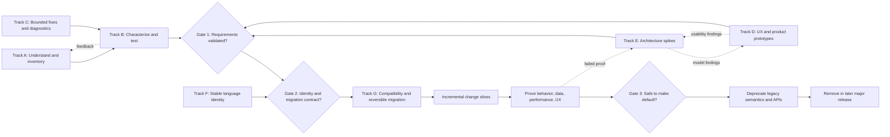

# Evolution and Migration Path

## Zweck, Evidenzbasis und Leseregeln

Dieses Dokument rekonstruiert aus allen neun vollständigen Source Audits einen plausiblen, bewusst **nicht künstlich linearen** Evolutions- und Migrationspfad. Es ist keine beschlossene TYPO3-Core-Roadmap. Der jüngere Quellenstand überschreibt ältere Zwischenstände; explizit abgeleitete Schritte sind als **Analytically Derived Recommendation** markiert. Die Audits decken Weekly Minutes und ausgewählte Transcripts von 2023 bis Juli 2026 sowie Monthly-/Meta-Dokumente ab. Quellenhierarchie und Datierungsrisiken sind in `Analysis/T3DD26/SourceAudits/Monthly-and-Meta.md:3-13` beschrieben; die chronologische Gesamtsynthese steht dort in `:30-43` und `:284-316`.

Jede Pfadzeile verwendet zwei getrennte Klassifikationen:

- **Path Category:** `Already Started`, `Explicitly Planned`, `Discussed`, `Likely Technical Prerequisite`, `Potential Additional Step`, `Depends on Architecture Decision` oder `Analytical Recommendation`.
- **Evidence Status:** exakt einer der zehn Werte `Current Core Behavior`, `Problem`, `Idea`, `Discussed Direction`, `Preferred Direction`, `Open Question`, `Planned`, `In Progress`, `Implemented` oder `Analytically Derived Recommendation`.

Die Statuswerte beschreiben den belegten Reifegrad, nicht die Attraktivität einer Idee. Ein Gerrit-WIP, ein Test im Initiative-Repository oder ein diskutierter Prototyp ist nicht automatisch eine im Core implementierte Zielarchitektur. Diese Trennung ist besonders für `-1`, BCP 47, Editing Language und den Structural Layer notwendig (`Analysis/T3DD26/SourceAudits/2025-H2-weekly.md:14-34`; `Analysis/T3DD26/SourceAudits/2026-April-May.md:25-34`; `Analysis/T3DD26/SourceAudits/2026-June-July.md:34-42`).

## Executive reconstruction

1. Der belegte Arbeitsmodus ist **iterativ und teilweise parallel**: kleine reproduzierbare Szenarien, Core-Tests und begrenzte Bugfixes laufen neben Konzept-, Architektur- und UX-Arbeit. Die im Juli 2025 formulierte Reihenfolge `-1 → 0 → BCP 47` wurde im September ausdrücklich zu „kleinen Schritten unter einer noch unscharfen Vision“ relativiert; im Juli 2026 waren Priorisierung und Ownership nach Core-Team-Änderungen erneut offen. **Primär:** `MeetingMinutes/Weekly/2025/08/2025-08-15.md:21-29`; `MeetingMinutes/Weekly/2025/09/2025-09-26.md:21-25`; `MeetingMinutes/Weekly/2026/07/24.md:27-35`. Synthese: `Analysis/T3DD26/SourceAudits/2025-H2-weekly.md:36-49,60-65`; `Analysis/T3DD26/SourceAudits/2026-June-July.md:34-42,109-115`. **Evidence Status: Preferred Direction.**
2. Der reifste technische Track ist die **Charakterisierung des heutigen `sys_language_uid = -1`-Verhaltens**, nicht dessen Entfernung. Inventar, manuelle Validierung, kleine Test-Patches, Workspace-Fälle und DataHandler-Sonderpfade sind begonnen; die Ersatzfunktion ist weiterhin Konzeptarbeit. **Primär:** `MeetingMinutes/Weekly/2026/01/09.md:21-77`; `MeetingMinutes/Weekly/2026/03/13.md:39-51`; `MeetingMinutes/Weekly/2026/04/24.md:49-57`. Synthese: `Analysis/T3DD26/SourceAudits/2026-Q1.md:36-61,151-168`; `Analysis/T3DD26/SourceAudits/2026-April-May.md:213-239`; `Analysis/T3DD26/SourceAudits/2026-June-July.md:88-105`. **Evidence Status: In Progress.**
3. Als funktionaler Ersatz für `-1` ist am beständigsten ein **explizites All-Languages-Verhalten** belegt: zunächst ein Boolean auf einem Source-/Default-/Struktur-Record, DataHandler-erzeugte konkrete Sprachrecords und systemseitige Synchronisation; später eventuell wählbare Zielgruppen. Aktivierung, Deaktivierung, Provenienz und Konfliktbehandlung sind nicht entschieden. **Primär:** `MeetingMinutes/Weekly/2025/01/2025-01-24.md:42-47`; `MeetingMinutes/Weekly/2025/11/2025-11-28.md:47-57`; `MeetingMinutes/Weekly/2026/06/11.md:62-74`. Synthese: `Analysis/T3DD26/SourceAudits/2025-H1-weekly.md:95-157`; `Analysis/T3DD26/SourceAudits/2025-H2-weekly.md:133-163,276-285`; `Analysis/T3DD26/SourceAudits/2026-June-July.md:66-86,141-160`. **Evidence Status: Discussed Direction.**
4. Die strukturelle Zielarchitektur bleibt ein Gate. Vollständige Sprach-Layer/Shadow Records und ein gemeinsamer sprachunabhängiger Struktur-Layer wurden verglichen; Ende 2025 wurde der gemeinsame Layer wegen Duplikation, Synchronisations- und Workspace-Kosten bevorzugt. Im Mai/Juni 2026 wurde jedoch ein pragmatischer versteckter `0`-Layer als Hypothese/Prototyp diskutiert, nicht als endgültiger neutraler Identity Layer. **Primär:** `MeetingMinutes/Weekly/2025/07/2025-07-18.md:49-73`; `MeetingMinutes/Weekly/2025/10/2025-10-24.md:45-78`; `MeetingMinutes/Weekly/2026/05/08.md:40-46`; `MeetingMinutes/Weekly/2026/07/10.md:50-58`. Synthese: `Analysis/T3DD26/SourceAudits/2025-H2-weekly.md:51-58,164-187`; `Analysis/T3DD26/SourceAudits/2026-April-May.md:131-170`; `Analysis/T3DD26/SourceAudits/2026-June-July.md:74-85,109-115`. **Evidence Status: Open Question.**
5. BCP 47 ist eine beständige fachliche Richtung für stabile, site-übergreifend verständliche Sprachidentität. Unentschieden bleiben Authoritative Storage, Mapping, Canonicalization und die Rolle interner numerischer IDs; deshalb kann BCP 47 parallel als Abstraktions-/Mapping-Track erforscht werden, aber eine Datenmigration wartet auf das Identity-Gate. **Primär:** `MeetingMinutes/Weekly/2025/07/2025-07-25.md:22-34,51-55`; `MeetingMinutes/Weekly/2026/06/11.md:74-80`. Synthese: `Analysis/T3DD26/SourceAudits/2025-H2-weekly.md:116-132,294-299`; `Analysis/T3DD26/SourceAudits/2026-June-July.md:70-86,141-160`. **Evidence Status: Preferred Direction.**
6. Editing Language und die UX „Inhalt dort anlegen, wo er gebraucht wird“ liefern den Produktnutzen, sind aber noch Prototyp-/Hypothesenarbeit. Sie hängen von Structural Identity, Sorting, Permissions und Free-Mode-Kompatibilität ab. **Primär:** `MeetingMinutes/Weekly/2026/05/08.md:48-67`; `MeetingMinutes/Weekly/2026/05/29.md:23-61`. Synthese: `Analysis/T3DD26/SourceAudits/2026-April-May.md:172-203,320-361`; `Analysis/T3DD26/SourceAudits/2026-June-July.md:50-57,78-85`. **Evidence Status: Discussed Direction.**
7. Der sichere Gesamtpfad lautet daher nicht nur `Understand → Test → Change → Prove`, sondern: **Understand + Stabilize + Prototype → Characterize → Decide → Prepare Compatibility/Migration → Change in reversible slices → Prove → Deprecate/Remove**. Die zusätzlichen Phasen sind analytisch abgeleitet; die Quellen belegen Test-first, Parallelität, PoCs, Migration statt Big Bang und die offenen Architecture Gates. **Primär:** `MeetingMinutes/Weekly/2025/08/2025-08-15.md:21-29,55-66`; `MeetingMinutes/Weekly/2025/09/2025-09-26.md:21-25,46-50`; `MeetingMinutes/Weekly/2026/04/24.md:29-37,69-73`; `MeetingMinutes/Weekly/2026/05/29.md:31-61`. Synthese: `Analysis/T3DD26/SourceAudits/2025-H1-weekly.md:255-305,307-372`; `Analysis/T3DD26/SourceAudits/2025-H2-weekly.md:215-249`; `Analysis/T3DD26/SourceAudits/2026-April-May.md:241-311`. **Evidence Status: Analytically Derived Recommendation.**

## Parallelisierbares Gesamtmodell

Die Parallelität ist quellenbasiert: Konzept und Core-Patches sollten seit August 2025 parallel laufen; Charakterisierung, kleine sichtbare Fixes und Discovery/Prototyping wurden im Juli 2026 erneut nebeneinander gestellt. **Primär:** `MeetingMinutes/Weekly/2025/08/2025-08-15.md:21-29`; `MeetingMinutes/Weekly/2026/07/24.md:27-35`. Synthese: `Analysis/T3DD26/SourceAudits/2025-H2-weekly.md:60-65,232-249`; `Analysis/T3DD26/SourceAudits/2026-June-July.md:38-42,162-173`. Die Gates, Compatibility-Schicht und Default-Umschaltung sind **Analytically Derived Recommendation**, weil keine Quelle eine vollständige Release-Mechanik beschließt.

## Track A — Understand: Semantik und Impact Surface

| Path Category | Evidence Status | Arbeitsschritt | Abhängigkeit / Gate | Hauptrisiko | Lokale Evidenz |
|---|---|---|---|---|---|
| Already Started | In Progress | Direkte und implizite Verwendungen von `-1` und `0` inventarisieren und nach Bedeutung klassifizieren: echtes All Languages, UI-Filter, „keine Sprache“, Seiten-/Site-Language-False-Positive, implizite Vergleiche. | Keine Architekturentscheidung nötig; liefert Input für Test- und API-Track. | Mechanischer Ersatz würde verschiedene Semantiken vermischen. | **Primär:** `MeetingMinutes/Weekly/2026/01/09.md:21-61`; `MeetingMinutes/Weekly/2026/01/16.md:57-60,71-78`. Synthese: `Analysis/T3DD26/SourceAudits/2026-Q1.md:36-61`; `Analysis/T3DD26/SourceAudits/Monthly-and-Meta.md:298-306` |
| Already Started | In Progress | Core-Flächen kartieren: DataHandler, TCA, `PageRepository`, `LanguageAspect`, Extbase, Backend-Rechte, Queries, Rendering, Fallback, Relations und Workspaces. | Inventar muss mit reproduzierbaren Fällen verknüpft werden. | Eine reine Text-/TODO-Liste wird durch Rebases stale und beweist keine Coverage. | **Primär:** `MeetingMinutes/Weekly/2025/11/2025-11-28.md:32-36`; `MeetingMinutes/Weekly/2026/07/10.md:50-56`. Synthese: `Analysis/T3DD26/SourceAudits/2025-H2-weekly.md:225-230`; `Analysis/T3DD26/SourceAudits/2026-Q1.md:40-53` |
| Already Started | In Progress | False Positives manuell validieren; Site Configuration Languages aus der `-1`-Inventarisierung entfernen, weil sie selbst nicht `-1` sein können. | Gate für belastbare Scope-Aussage. | Falsche Annahmen blähen Patch/Testumfang auf. | **Primär:** `MeetingMinutes/Weekly/2026/04/24.md:49-57`. Synthese: `Analysis/T3DD26/SourceAudits/2026-April-May.md:76-83,219-239` |
| Discussed | Discussed Direction | Benannte Konstanten für `-1` und `0` als Discoverability-Schritt erwägen; danach kontextabhängige semantische Helper. | Semantik-Katalog muss zuerst ausreichend stabil sein. | Ein Constant-only-Refactor kann implizite Vergleiche und unterschiedliche Bedeutungen verschleiern. | **Primär:** `MeetingMinutes/Weekly/2026/03/13.md:39-47`. Synthese: `Analysis/T3DD26/SourceAudits/2026-Q1.md:47-61` |
| Likely Technical Prerequisite | Analytically Derived Recommendation | Maschinenlesbare Semantik-/Coverage-Matrix pflegen: Fundstelle → Bedeutung → Producer → Consumer → bestehender Test → gewünschtes Verhalten → Migrationseffekt. | Verbindet Track A mit Track B und verhindert doppelte Arbeit. | Ohne Traceability bleibt „vollständig getestet“ unbeweisbar. | **Primär:** `MeetingMinutes/Weekly/2026/01/16.md:45-55`; `MeetingMinutes/Weekly/2026/03/13.md:45-51`. Synthese: `Analysis/T3DD26/SourceAudits/2026-Q1.md:40-53,151-168` |
| Potential Additional Step | Analytically Derived Recommendation | Deterministische AST-/Rector-Analyse als Ergänzung, nicht Ersatz, für die semantische Review evaluieren. | Erst nach Definition der syntaktisch auffindbaren Muster. | Tool findet Syntax, aber nicht Kontextbedeutung; hoher Pflegeaufwand. | **Primär:** `MeetingMinutes/Weekly/2026/01/09.md:63-67`; Qualifizierung: `MeetingMinutes/Weekly/2026/01/16.md:20-27`. Synthese: `Analysis/T3DD26/SourceAudits/2026-Q1.md:40-44` |

### Gate U — „Understand complete enough“

Der Track darf in mutierende Arbeit übergehen, wenn jede bekannte Sondersemantik einem reproduzierbaren Fall oder einer bewusst dokumentierten Nicht-Abdeckung zugeordnet ist, False Positives entfernt sind und Core-Maintainer die Scope-Grenzen geprüft haben. Dieses Gate ist **Analytically Derived Recommendation**, gestützt durch den wiederholten Bedarf an manueller Validierung, Core-Input und testbarer Semantik. **Primär:** `MeetingMinutes/Weekly/2026/01/16.md:20-55,71-80`; `MeetingMinutes/Weekly/2026/04/24.md:67-73`. Synthese: `Analysis/T3DD26/SourceAudits/2026-Q1.md:41-61`; `Analysis/T3DD26/SourceAudits/2026-April-May.md:38-43,228-235`.

## Track B — Test: Characterization, Acceptance und Regression

| Path Category | Evidence Status | Arbeitsschritt | Abhängigkeit / Gate | Hauptrisiko | Lokale Evidenz |
|---|---|---|---|---|---|
| Already Started | In Progress | `Language All`-Verhalten in kleinen, mergebaren Core-Patches charakterisieren, beginnend mit DataHandler/use-case- oder extensionbezogenen Paketen. | Track-A-Matrix priorisiert Fälle. | Große Kartesische Suite erzeugt Testschuld und Review-Stau. | **Primär:** `MeetingMinutes/Weekly/2024/10/2024-10-04.md:36-44`; `MeetingMinutes/Weekly/2026/03/13.md:45-51`. Synthese: `Analysis/T3DD26/SourceAudits/2024-H2-weekly.md:76-89,233-250`; `Analysis/T3DD26/SourceAudits/2026-Q1.md:49-53` |
| Already Started | In Progress | Workspace-Paste/Copy-Fälle sowie Parent-/Child-Neuanlage und `-1`-Kombinationen prüfen (`#93289`, `#93028`, Vergleich `#87595`). | Verhalten darf nicht vor Architekturentscheid voreilig „korrigiert“ werden. | Tests könnten zufällige Altlogik als Vertrag einfrieren. | **Primär:** `MeetingMinutes/Weekly/2026/03/20.md:37-45`; `MeetingMinutes/Weekly/2026/04/24.md:51-57`. Synthese: `Analysis/T3DD26/SourceAudits/2026-April-May.md:219-239,282-289` |
| Already Started | In Progress | Deterministische Initiative-Testextension als visuelle Reproduktionsumgebung nutzen; relevante Fälle anschließend in Core-Tests übertragen. | Extension bleibt Szenario-Generator, nicht zweite Core-Test-Suite. | Randomisierte Daten und falsche Test-Scope können grüne, aber konzeptionell falsche Ergebnisse erzeugen. | **Primär:** `MeetingMinutes/Weekly/2025/09/2025-09-05.md:24-40,70-77`; `MeetingMinutes/Weekly/2025/10/2025-10-17.md:24-34`. Synthese: `Analysis/T3DD26/SourceAudits/2025-H2-weekly.md:215-243`; `Analysis/T3DD26/SourceAudits/2026-Q1.md:79-90,221-227` |
| Explicitly Planned | Planned | Deliberate-failure-Probe in einem `-1`-Branch nutzen, um tatsächliche Suite-Coverage und angrenzende ungetestete Flows aufzudecken. | Nur als temporäre lokale Diagnose. | Ein Treffer beweist Ausführung, nicht semantische Vollständigkeit. | **Primär:** `MeetingMinutes/Weekly/2026/03/13.md:49-51`; `Transcripts/2026-03-13 12-00-26 - Meeting der Initiative.txt:702-742`. Synthese: `Analysis/T3DD26/SourceAudits/2026-Q1.md:49-53,235-240` |
| Likely Technical Prerequisite | Analytically Derived Recommendation | Drei Testarten klar trennen: (a) Characterization des heutigen Verhaltens, (b) Regression für als Fehler klassifizierte Fälle, (c) Acceptance des Ersatzmodells. | Semantische Klassifikation aus Track A. | Bug-Charakterisierung kann sonst versehentlich zum dauerhaften Soll werden. | **Primär:** `MeetingMinutes/Weekly/2025/09/2025-09-05.md:30-40,60-77`; `MeetingMinutes/Weekly/2025/11/2025-11-14.md:21-63`. Synthese: `Analysis/T3DD26/SourceAudits/2025-H2-weekly.md:232-249` |
| Potential Additional Step | Analytically Derived Recommendation | Parametrisierung nach semantisch relevanten Achsen statt vollständigem Cartesian Product; identische Fallback-Suiten datengetrieben organisieren. | Erst Matrix und Äquivalenzklassen definieren. | Fehlende Achse versus unwartbare Testmenge. | **Primär:** `MeetingMinutes/Weekly/2024/12/2024-12-20.md:45-55`. Synthese: `Analysis/T3DD26/SourceAudits/2024-H2-weekly.md:76-88,225-231` |
| Potential Additional Step | Analytically Derived Recommendation | Mutation-/coverage-basierte Prüfung um gezielte Integrationsfälle ergänzen: Workspaces, restore/delete, MM/IRRE, Reference Index, direct DataHandler calls, Extbase und frontend rendering. | Architektur-PoC definiert neue Invarianten. | Nur Web-UI-Tests übersehen API-/Extension-Aufrufer. | **Primär:** `MeetingMinutes/Weekly/2026/02/13.md:31-37`; `MeetingMinutes/Weekly/2026/03/20.md:37-45`; `MeetingMinutes/Weekly/2025/08/2025-08-22.md:43-60`. Synthese: `Analysis/T3DD26/SourceAudits/2026-Q1.md:75-101,299-310`; `Analysis/T3DD26/SourceAudits/2026-June-July.md:141-160` |

### Gate T — „Behavior baseline trustworthy“

Vor jeder Datenmigration müssen Tests sowohl erhaltenswerte Use Cases als auch bewusst zu ändernde Fehler ausweisen. Das Gate verlangt Coverage über Write-, Read-, Overlay-, Fallback-, Relation-, Workspace- und Extension-Pfade; vollständige Gleichheit mit Altverhalten ist **nicht** das Ziel, wenn das alte Verhalten als Fehler klassifiziert wurde. Dies ist **Analytically Derived Recommendation**, basierend auf der dokumentierten Spannung „testen, aber obsoletes `-1`-Verhalten nicht unnötig festschreiben“. **Primär:** `MeetingMinutes/Weekly/2024/12/2024-12-20.md:45-55`; `MeetingMinutes/Weekly/2025/01/2025-01-17.md:21-31`; `MeetingMinutes/Weekly/2026/04/24.md:59-67`. Synthese: `Analysis/T3DD26/SourceAudits/2025-H1-weekly.md:307-325`; `Analysis/T3DD26/SourceAudits/2026-April-May.md:38-43,84-91`.

## Track C — Stabilize: begrenzte Core-Fixes und Diagnostik

| Path Category | Evidence Status | Arbeitsschritt | Zweck / Abgrenzung | Lokale Evidenz |
|---|---|---|---|---|
| Already Started | Implemented | Bereits gemergte, begrenzte Fixes als belastbare Invarianten nutzen: Ziel-Site-Language-Copy-Filter `#92580`, DataHandler-Split `#92881`, nichtsprachfähige IRRE-Children `#88837`, Mount-Point-Fix `#94831`. | Stabilisiert heutigen Core; implementiert keine neue Spracharchitektur. | **Primär:** `MeetingMinutes/Weekly/2026/02/13.md:17-19`; `MeetingMinutes/Weekly/2026/02/20.md:37-39`; `MeetingMinutes/Weekly/2026/04/24.md:23-27`; `MeetingMinutes/Weekly/2026/07/24.md:17-25`. Synthese: `Analysis/T3DD26/SourceAudits/2026-Q1.md:75-90,117-127,151-168`; `Analysis/T3DD26/SourceAudits/2026-April-May.md:84-91,213-217`; `Analysis/T3DD26/SourceAudits/2026-June-July.md:88-105` |
| Already Started | In Progress | Free-Mode-Copy/Move, orphan warnings/dbdoctor, duplicate parents, `l10n_source` lookup und Mode-UI als kleine beobachtbare Fixes weiterführen. | Kann parallel zu Architekturarbeit laufen und macht Datenfehler sichtbar. | **Primär:** `MeetingMinutes/Weekly/2026/03/13.md:23-31,53-55`; `MeetingMinutes/Weekly/2026/07/24.md:57-75`; `MeetingMinutes/Weekly/2026/07/31.md:21-37`. Synthese: `Analysis/T3DD26/SourceAudits/2026-Q1.md:75-103,151-168`; `Analysis/T3DD26/SourceAudits/2026-June-July.md:88-105` |
| Explicitly Planned | Planned | Bestehende Orphans/Inkonsistenzen sichtbar, reparierbar und nicht still löschbar machen; Warnings und Audit-/Cleanup-Werkzeuge bereitstellen. | Vorbereitung auf Migration und bessere Ausgangsdaten. | **Primär:** `MeetingMinutes/Weekly/2025/11/2025-11-28.md:53-76`; `MeetingMinutes/Weekly/2026/01/30.md:48-55`. Synthese: `Analysis/T3DD26/SourceAudits/2025-H2-weekly.md:225-230,276-292`; `Analysis/T3DD26/SourceAudits/2026-Q1.md:89-101,299-310` |
| Analytical Recommendation | Analytically Derived Recommendation | Jeden Fix als „current-model hardening“ oder „future-model preparation“ markieren und keine erfolgreiche Bugfix-Serie als Beweis der Zielarchitektur verwenden. | Verhindert Statusinflation im Talk und in Roadmap-Entscheidungen. | **Primär:** `MeetingMinutes/Weekly/2026/04/24.md:23-47`; `MeetingMinutes/Weekly/2026/07/24.md:27-35`. Synthese: `Analysis/T3DD26/SourceAudits/2026-Q1.md:22-32`; `Analysis/T3DD26/SourceAudits/2026-June-July.md:216-224` |

## Track D — Model and prototype: All-Languages, Synchronisation und Provenienz

| Path Category | Evidence Status | Arbeitsschritt | Abhängigkeit / Gate | Hauptrisiko | Lokale Evidenz |
|---|---|---|---|---|---|
| Discussed | Discussed Direction | Verhalten von `-1` zunächst durch Boolean auf Source-/Default-/Structural Record plus konkrete Zielsprachrecords und DataHandler-Synchronisation ersetzen. | Erfordert Zielsprachdefinition, Lifecycle und Feldvertrag. | Feature-Parität ohne sichere Konfliktregeln kann Daten überschreiben. | **Primär:** `MeetingMinutes/Weekly/2025/01/2025-01-24.md:42-47`; `MeetingMinutes/Weekly/2025/09/2025-09-26.md:33-43`; `MeetingMinutes/Weekly/2026/06/11.md:62-74`. Synthese: `Analysis/T3DD26/SourceAudits/2025-H1-weekly.md:95-157`; `Analysis/T3DD26/SourceAudits/2025-H2-weekly.md:133-150`; `Analysis/T3DD26/SourceAudits/2026-June-July.md:66-73` |
| Discussed | Idea | Boolean später zu expliziten Zielsprachen/Sync-Gruppen erweitern. | Erst Paritätsmodell und API stabilisieren. | Produktfeature vergrößert Scope vor erfolgreicher Migration. | **Primär:** `MeetingMinutes/Weekly/2025/11/2025-11-28.md:47-52`; `MeetingMinutes/Weekly/2026/06/11.md:74-80`. Synthese: `Analysis/T3DD26/SourceAudits/2025-H2-weekly.md:133-150`; `Analysis/T3DD26/SourceAudits/2026-June-July.md:70-73` |
| Discussed | Discussed Direction | Feld- und Record-Synchronisation trennen; None/Allow/Enforce und bestehende `l10n_mode`-Semantiken vergleichen statt vorschnell zu ersetzen. | Semantischer TCA-Vertrag und UI erforderlich. | Ein Name wie „enforce“ beweist weder API noch Editor-Unlösbarkeit. | **Primär:** `MeetingMinutes/Weekly/2024/10/2024-10-18.md:39-58`; `MeetingMinutes/Weekly/2025/08/2025-08-22.md:30-41`. Synthese: `Analysis/T3DD26/SourceAudits/2024-H2-weekly.md:138-160`; `Analysis/T3DD26/SourceAudits/2025-H2-weekly.md:67-78,151-163` |
| Explicitly Planned | Planned | Configurable record-level synchronization vor enforced behavior einführen; nur relevante Felder synchronisieren und vorhandene Feldregeln respektieren. | Muss mit bestehenden `allowLanguageSynchronization`/`l10n_mode`-Zuständen koexistieren. | Doppelte Steuerung und unklare UI-Priorität. | **Primär:** `MeetingMinutes/Weekly/2025/01/2025-01-31.md:44-52`. Synthese: `Analysis/T3DD26/SourceAudits/2025-H1-weekly.md:126-157` |
| Likely Technical Prerequisite | Analytically Derived Recommendation | Dauerhafte Provenienz-/Ownership-State-Machine definieren: manual, generated-synced, detached, conflict, pending, failed; Transitionen auditierbar machen. | Vor erstem mutierenden PoC und Migration. | Ohne Provenienz sind Abschalten, Restore und Konfliktlösung nicht sicher. | **Primär:** `MeetingMinutes/Weekly/2025/01/2025-01-17.md:51-55`; `MeetingMinutes/Weekly/2025/11/2025-11-28.md:53-57`. Synthese: `Analysis/T3DD26/SourceAudits/2025-H1-weekly.md:145-157`; `Analysis/T3DD26/SourceAudits/2025-H2-weekly.md:80-85,276-285` |
| Likely Technical Prerequisite | Analytically Derived Recommendation | Aktivierungsvertrag definieren: bestehende Varianten vergleichen, Dry Run, block/adopt/merge/exempt/overwrite explizit wählen; niemals still überschreiben. | Provenienz und Feldvertrag. | Verlust redaktionell unabhängiger Inhalte. | **Primär:** `MeetingMinutes/Weekly/2025/01/2025-01-24.md:28-40`; `MeetingMinutes/Weekly/2025/01/2025-01-31.md:35-42`. Synthese: `Analysis/T3DD26/SourceAudits/2025-H1-weekly.md:145-157`; `Analysis/T3DD26/SourceAudits/2026-April-May.md:123-130` |
| Likely Technical Prerequisite | Analytically Derived Recommendation | Deaktivierungs- und New-Language-Vertrag definieren: detach/freeze/delete, Backfill-Trigger, Retry, Queue/Transaction und Fehlerzustand. | Provenienz und authoritative target-language universe. | Duplicate explosion, unvollständige Backfills, unreversible Löschung. | **Primär:** `MeetingMinutes/Weekly/2025/11/2025-11-28.md:53-57`; `MeetingMinutes/Weekly/2026/06/11.md:74-80`; `MeetingMinutes/Weekly/2026/07/24.md:57-63`. Synthese: `Analysis/T3DD26/SourceAudits/2025-H2-weekly.md:80-85,276-285`; `Analysis/T3DD26/SourceAudits/2026-June-July.md:141-160` |
| Depends on Architecture Decision | Open Question | Entscheiden, ob `enforceLanguageSynchronization` bestehende Mechanismen ersetzt, abbildet oder dauerhaft ergänzt. | Extension-Kompatibilität und TCA-Migrationsplan. | Bruch von Integrator-Konfiguration und UI-Verhalten. | **Primär:** `MeetingMinutes/Weekly/2025/08/2025-08-15.md:41-45`; Qualifizierung: `MeetingMinutes/Weekly/2025/08/2025-08-22.md:30-41`. Synthese: `Analysis/T3DD26/SourceAudits/2025-H2-weekly.md:67-78` |

### Gate S — „Synchronization contract complete“

Freigabe erst, wenn Record-Scope, Feld-Scope, Provenienz, Aktivierung, Deaktivierung, neue Sprachen, Relation/IRRE/MM, Error/Retry und editorielle Kontrolle spezifiziert sowie durch Acceptance Tests beschrieben sind. Das Gate ist **Analytically Derived Recommendation**; die Quellen liefern die Bausteine und die offenen Lücken, aber keinen fertigen Vertrag. **Primär:** `MeetingMinutes/Weekly/2025/01/2025-01-31.md:44-52`; `MeetingMinutes/Weekly/2025/08/2025-08-22.md:43-60`; `MeetingMinutes/Weekly/2025/11/2025-11-28.md:47-57`; `MeetingMinutes/Weekly/2026/05/29.md:39-61`. Synthese: `Analysis/T3DD26/SourceAudits/2025-H1-weekly.md:126-157`; `Analysis/T3DD26/SourceAudits/2025-H2-weekly.md:276-305`; `Analysis/T3DD26/SourceAudits/2026-April-May.md:320-371`.

## Track E — Architecture spikes: Structural Identity, `0` und Layer-Modelle

| Path Category | Evidence Status | Arbeitsschritt | Abhängigkeit / Gate | Hauptrisiko | Lokale Evidenz |
|---|---|---|---|---|---|
| Discussed | Open Question | Drei Modelle explizit vergleichen: heutige sparse records/overlays; vollständig materialisierte Sprach-Layer mit Shadows; gemeinsamer sprachunabhängiger Structural/Identity Layer. | Gemeinsame Invarianten und PoC-Workloads nötig. | Begriffe „shadow“, „neutral“ und „hidden `0`“ wurden historisch unterschiedlich verwendet. | **Primär:** `MeetingMinutes/Weekly/2024/10/2024-10-18.md:60-65`; `MeetingMinutes/Weekly/2025/07/2025-07-18.md:49-73`; `MeetingMinutes/Weekly/2025/10/2025-10-24.md:45-78`. Synthese: `Analysis/T3DD26/SourceAudits/2025-H2-weekly.md:51-58,164-187`; `Analysis/T3DD26/SourceAudits/2026-April-May.md:131-170` |
| Discussed | Preferred Direction | Den Ende 2025 bevorzugten gemeinsamen Structure Layer als führende Hypothese prüfen: `transOrigPointerField` trägt Strukturidentität, `translationSource` beschreibt Content-Herkunft. | Kein finaler Schemaentscheid; spätere Quellen nennen den Layer ausdrücklich Hypothese. | Bestehende Default-Semantik könnte nur umbenannt statt wirklich entkoppelt werden. | **Primär:** `MeetingMinutes/Weekly/2025/10/2025-10-24.md:45-78`; Qualifizierung: `MeetingMinutes/Weekly/2026/07/10.md:50-58`. Synthese: `Analysis/T3DD26/SourceAudits/2025-H2-weekly.md:24-30,45-58,164-176`; `Analysis/T3DD26/SourceAudits/2026-June-July.md:74-85,109-115` |
| Discussed | Idea | Pragmatischen hidden-`0`-Spine prototypisieren: `0` bleibt intern strukturell, alle realen Editorial Languages erhalten eigene IDs, Partner entstehen über DataHandler. | Nur als Übergangs-/Alternative-Modell behandeln. | Entfernt die redaktionelle Sonderrolle von `0`, nicht zwingend seine technische Sondersemantik. | **Primär:** `MeetingMinutes/Weekly/2026/05/08.md:40-46`; `MeetingMinutes/Weekly/2026/05/29.md:23-27`. Synthese: `Analysis/T3DD26/SourceAudits/2026-April-May.md:25-34,131-153` |
| Discussed | Idea | Shadow-/Placeholder-Prototyp für language-specific additions bauen; im Diagnosemodus alle Structural Records sichtbar lassen. | Sorting/Permissions müssen parallel gespikt werden. | Technische Records werden editoriell sichtbar oder erzeugen mehrdeutige Reihenfolge. | **Primär:** `MeetingMinutes/Weekly/2026/05/29.md:39-55`. Synthese: `Analysis/T3DD26/SourceAudits/2026-April-May.md:147-170,181-193` |
| Likely Technical Prerequisite | Analytically Derived Recommendation | Gemeinsame Identity-Invarianten vor Schemawahl definieren: Gruppenzugehörigkeit, Content Source, Structure Parent, variant ownership, independent variant, connect/merge/split. | Gate für `l10n_parent`-, `translationSource`- und Import-/Export-Migration. | Schema wird sonst aus einer einzelnen UI-Idee statt aus Domänenregeln abgeleitet. | **Primär:** `MeetingMinutes/Weekly/2025/10/2025-10-24.md:58-66`; `Transcripts/2026-05-29 12-01-43 - Meeting der Initiative.txt:105-116`. Synthese: `Analysis/T3DD26/SourceAudits/2025-H2-weekly.md:287-292`; `Analysis/T3DD26/SourceAudits/2026-April-May.md:333-351` |
| Likely Technical Prerequisite | Analytically Derived Recommendation | Sorting-Spike mit unsichtbaren Records sowie Permission-Spike für sprachübergreifende Strukturänderung durchführen. | Vor UX-Prototyp mit echten Mutationen. | Gleiche sichtbare Aktion kann mehrere globale Ordnungen bedeuten; unberechtigte Fremdsprachenwrites. | **Primär:** `MeetingMinutes/Weekly/2026/05/29.md:47-61`. Synthese: `Analysis/T3DD26/SourceAudits/2026-April-May.md:53-59,92-97,343-361` |
| Potential Additional Step | Analytically Derived Recommendation | Die Modelle mit identischen Szenarien benchmarken: Pages, `tt_content`, generische Records, IRRE/MM, 2/5/20 Sprachen, sparse vs divergent, Workspaces. | Messkriterien vor PoC festlegen. | Anekdotische „mehr/weniger Komplexität“-Entscheidung ohne Daten. | **Primär:** `MeetingMinutes/Weekly/2025/07/2025-07-18.md:61-73`; `MeetingMinutes/Weekly/2025/10/2025-10-24.md:68-78`; `MeetingMinutes/Weekly/2026/05/29.md:47-55`. Synthese: `Analysis/T3DD26/SourceAudits/2025-H2-weekly.md:178-187`; `Analysis/T3DD26/SourceAudits/2026-Q1.md:128-138`; `Analysis/T3DD26/SourceAudits/2026-April-May.md:204-211` |
| Potential Additional Step | Analytically Derived Recommendation | Messen: Record-/Version-Anzahl, Index-/Reference-Index-Größe, Query Count/Plan, Cache invalidation, localization write amplification, Workspace publish/restore, Editor-Clutter. | Gemeinsam mit technischer Validierung ausführen. | Optimierung eines Modells anhand nur eines Subsystems. | **Primär:** `MeetingMinutes/Weekly/2025/10/2025-10-24.md:68-78`; `MeetingMinutes/Weekly/2026/05/29.md:47-55`; `MeetingMinutes/Weekly/2026/07/10.md:50-58`. Synthese: `Analysis/T3DD26/SourceAudits/2026-April-May.md:343-351`; `Analysis/T3DD26/SourceAudits/2026-June-July.md:153-158` |
| Depends on Architecture Decision | Open Question | Wählen, ob `0` dauerhaft versteckter Anchor, temporäre Compatibility-Schicht oder vollständig durch neutrale Identity ersetzt wird. | PoC-Ergebnisse und Migration Mapping. | Frühzeitige Festlegung blockiert BCP-47-/Equal-Language-Ziel oder macht Migration unnötig teuer. | **Primär:** `MeetingMinutes/Weekly/2026/05/08.md:40-46`; `MeetingMinutes/Weekly/2026/06/11.md:66-80`; `MeetingMinutes/Weekly/2026/07/10.md:50-58`. Synthese: `Analysis/T3DD26/SourceAudits/2026-April-May.md:131-146,333-341`; `Analysis/T3DD26/SourceAudits/2026-June-July.md:77-85,147-158` |
| Depends on Architecture Decision | Open Question | Entscheiden, ob Shadows und neutraler Layer Alternativen oder kombinierbare Komponenten sind. | Klare Rollen für Identity, Structure und Missing Variant. | Doppeltes Datenmodell und doppelte Lifecycle-Logik. | **Primär:** `MeetingMinutes/Weekly/2025/07/2025-07-18.md:49-73`; `MeetingMinutes/Weekly/2025/10/2025-10-24.md:45-78`. Synthese: `Analysis/T3DD26/SourceAudits/2025-H2-weekly.md:53-58,287-292`; `Analysis/T3DD26/SourceAudits/2026-June-July.md:151-156` |

### Gate A — „Architecture selected with evidence“

Eine Zielarchitektur ist erst auswählbar, wenn PoCs dieselben Use Cases abdecken, Lifecycle und Identity explizit sind, Daten-/Runtime-/Workspace-Kosten gemessen wurden und die Editor-UX keinen verborgenen Strukturwiderspruch enthält. Die jüngste Quellenlage erlaubt einen bevorzugten Hypothesenpfad, aber keine Entscheidung. **Primär:** `MeetingMinutes/Weekly/2025/07/2025-07-18.md:49-83`; `MeetingMinutes/Weekly/2025/10/2025-10-24.md:45-78`; `MeetingMinutes/Weekly/2026/05/29.md:39-61`; `MeetingMinutes/Weekly/2026/07/10.md:50-58`. Synthese: `Analysis/T3DD26/SourceAudits/2025-H2-weekly.md:53-58`; `Analysis/T3DD26/SourceAudits/2026-April-May.md:25-34,446-451`; `Analysis/T3DD26/SourceAudits/2026-June-July.md:34-42,109-115`. **Evidence Status: Analytically Derived Recommendation.**

## Track F — Stable Language Identity und BCP 47

| Path Category | Evidence Status | Arbeitsschritt | Abhängigkeit / Gate | Hauptrisiko | Lokale Evidenz |
|---|---|---|---|---|---|
| Discussed | Preferred Direction | BCP 47 als stabile fachliche Sprachidentität weiter spezifizieren, getrennt von site-lokalen numerischen Bedeutungen. | Kann als Abstraktions-/Mapping-PoC parallel laufen. | „BCP 47“ allein löst Authority, Canonicalization und Record Mapping nicht. | **Primär:** `MeetingMinutes/Weekly/2023/11/2023-11-10.md:30-53`; `MeetingMinutes/Weekly/2023/11/2023-11-17.md:40-49`. Synthese: `Analysis/T3DD26/SourceAudits/2023-weekly.md:185-199,228-233`; `Analysis/T3DD26/SourceAudits/Monthly-and-Meta.md:172-187` |
| Discussed | Preferred Direction | Cross-Site-/Cross-Root- und File-Metadata-Use-Cases als Acceptance Requirements verwenden. | Fachliche Requirements, keine Implementierungsannahme. | Aus einem Nutzenbeispiel wird vorschnell ein globales Registry-Design abgeleitet. | **Primär:** `MeetingMinutes/Weekly/2025/07/2025-07-25.md:22-34,57-65`; `MeetingMinutes/Weekly/2026/07/10.md:50-54`. Synthese: `Analysis/T3DD26/SourceAudits/2025-H2-weekly.md:116-132,204-213`; `Analysis/T3DD26/SourceAudits/2026-June-July.md:74-86` |
| Likely Technical Prerequisite | Analytically Derived Recommendation | Language Identity Abstraction/API vor Storage-Migration einführen: semantic tag, legacy UID, Site Language mapping und source provenance getrennt modellieren. | Erlaubt Parallelbetrieb und Extension-Migration. | Big-bang Wechsel aller Foreign Keys ist kaum reversibel. | **Primär:** `MeetingMinutes/Weekly/2025/07/2025-07-11.md:54-61`; `MeetingMinutes/Weekly/2025/07/2025-07-25.md:22-34`. Synthese: `Analysis/T3DD26/SourceAudits/2025-H2-weekly.md:116-132`; `Analysis/T3DD26/SourceAudits/Monthly-and-Meta.md:298-316` |
| Likely Technical Prerequisite | Analytically Derived Recommendation | Canonicalization-/Collision-Policy definieren: language, region, script, variants, private use, equivalent tags, missing/ambiguous locale. | Vor Import, Migration und uniqueness constraints. | Zwei Sites können gleiche Sprache verschieden oder gleiche ID unterschiedlich benennen. | **Primär:** `MeetingMinutes/Weekly/2025/07/2025-07-25.md:22-34`; `MeetingMinutes/Weekly/2026/07/31.md:55-61`. Synthese: `Analysis/T3DD26/SourceAudits/2025-H2-weekly.md:294-299`; `Analysis/T3DD26/SourceAudits/2026-June-July.md:62-76` |
| Potential Additional Step | Analytically Derived Recommendation | Mapping-Report/Dry Run aus Site Configurations, vorhandenen Records und File Metadata erstellen; Ambiguitäten manuell auflösbar in versionierbarer Konfiguration speichern. | Vor Datenmutation und Import-/Export-Kompatibilität. | Locale ist nicht immer gleich fachlicher Content Language. | **Primär:** `MeetingMinutes/Weekly/2025/07/2025-07-25.md:22-34`; `MeetingMinutes/Weekly/2025/01/2025-01-24.md:55-60`. Synthese: `Analysis/T3DD26/SourceAudits/2025-H2-weekly.md:116-132` |
| Depends on Architecture Decision | Open Question | Entscheiden, ob BCP 47 am Record, an gemeinsamer Language Entity, am Identity Layer oder als Mapping zu internen UIDs authoritative ist. | Structural-Identity- und Compatibility-Gate. | Falsche Authority erzeugt neue Cross-Site-Sonderfälle. | **Primär:** `MeetingMinutes/Weekly/2025/07/2025-07-25.md:22-34`; `MeetingMinutes/Weekly/2026/06/11.md:74-80`. Synthese: `Analysis/T3DD26/SourceAudits/2025-H2-weekly.md:116-132,294-299`; `Analysis/T3DD26/SourceAudits/2026-June-July.md:74-86,157-158` |
| Depends on Architecture Decision | Open Question | Festlegen, ob interne numerische IDs bleiben und nur ihre fachliche Semantik verlieren oder physisch ersetzt werden. | Schema-/API-Kompatibilität. | Unnötiger Datenbankumbau oder fortgesetzte semantische Magie. | **Primär:** `MeetingMinutes/Weekly/2026/06/11.md:74-80`; `MeetingMinutes/Weekly/2026/07/31.md:55-61`. Synthese: `Analysis/T3DD26/SourceAudits/2026-June-July.md:74-76,157-158` |

### Gate I — „Identity and mapping contract“

Vor produktiver BCP-47-Migration müssen Authority, Canonicalization, Legacy Mapping, Collision Handling, Site/Record-Trennung, Import/Export und Extension API feststehen. BCP 47 kann als fachliche Richtung vorher kommuniziert werden; Storage und Migration bleiben bis zum Gate offen. **Primär:** `MeetingMinutes/Weekly/2025/07/2025-07-25.md:22-34`; `MeetingMinutes/Weekly/2026/06/11.md:74-80`. Synthese: `Analysis/T3DD26/SourceAudits/2025-H2-weekly.md:116-132,294-299`; `Analysis/T3DD26/SourceAudits/2026-April-May.md:363-371`. **Evidence Status: Analytically Derived Recommendation.**

## Track G — Product and UX prototype: Editing Language, Localization und Modes

| Path Category | Evidence Status | Arbeitsschritt | Abhängigkeit / Gate | Hauptrisiko | Lokale Evidenz |
|---|---|---|---|---|---|
| Explicitly Planned | Planned | Skizzen/clickable prototype für Editing Language, Page Tree, Page/Layout und List/Comparison erstellen; zunächst Produktverständnis validieren. | Kann read-only vor Architekturentscheid laufen. | UI verspricht Verhalten, das Sorting/Identity nicht tragen können. | **Primär:** `MeetingMinutes/Weekly/2026/05/08.md:60-68`; `Transcripts/2026-05-08 12-13-43 - Meeting der Initiative.txt:667-701`. Synthese: `Analysis/T3DD26/SourceAudits/2026-April-May.md:45-60,172-193` |
| Discussed | Preferred Direction | Editing Language als Editorial Context, getrennt von Backend UI Language und möglicher Translation Source, verwenden. | Permissions und Site/Record Language Mapping klären. | Neuer Selector ohne Authority-/Permission-Modell. | **Primär:** `MeetingMinutes/Weekly/2026/05/08.md:60-64`; `Transcripts/2026-05-08 12-13-43 - Meeting der Initiative.txt:591-637`. Synthese: `Analysis/T3DD26/SourceAudits/2026-April-May.md:172-180` |
| Discussed | Preferred Direction | Ziel-UX: Editor erstellt Inhalt in der benötigten Sprache; TYPO3 erzeugt/verwaltet strukturelle Beziehung im Hintergrund. | Structural Partner/Identity und Lifecycle. | Verdeckte technische Records erzeugen unerwartete Änderungen in anderen Sprachen. | **Primär:** `MeetingMinutes/Weekly/2026/05/29.md:23-27,39-45`; `Transcripts/2026-05-29 12-01-43 - Meeting der Initiative.txt:21-38,127-176`. Synthese: `Analysis/T3DD26/SourceAudits/2026-April-May.md:195-203,373-386`; `Analysis/T3DD26/SourceAudits/2026-June-July.md:50-57,81-83` |
| Discussed | Discussed Direction | Free-Erlebnis erhalten, technische Connection intern verwalten; Translate/Copy nur anbieten, wenn beide Resultate semantisch möglich sind. | Identity-/Mode-Regeln und current-config migration. | Fälschliche „Free Mode deprecation“ würde legitime stark divergente Strukturen brechen. | **Primär:** `MeetingMinutes/Weekly/2025/10/2025-10-24.md:37-43`; `MeetingMinutes/Weekly/2026/07/24.md:65-75`. Synthese: `Analysis/T3DD26/SourceAudits/2025-H2-weekly.md:189-203`; `Analysis/T3DD26/SourceAudits/2026-June-July.md:55-57,129-133,159-160` |
| Potential Additional Step | Analytically Derived Recommendation | Moderierte Usability-Tests mit mindestens: nur Zielsprache berechtigter Editor, hauptsächlich verbunden + eine lokale Ergänzung, stark divergente Site, globale Storage-Inhalte, fehlende Seite, intentional absence. | Click prototype reicht vor mutierender Extension. | Happy-path-only-UX verdeckt Permission- und Divergenzprobleme. | **Primär:** `MeetingMinutes/Weekly/2026/05/29.md:47-61`; `MeetingMinutes/Weekly/2026/07/24.md:19-25`. Synthese: `Analysis/T3DD26/SourceAudits/2024-H2-weekly.md:198-205`; `Analysis/T3DD26/SourceAudits/2026-June-July.md:46-64,175-189` |
| Potential Additional Step | Analytically Derived Recommendation | UX-Wording und Dokumentation strikt auf Editor-Intent ausrichten: „create/localize here“, nicht Parent/Mode/Sync-Mechanik. | Nach Acceptance Requirements, vor Backend API freeze. | Technische Begriffe bleiben Produktvertrag und erschweren spätere Architekturänderung. | **Primär:** `MeetingMinutes/Weekly/2025/05/2025-05-02.md:19-23`; `MeetingMinutes/Weekly/2026/05/08.md:32-38`. Synthese: `Analysis/T3DD26/SourceAudits/2025-H1-weekly.md:86-93,222-239`; `Analysis/T3DD26/SourceAudits/2026-April-May.md:45-52` |
| Depends on Architecture Decision | Open Question | Entscheiden, welche Strukturänderungen Editing Language führen darf und wie andere Sprachrecords sichtbar/gesperrt sind. | Sorting/Permission-PoC. | Cross-language writes ohne Berechtigung oder nichtdeterministische Ordnung. | **Primär:** `MeetingMinutes/Weekly/2026/05/29.md:47-61`; `Transcripts/2026-05-29 12-01-43 - Meeting der Initiative.txt:270-481`. Synthese: `Analysis/T3DD26/SourceAudits/2026-April-May.md:181-189,353-361` |
| Depends on Architecture Decision | Preferred Direction | Free Mode als expliziten Endpunkt für vollständig unabhängige Strukturen erhalten und festlegen, wie seltenere technische Mode-Entscheidungen in der neuen UX abgebildet werden. Eine Deprecation ist aktuell nicht belegt. | Strukturmodell, reale Bestandsanalyse und UX-Gate. | Verlust legitimer Unabhängigkeit, wenn „Simplification“ fälschlich als Abschaffung implementiert wird. | **Primär:** `Transcripts/2026-05-08 12-13-43 - Meeting der Initiative.txt:720-738`; `Transcripts/2026-05-29 12-01-43 - Meeting der Initiative.txt:203-223`; `MeetingMinutes/Weekly/2026/07/24.md:65-75`. Synthese: `Analysis/T3DD26/SourceAudits/2026-April-May.md:195-203`; `Analysis/T3DD26/SourceAudits/2026-June-July.md:159-160,216-224` |

### Gate X — „Product value and safe editor contract“

Vor Backend-Default oder Mode-Änderung müssen die Kern-Use-Cases mit Prototypen validiert, Permissions/Sorting geklärt und Free-/Connected-Bestandskonfigurationen inventarisiert sein. Das Gate ist **Analytically Derived Recommendation**; der Prototyp ist geplant, der genaue UX-Vertrag nicht. **Primär:** `MeetingMinutes/Weekly/2026/05/08.md:60-68`; `MeetingMinutes/Weekly/2026/05/29.md:47-61`. Synthese: `Analysis/T3DD26/SourceAudits/2026-April-May.md:45-60,172-193`; `Analysis/T3DD26/SourceAudits/2026-June-July.md:38-42`.

## Track H — Migration, Compatibility, Extensions und Dokumentation

| Path Category | Evidence Status | Arbeitsschritt | Abhängigkeit / Gate | Hauptrisiko | Lokale Evidenz |
|---|---|---|---|---|---|
| Discussed | Preferred Direction | Bestehende Übersetzungen aktualisieren statt löschen/recreate; divergente Daten vor Überschreiben erkennen und warnen; fehlende Varianten erzeugen. | Synchronization Contract und Provenienz. | Datenverlust und UID-/Reference-Bruch. | **Primär:** `MeetingMinutes/Weekly/2025/01/2025-01-24.md:28-40`; `MeetingMinutes/Weekly/2025/01/2025-01-31.md:35-42`. Synthese: `Analysis/T3DD26/SourceAudits/2025-H1-weekly.md:145-157` |
| Discussed | Idea | Preflight, Logs, Rollback, Bulk Defaults und interaktiven Migration Assistant nutzen. | Dry-run-fähige Migration Engine. | „Rollback“ ohne echte Reversibilität vermittelt falsche Sicherheit. | **Primär:** `MeetingMinutes/Weekly/2025/01/2025-01-24.md:35-40`; `MeetingMinutes/Weekly/2025/01/2025-01-31.md:35-42`. Synthese: `Analysis/T3DD26/SourceAudits/2025-H1-weekly.md:145-157,359-372` |
| Explicitly Planned | Planned | Production Validation, Migration Error Handling und strukturierte Implementierungsplanung durchführen. | PoC- und Gate-Ergebnisse. | Konzept funktioniert nur auf Fixtures. | **Primär:** `MeetingMinutes/Weekly/2025/01/2025-01-24.md:28-40`; `MeetingMinutes/Weekly/2025/01/2025-01-31.md:27-42`. Synthese: `Analysis/T3DD26/SourceAudits/Monthly-and-Meta.md:260-280,298-316` |
| Likely Technical Prerequisite | Analytically Derived Recommendation | Extension/API-Inventory erstellen: direkte `sys_language_uid`-/`-1`-/`0`-Checks, `l10n_parent`, TCA, Query restrictions, overlays, Extbase persistence, import/export. | Track-A-Semantik und Identity API. | Core migriert, Extensions reintroduzieren alte Semantik. | **Primär:** `MeetingMinutes/Weekly/2026/01/09.md:21-67`; `MeetingMinutes/Weekly/2026/03/13.md:39-51`. Synthese: `Analysis/T3DD26/SourceAudits/2026-Q1.md:47-53`; `Analysis/T3DD26/SourceAudits/2026-June-July.md:50-54` |
| Potential Additional Step | Analytically Derived Recommendation | Non-breaking Compatibility API/adapter einführen: semantische Language Identity, `isAllLanguages`-Intent, variant-group access, dual read/explicit write. | Architecture und Identity Gates. | Compatibility Layer wird dauerhaft oder maskiert Inkonsistenzen. | **Primär:** `MeetingMinutes/Weekly/2026/03/13.md:39-47`; `MeetingMinutes/Weekly/2025/09/2025-09-26.md:39-50`. Synthese: `Analysis/T3DD26/SourceAudits/2026-Q1.md:47-61`; `Analysis/T3DD26/SourceAudits/Monthly-and-Meta.md:298-316` |
| Potential Additional Step | Analytically Derived Recommendation | Feature-gated/opt-in Pilot nur dann nutzen, wenn alte und neue Modelle parallel sicher lesbar sind; Flag nicht als Ersatz für Datenmigration missbrauchen. | Compatibility API und reversible writes. | Zwei Wahrheiten, Split Brain, ungetestete Downgrade-Pfade. | **Primär:** `MeetingMinutes/Weekly/2025/01/2025-01-24.md:28-40`; `MeetingMinutes/Weekly/2025/09/2025-09-26.md:39-50`. Synthese: Feature Flags sind nicht beschlossen; Parallelbetrieb ist analytisch in `Analysis/T3DD26/SourceAudits/Monthly-and-Meta.md:311-316` |
| Potential Additional Step | Analytically Derived Recommendation | Upgrade Wizard/CLI in zwei Stufen: `analyze --no-write` mit Konfliktreport; danach idempotentes `migrate` mit checkpoint/retry/audit. | Mapping-, Lifecycle- und Architecture-Gates. | Teilmigration, Timeout, nicht reproduzierbare Konflikte. | **Primär:** `MeetingMinutes/Weekly/2024/09/2024-09-06.md:59-63`; `MeetingMinutes/Weekly/2025/01/2025-01-24.md:28-40`. Synthese: `Analysis/T3DD26/SourceAudits/2025-H1-weekly.md:145-157`; `Analysis/T3DD26/SourceAudits/Monthly-and-Meta.md:298-316` |
| Potential Additional Step | Analytically Derived Recommendation | Extension Authors vor Deprecation mit Scanner, Mapping Guide, API-Beispielen, Test Fixtures und Migrationsrezepten versorgen. | Compatibility API stabil. | Ökosystemblocker werden erst in Major Release sichtbar. | **Primär:** `MeetingMinutes/Weekly/2026/01/09.md:21-67`; `MeetingMinutes/Weekly/2026/03/13.md:39-51`. Synthese: `Analysis/T3DD26/SourceAudits/2026-Q1.md:47-53`; `Analysis/T3DD26/SourceAudits/2026-June-July.md:50-54` |
| Potential Additional Step | Analytically Derived Recommendation | Dokumentation in vier Ebenen liefern: current semantics; new domain model; integrator migration; editor UX. | Erst nach Gates, aber Entwürfe parallel. | Vision und aktueller Core werden vermischt. | **Primär:** `MeetingMinutes/Weekly/2025/01/2025-01-31.md:27-33`; `MeetingMinutes/Weekly/2025/02/2025-02-28.md:73-80`. Synthese: `Analysis/T3DD26/SourceAudits/2025-H2-weekly.md:342-347`; `Analysis/T3DD26/SourceAudits/Monthly-and-Meta.md:336-345` |
| Depends on Architecture Decision | Open Question | Datenmigration für `-1`, `0`, `l10n_parent`, Structural Identity und BCP 47 als getrennte oder kombinierte Migrationen schneiden. | Alle Architektur-/Identity-/Sync-Gates. | Big-bang Migration ist schwer reversibel; zu viele Stufen erzeugen lange Dualität. | **Primär:** `MeetingMinutes/Weekly/2025/07/2025-07-11.md:54-61`; `MeetingMinutes/Weekly/2025/09/2025-09-26.md:21-25`. Synthese: `Analysis/T3DD26/SourceAudits/2025-H2-weekly.md:232-249`; `Analysis/T3DD26/SourceAudits/2026-June-July.md:141-173` |

## Track I — Change, Prove, Deprecate, Remove

| Path Category | Evidence Status | Arbeitsschritt | Gate / Proof | Lokale Evidenz |
|---|---|---|---|---|
| Analytical Recommendation | Analytically Derived Recommendation | Zuerst non-breaking Abstraktionen und Diagnostik mergen, ohne Datenmodellverhalten umzuschalten. | Semantik- und Regressionstests grün; Extension API dokumentiert. | **Primär:** `MeetingMinutes/Weekly/2026/03/13.md:39-51`; `MeetingMinutes/Weekly/2025/09/2025-09-26.md:21-25`. Synthese: `Analysis/T3DD26/SourceAudits/2026-Q1.md:47-61`; `Analysis/T3DD26/SourceAudits/2026-June-July.md:162-173` |
| Analytical Recommendation | Analytically Derived Recommendation | Danach einen begrenzten Ersatz-Vertical-Slice implementieren, z. B. explizites All-Languages für einen kontrollierten Record-/Relationstyp. | Gate S + ausgewählte PoC-Architektur + rollback-fähige Migration. | **Primär:** `MeetingMinutes/Weekly/2024/10/2024-10-04.md:36-44`; `MeetingMinutes/Weekly/2025/09/2025-09-26.md:21-25`. Synthese: `Analysis/T3DD26/SourceAudits/2025-H2-weekly.md:60-65,232-249` |
| Analytical Recommendation | Analytically Derived Recommendation | Parallel alte Reads kompatibel halten, neue Writes explizit erzeugen, Dual-State-Invarianten überwachen. | Nur wenn Compatibility-Analyse sicheren Parallelbetrieb bestätigt. | **Primär:** `MeetingMinutes/Weekly/2025/01/2025-01-24.md:28-40`; `MeetingMinutes/Weekly/2025/09/2025-09-26.md:39-50`. Synthese: Keine Quelle beschließt Dual Mode; Bedarf folgt aus `Analysis/T3DD26/SourceAudits/Monthly-and-Meta.md:298-316` |
| Analytical Recommendation | Analytically Derived Recommendation | Prove auf fünf Ebenen: funktional, Datenintegrität, Performance/Scale, Workspace/References, Editor UX/Permissions. | Akzeptanzschwellen vor Pilot festlegen. | **Primär:** `MeetingMinutes/Weekly/2026/03/27.md:32-40`; `MeetingMinutes/Weekly/2026/05/29.md:47-61`. Synthese: `Analysis/T3DD26/SourceAudits/2026-April-May.md:320-371`; `Analysis/T3DD26/SourceAudits/2026-June-July.md:141-160` |
| Depends on Architecture Decision | Open Question | `-1` erst deprecaten, wenn funktional gleichwertiger Ersatz und Migration verfügbar sind. | Gate S, Migration Dry Run, Compatibility, Proof. | **Primär:** `MeetingMinutes/Weekly/2024/07/2024-07-05.md:20-24`; `MeetingMinutes/Weekly/2026/04/24.md:29-37`. Synthese: `Analysis/T3DD26/SourceAudits/2024-H2-weekly.md:60-75`; `Analysis/T3DD26/SourceAudits/2026-April-May.md:38-43` |
| Depends on Architecture Decision | Open Question | Sonderrolle von `0`, alte Overlay-/Fallback-APIs, technische Modes und Legacy Identity erst in späterem Major entfernen. | Architecture/Identity/UX Gates und Ökosystem-Adoption. | **Primär:** `MeetingMinutes/Weekly/2026/06/11.md:66-80`; `MeetingMinutes/Weekly/2026/07/24.md:27-35`. Synthese: `Analysis/T3DD26/SourceAudits/2026-June-July.md:74-85,141-173` |

### Gate P — „Proven safe“

Ein Change gilt erst als proved, wenn Characterization- und Acceptance-Suites die beabsichtigte Differenz erklären, Migrationsreports keine ungelösten Konflikte enthalten, Referenzen/Workspaces/Versioning belastbar sind, Performance-Grenzen eingehalten werden, Extensions einen dokumentierten Übergang besitzen und Editor-Tests die neue UX bestätigen. Das ist **Analytically Derived Recommendation**; keine Quelle liefert bereits diese vollständige Abnahme. **Primär:** `MeetingMinutes/Weekly/2025/01/2025-01-24.md:28-40`; `MeetingMinutes/Weekly/2026/03/27.md:32-40`; `MeetingMinutes/Weekly/2026/05/29.md:47-61`.

## Aktueller technischer Anker: Gerrit #92267

Der folgende Stand wurde am **2026-08-08** gegen die offizielle Gerrit-REST-Antwort validiert. Er ersetzt ältere, roadmap-artig klingende Beschreibungen des Changes, nicht aber die historischen Meeting-Aussagen. Der vollständige technische Nachweis steht in `Analysis/T3DD26/External-Technical-Validation.md:71-132`.

| Path Category | Evidence Status | Aktueller technischer Stand | Konsequenz für den Pfad | Lokale Evidenz |
|---|---|---|---|---|
| Already Started | Current Core Behavior | Persistiertes Language All `-1` wird weiterhin in Backend-Queries/-Anzeige, Localization, Permissions, Parent-/Relation-Selektoren, DataHandler Copy/Paste, Overlays, Slugs, Extbase/Record API, Metadaten, Workspaces sowie vorhandenen Tests/Fixtures speziell behandelt. | Die Ablösung ist querschnittlich; kein einzelner DataHandler-Patch deckt die Behavior Surface ab. | **Primär:** `MeetingMinutes/Weekly/2026/01/09.md:21-61`; `MeetingMinutes/Weekly/2026/03/20.md:25-45`. Technische Validierung: `Analysis/T3DD26/External-Technical-Validation.md:114-132` |
| Already Started | In Progress | [Gerrit #92267](https://review.typo3.org/c/Packages/TYPO3.CMS/+/92267) ist `NEW`, `work_in_progress: true`, Patchset 6, Commit `719c5f26b9e92722e63d4b976fe9f16594b4d88d`; 59 Einfügungen in 39 bestehenden Dateien, keine Löschungen. | Als lebendes Marker-/Inventar-Artefakt behandeln, nicht als implementierten Ersatz. | **Primärer historischer Anker:** `MeetingMinutes/Weekly/2026/04/24.md:49-53`. Aktueller technischer Nachweis: `Analysis/T3DD26/External-Technical-Validation.md:71-93` |
| Already Started | In Progress | Jede eingefügte Zeile ist eine TODO-Kommentar-Annotation. Es gibt keine neue Testmethode, Assertion, Fixture-Zeile, API, Migration oder TCA-Konfiguration und keine ausführbare Verhaltensänderung. | #92267 gehört in **Understand**, noch nicht in **Test** oder **Change**. | **Primärer Arbeitsplan:** `MeetingMinutes/Weekly/2026/01/09.md:63-67`; `MeetingMinutes/Weekly/2026/03/13.md:45-51`. Aktueller technischer Nachweis: `Analysis/T3DD26/External-Technical-Validation.md:93-112` |
| Already Started | In Progress | Core CI meldete `Verified+1`; der Change ist dennoch WIP/not ready, nicht submitted/merged und ohne Code-Review-Freigabe. | CI-Grün belegt nur die Integrität des aktuellen Marker-Patches, weder semantische Vollständigkeit noch Zielarchitektur. | **Primärer historischer Anker:** `MeetingMinutes/Weekly/2026/04/24.md:49-53`. Aktueller technischer Nachweis: `Analysis/T3DD26/External-Technical-Validation.md:75-91` |
| Likely Technical Prerequisite | Analytically Derived Recommendation | Die 39 Fundstellen einzeln semantisch reviewen, False Positives und Lücken dokumentieren und jede akzeptierte Annahme an Characterization-/Acceptance-Fälle binden. | Erst danach kann aus #92267 eine belastbare Coverage-Matrix entstehen; der aktuelle Patch selbst bleibt unverändert ein Inventar. | **Primär:** `MeetingMinutes/Weekly/2026/01/16.md:20-27,29-55`; `MeetingMinutes/Weekly/2026/03/13.md:45-51`. Technische Coverage-Grenze: `Analysis/T3DD26/External-Technical-Validation.md:116-132`; Synthese: `Analysis/T3DD26/SourceAudits/2026-Q1.md:40-53,151-168` |

Damit ist für #92267 **nicht** belegt: implementierte Tests, ein Boolean-Ersatz, `enforceLanguageSynchronization`, BCP-47-Storage, ein neues Layer-Modell oder Entfernung/Deprecation von `-1`. Diese Negativabgrenzung ist **Evidence Status: Current Core Behavior** für den unveränderten Core bzw. **In Progress** für das Marker-Inventar. **Primärer Arbeitsstand:** `MeetingMinutes/Weekly/2026/04/24.md:49-53`; aktueller technischer Nachweis: `Analysis/T3DD26/External-Technical-Validation.md:26-36,95-97`.

## Evolution ohne falsche Linearität

| Zeitraum | Path Category | Evidence Status | Entwicklung und heutige Einordnung | Lokale Evidenz |
|---|---|---|---|---|
| 2023 | Already Started | Problem | Verteilte Overlay-/Fallback-Pfade, hart codierte `0`/`-1`-Semantik und kollidierende Begriffe werden sichtbar; BCP 47 wird bevorzugt, aber ohne Ablösungsmodell für die Sonderwerte. | `Analysis/T3DD26/SourceAudits/2023-weekly.md:220-280` |
| H1 2024 | Discussed | Open Question | Der anfängliche Boolean-plus-DataHandler-Ersatz für `-1` wird bis Juni zum Provenienz-, Authority-, Konflikt- und Transition-Problem. Ein versteckter automatisch erzeugter Default-Control-Record wird abgelehnt; neutrale Identity bleibt ungelöst. | `Analysis/T3DD26/SourceAudits/2024-H1-weekly.md:317-355` |
| H2 2024 | Discussed | Preferred Direction | Self-contained/complete language layers erreichen ihren historischen Präferenzhöhepunkt; zugleich bleiben Lifecycle, redaktionelle Kontrolle und die technische Realisierung offen. | `Analysis/T3DD26/SourceAudits/2024-H2-weekly.md:93-129,215-223` |
| H1 2025 | Discussed | Discussed Direction | Konkrete Sprachrecords werden als begrenzter Ersatz für einen `-1`-Record und Record-Level-Synchronisation ausgearbeitet. Das belegt keine universelle Vollmaterialisierung aller Layer. | `Analysis/T3DD26/SourceAudits/2025-H1-weekly.md:95-157,202-220` |
| Jul–Sep 2025 | Explicitly Planned | Planned | `-1 → 0 → BCP 47` und vollständige Layer/Shadows werden als Arbeitsfolge formuliert; wenige Wochen später wird die Umsetzung ausdrücklich als kleine Schritte unter einer noch unscharfen Vision beschrieben. | `Analysis/T3DD26/SourceAudits/2025-H2-weekly.md:36-49,60-65,164-175` |
| Okt 2025 | Discussed | Preferred Direction | Im direkten Modellvergleich gewinnt ein gemeinsamer sprachunabhängiger Structure Layer gegen universelle Shadow-Duplikation; Structure Identity und Content Provenance sollen getrennt werden. | `Analysis/T3DD26/SourceAudits/2025-H2-weekly.md:51-58,175-187` |
| Q1 2026 | Already Started | In Progress | Der reale Fortschritt verlagert sich auf Marker-Inventar, Characterization, Test-Coverage und kleine gemergte Fixes; die Strukturarchitektur wird nicht entschieden. | `Analysis/T3DD26/SourceAudits/2026-Q1.md:36-61,75-90,151-168` |
| Apr–Jul 2026 | Discussed | Open Question | Editing Language und ein versteckter `0`-Structure-Spine werden als Produkt-/PoC-Hypothese konkretisiert. Im Juli bleiben Reihenfolge, Ownership und Priorisierung offen; bounded fixes und Discovery laufen weiter. | `Analysis/T3DD26/SourceAudits/2026-April-May.md:131-203`; `Analysis/T3DD26/SourceAudits/2026-June-July.md:34-42,109-115` |
| Aug 2026 | Already Started | In Progress | #92267 wurde auf Patchset 6 rebased und bleibt ein nicht gemergtes WIP-Inventar ohne ausführbare Änderung. | `Analysis/T3DD26/External-Technical-Validation.md:71-97` |

Die scheinbaren Widersprüche sind produktiv zu behandeln: vollständige Sprach-Layer, gemeinsamer neutraler Structure Layer und hidden-`0`-Spine sind unterscheidbare Modelle; ein `-1`-Ersatz durch konkrete synchronisierte Varianten ist ein begrenzter Mechanismus und beweist keines dieser Modelle als universelle Architektur. **Evidence Status: Analytically Derived Recommendation.** Diese Trennung folgt aus `Analysis/T3DD26/SourceAudits/2024-H2-weekly.md:103-121`, `Analysis/T3DD26/SourceAudits/2025-H2-weekly.md:164-187` und `Analysis/T3DD26/SourceAudits/2026-April-May.md:131-170`.

## Understand / Test / Change / Prove, revidiert

Die vier Verben bleiben nützlich, sind aber weder vier Release-Phasen noch eine einzige serielle Pipeline. Die folgende Zuordnung macht parallele Arbeit und echte Abhängigkeiten sichtbar.

| Arbeitsmodus | Path Category | Evidence Status | Darf jetzt laufen? | Exit-/Übergangsbedingung | Lokale Evidenz |
|---|---|---|---|---|---|
| **Understand** — Semantik, Fundstellen, Stakeholder und reale Daten inventarisieren | Already Started | In Progress | Ja; #92267, manuelle Validierung und Use-Case-Erhebung laufen bzw. liefen. | Gate U: jede Semantik ist reviewt, reproduzierbar oder bewusst ausgenommen. | `Analysis/T3DD26/SourceAudits/2026-Q1.md:36-61`; `Analysis/T3DD26/SourceAudits/2026-April-May.md:219-239` |
| **Stabilize** — heutige Fehler begrenzt korrigieren und Inkonsistenzen sichtbar machen | Already Started | Implemented | Ja; einzelne Fixes sind gemergt, weitere laufen parallel. | Jeder Fix besitzt Regressionstest und ist als Current-Model-Hardening eingeordnet. | `Analysis/T3DD26/SourceAudits/2026-Q1.md:75-90,117-127`; `Analysis/T3DD26/SourceAudits/2026-June-July.md:88-105` |
| **Prototype** — UX, Structure/Shadow/hidden-`0` und Identity mit denselben Szenarien vergleichen | Explicitly Planned | Planned | Read-only UX und isolierte Spikes ja; produktive Writes nein. | Gates A/X: messbare technische und redaktionelle Ergebnisse, keine nur narrative Präferenz. | `Analysis/T3DD26/SourceAudits/2026-April-May.md:45-60,131-193`; `Analysis/T3DD26/SourceAudits/2026-June-July.md:109-115` |
| **Test / Characterize** — aktuelles Verhalten, Bugs und neues Soll getrennt absichern | Already Started | In Progress | Ja, in kleinen Core-Patches und reproduzierbaren Initiative-Szenarien. | Gate T: Behavior-Baseline und beabsichtigte Differenzen sind erklärt. | `Analysis/T3DD26/SourceAudits/2024-H2-weekly.md:76-89,233-250`; `Analysis/T3DD26/SourceAudits/2026-Q1.md:49-53` |
| **Decide** — Sync-, Structure-, Identity- und UX-Verträge auswählen | Depends on Architecture Decision | Open Question | Noch nicht als Gesamtentscheidung; einzelne Requirements können vorgezogen werden. | Gates S/A/I/X mit dokumentierten Alternativen, Messwerten und Decision Records. | `Analysis/T3DD26/SourceAudits/2025-H2-weekly.md:287-305`; `Analysis/T3DD26/SourceAudits/2026-June-July.md:141-160` |
| **Prepare** — Compatibility APIs, Scanner, Dry Run, Migration und Dokumentation | Analytical Recommendation | Analytically Derived Recommendation | Design parallel; mutierende Migration erst nach Decisions. | Idempotenter No-write-Report, Extension-Vertrag und Rollback-/Recovery-Nachweis. | Abgeleitet aus `Analysis/T3DD26/SourceAudits/2025-H1-weekly.md:145-157,359-372`; `Analysis/T3DD26/SourceAudits/Monthly-and-Meta.md:298-316` |
| **Change** — reversible Vertical Slices statt Big Bang | Analytical Recommendation | Analytically Derived Recommendation | Erst nach den für den Slice relevanten Gates; andere Tracks laufen weiter. | Neuer Write-Pfad und kompatibler Read-Pfad bestehen Acceptance, Migration und Extension-Tests. | Kleine Schritte in `Analysis/T3DD26/SourceAudits/2025-H2-weekly.md:60-65,232-249`; offene Lifecycle-Flächen in `Analysis/T3DD26/SourceAudits/2026-June-July.md:141-160` |
| **Prove** — Funktion, Daten, Scale, Workspaces/References und UX nachweisen | Analytical Recommendation | Analytically Derived Recommendation | Pro Slice, nicht erst am Ende. | Gate P: definierte Schwellen erreicht, keine ungelösten Migrationskonflikte. | Abgeleitet aus Mess- und Produktionslücken in `Analysis/T3DD26/SourceAudits/2026-April-May.md:204-211,320-371`; `Analysis/T3DD26/SourceAudits/Monthly-and-Meta.md:260-280` |
| **Deprecate / Remove** — Legacy-Semantik und APIs kontrolliert auslaufen lassen | Depends on Architecture Decision | Open Question | Nein; weder Ersatz noch Migrations-/Kompatibilitätsvertrag ist vollständig. | Erst nach Default-Erprobung, Adoption, Deprecation Window und Major-Release-Gate. | Ersatz-vor-Entfernung in `Analysis/T3DD26/SourceAudits/2024-H2-weekly.md:60-75`; offener aktueller Stand in `Analysis/T3DD26/SourceAudits/2026-June-July.md:141-173` |

## Release-unabhängige Migrationsleiter

Die Leiter beschreibt **Bedingungen**, keine zugesagten TYPO3-Versionen. Historische Versionsziele wurden durch spätere Unsicherheit bei Scope, Ownership und Architektur überholt (`Analysis/T3DD26/SourceAudits/2025-H2-weekly.md:36-49,232-249`; `Analysis/T3DD26/SourceAudits/2026-June-July.md:34-42`).

| Stufe | Path Category | Evidence Status | Lieferobjekt | Eintritt / Exit | Lokale Evidenz |
|---|---|---|---|---|---|
| 0. Baseline | Already Started | In Progress | Reviewtes Semantik-Inventar plus getrennte Characterization-/Regression-Map. | Start jetzt; Exit Gates U/T. | `Analysis/T3DD26/SourceAudits/2026-Q1.md:36-61,151-168`; `Analysis/T3DD26/External-Technical-Validation.md:93-132` |
| 1. Non-breaking foundation | Potential Additional Step | Analytically Derived Recommendation | Semantische APIs/Helper, Diagnostics und explizite Domain-Typen ohne Storage-Umschaltung. | Nach stabilen Semantiknamen; Exit Extension-Testbarkeit. | Helper-Richtung in `Analysis/T3DD26/SourceAudits/2026-Q1.md:47-61`; Compatibility-Bedarf in `Analysis/T3DD26/SourceAudits/Monthly-and-Meta.md:298-316` |
| 2. Vergleichbare PoCs | Explicitly Planned | Planned | UX-Prototyp plus Structure/Identity/Sync-Spikes auf einem gemeinsamen Szenario- und Messkatalog. | Parallel zu 0/1; Exit Gates S/A/I/X. | `Analysis/T3DD26/SourceAudits/2026-April-May.md:45-60,131-211`; `Analysis/T3DD26/SourceAudits/2026-June-July.md:109-115` |
| 3. Decision package | Depends on Architecture Decision | Open Question | Versionierte Decision Records für Structure Identity, All-Languages Lifecycle, BCP-47 Authority, Sorting/Permissions und Legacy Modes. | Nur evidenzbasiert nach PoCs; keine Zeitbox darf fehlende Sicherheit ersetzen. | `Analysis/T3DD26/SourceAudits/2025-H2-weekly.md:287-305`; `Analysis/T3DD26/SourceAudits/2026-April-May.md:333-371` |
| 4. Preflight und Migration Dry Run | Potential Additional Step | Analytically Derived Recommendation | Konfliktinventar für bestehende Varianten, Orphans, IDs/Tags, Relations, Workspaces und Extensions; keine Writes. | Nach Decision package; Exit: alle Konfliktklassen besitzen Policy. | Preflight/Warnings in `Analysis/T3DD26/SourceAudits/2025-H1-weekly.md:145-157`; Orphans/duplicates in `Analysis/T3DD26/SourceAudits/2025-H2-weekly.md:276-292` |
| 5. Reversibler Pilot | Potential Additional Step | Analytically Derived Recommendation | Ein begrenzter Record-/Relationstyp oder kontrollierte Installationen mit explizitem Opt-in, Telemetrie/Logs und Recovery. | Nur wenn Dual Read/Write sicher ist; Exit Proof-Schwellen. | Kleine Patches/PoCs in `Analysis/T3DD26/SourceAudits/2025-H2-weekly.md:60-65,232-249`; Produktionsvalidierung in `Analysis/T3DD26/SourceAudits/Monthly-and-Meta.md:260-280` |
| 6. Neuer Default | Depends on Architecture Decision | Open Question | Neue Semantik wird Standard für Neuinstallationen/neu erzeugte Daten; Legacy bleibt lesbar und migrierbar. | Gate P, Extension Readiness und belastbare Upgrade-Strecke. | Keine beschlossene Default-Umschaltung; Ableitung aus `Analysis/T3DD26/SourceAudits/Monthly-and-Meta.md:298-316` |
| 7. Deprecation | Depends on Architecture Decision | Open Question | Konkrete Warnungen, Scanner, Dokumentation und mindestens ein klar benanntes Major-Release-Fenster für Legacy Writes/APIs. | Erst nach realer Adoption und vollständigem Ersatz. | Ersatz-vor-Deprecation in `Analysis/T3DD26/SourceAudits/2024-H2-weekly.md:60-75`; Extension-Kommunikation in `Analysis/T3DD26/SourceAudits/2026-Q1.md:47-53` |
| 8. Entfernung | Depends on Architecture Decision | Open Question | Entfernen persistierter Sondersemantik nur, wenn keine unterstützte Upgrade-Strecke mehr Legacy Writes benötigt. | Späteres Major; Daten-, API-, UX- und Ökosystembeweis. | Kein aktueller Removal-Plan: `Analysis/T3DD26/SourceAudits/2026-June-July.md:141-173,216-224` |

## Gate- und Abhängigkeitsmatrix

| Gate | Path Category | Evidence Status | Muss nachweisbar sein | Blockiert | Lokale Evidenz |
|---|---|---|---|---|---|
| U — Semantik | Likely Technical Prerequisite | Analytically Derived Recommendation | Reviewte Meaning-/Producer-/Consumer-/Test-Zuordnung, False Positives entfernt. | Behavior Change und vollständige Coverage-Behauptung. | `Analysis/T3DD26/SourceAudits/2026-Q1.md:40-61`; `Analysis/T3DD26/SourceAudits/2026-April-May.md:219-239` |
| T — Behavior baseline | Likely Technical Prerequisite | Analytically Derived Recommendation | Characterization, Regression und Acceptance sind getrennt; Write/Read/Overlay/Fallback/Relations/Workspace abgedeckt. | Datenmigration und Default-Umschaltung. | `Analysis/T3DD26/SourceAudits/2025-H1-weekly.md:307-325`; `Analysis/T3DD26/SourceAudits/2026-April-May.md:38-43` |
| S — Synchronization | Depends on Architecture Decision | Open Question | Scope, Provenienz, Konflikte, Toggle, neue Sprache, Delete/Restore, Retry und relationale Semantik. | `-1`-Ersatz und Migration. | `Analysis/T3DD26/SourceAudits/2025-H1-weekly.md:126-157`; `Analysis/T3DD26/SourceAudits/2025-H2-weekly.md:276-305` |
| A — Structure/Identity | Depends on Architecture Decision | Open Question | PoC-Vergleich, Schema-Invarianten, Sorting, Permissions, Workspace/Reference Index und gemessene Kosten. | `0`-/Layer-Migration, mutierende Editing-Language-UX. | `Analysis/T3DD26/SourceAudits/2025-H2-weekly.md:164-187`; `Analysis/T3DD26/SourceAudits/2026-April-May.md:320-361` |
| I — Language identity | Depends on Architecture Decision | Open Question | BCP-47 Authority/Canonicalization, Legacy Mapping, Collision Policy, Site/Record/API-Vertrag. | Produktive ID-/Storage-Migration und Cross-Site-Versprechen. | `Analysis/T3DD26/SourceAudits/2025-H2-weekly.md:116-132,294-299`; `Analysis/T3DD26/SourceAudits/2026-June-July.md:74-86` |
| X — UX | Depends on Architecture Decision | Open Question | Validierte Kern-Use-Cases, Sorting-/Permission-Vertrag und Erhalt legitimer unabhängiger Strukturen. | Backend-Default und Mode-Simplification. | `Analysis/T3DD26/SourceAudits/2026-April-May.md:172-203,320-361`; `Analysis/T3DD26/SourceAudits/2026-June-July.md:46-64` |
| P — Proof | Analytical Recommendation | Analytically Derived Recommendation | Funktion, Datenintegrität, Scale, Workspace/References, Extensions und UX erreichen vorab definierte Schwellen. | Default, Deprecation und Removal. | Abgeleitet aus `Analysis/T3DD26/SourceAudits/2026-April-May.md:204-211,320-371`; `Analysis/T3DD26/SourceAudits/Monthly-and-Meta.md:260-280` |

## Risiko- und Gegenmaßnahmenregister

| Risiko | Path Category | Evidence Status | Gegenmaßnahme / Gate | Lokale Evidenz |
|---|---|---|---|---|
| Bestehende unabhängige Übersetzungen werden beim Einschalten von Synchronisation still überschrieben. | Likely Technical Prerequisite | Problem | Preflight mit block/adopt/merge/exempt-Entscheid, Provenienz und niemals implizitem Overwrite; Gate S. | `Analysis/T3DD26/SourceAudits/2025-H1-weekly.md:145-157`; `Analysis/T3DD26/SourceAudits/2026-April-May.md:123-130` |
| Wiederholtes Toggle oder New-Language-Backfill erzeugt Orphans, Duplikate oder irreversible Lücken. | Likely Technical Prerequisite | Problem | Idempotente State Machine, Soft Delete/Restore, Retry und Audit Log; Gate S. | `Analysis/T3DD26/SourceAudits/2025-H2-weekly.md:80-85,276-285` |
| Shadows/hidden Records verfälschen Sorting oder erlauben Writes in Sprachen ohne Berechtigung. | Depends on Architecture Decision | Open Question | Sorting- und Permission-Spikes mit Page Tree, Page/Layout und List Module; Gates A/X. | `Analysis/T3DD26/SourceAudits/2026-April-May.md:53-59,181-193,343-361` |
| Materialisierte Layer vervielfachen Records, Versionen, Queries, Cache-Invalidierungen und Workspace-Kosten. | Depends on Architecture Decision | Open Question | Identische PoC-Workloads messen; Entscheidung nicht aus Bauchgefühl; Gate A. | `Analysis/T3DD26/SourceAudits/2025-H2-weekly.md:164-187`; `Analysis/T3DD26/SourceAudits/2026-Q1.md:128-138` |
| Ein BCP-47-Tag wird aus Locale/Label falsch oder mehrdeutig abgeleitet; Cross-Site-Daten kollidieren. | Depends on Architecture Decision | Problem | Canonicalization, versioniertes manuelles Mapping und Konfliktreport; Gate I. | `Analysis/T3DD26/SourceAudits/2025-H2-weekly.md:116-132,294-299`; `Analysis/T3DD26/SourceAudits/2026-June-July.md:62-76` |
| Characterization Tests frieren einen Fehler als dauerhaften Vertrag ein oder eine kartesische Suite wird unwartbar. | Likely Technical Prerequisite | Problem | Testtypen trennen, Äquivalenzklassen bilden und beabsichtigte Differenzen dokumentieren; Gate T. | `Analysis/T3DD26/SourceAudits/2024-H2-weekly.md:76-88,225-231`; `Analysis/T3DD26/SourceAudits/2025-H1-weekly.md:307-325` |
| Extensions umgehen neue APIs und setzen direkte `-1`-/`0`-/UID-/Overlay-Annahmen fort. | Potential Additional Step | Analytically Derived Recommendation | Scanner, Compatibility API, Deprecation Guide, Fixtures und CI-Beispiele vor Legacy-Warnungen liefern. | Abgeleitet aus breiter Surface und Kommunikationsbedarf in `Analysis/T3DD26/SourceAudits/2026-Q1.md:47-53`; `Analysis/T3DD26/SourceAudits/2026-June-July.md:50-54` |
| Ein Feature Flag erzeugt bei parallelem Alt-/Neumodell Split Brain oder einen nicht unterstützten Downgrade. | Potential Additional Step | Analytically Derived Recommendation | Opt-in nur mit expliziten Dual-State-Invarianten, auditierbaren Writes und getesteter Recovery. | Parallelbetrieb ist nur Analyse, nicht Beschluss: `Analysis/T3DD26/SourceAudits/Monthly-and-Meta.md:298-316` |
| UX-Simplification wird als Free-Mode-Abschaffung missverstanden und bricht stark divergente Sites. | Depends on Architecture Decision | Problem | Free Mode als unabhängigen Endpunkt erhalten; reales Bestands-/Usability-Sample in Gate X. | `Analysis/T3DD26/SourceAudits/2026-April-May.md:195-203`; `Analysis/T3DD26/SourceAudits/2026-June-July.md:159-160,216-224` |
| Vision, Ownership und Priorisierung bleiben unklar; technische Vorarbeit wird irrtümlich als Roadmap verkauft. | Already Started | Problem | Decision Owner pro Gate, Decision Log und explizite Statusangabe je Patch/Artefakt. | `Analysis/T3DD26/SourceAudits/2025-H2-weekly.md:60-65`; `Analysis/T3DD26/SourceAudits/2026-June-July.md:34-42` |

## Compatibility-, Deprecation- und Dokumentationsvertrag

| Surface | Path Category | Evidence Status | Kompatibilitäts-/Dokumentationsanforderung | Deprecation-Grenze | Lokale Evidenz |
|---|---|---|---|---|---|
| Persistiertes `-1` | Depends on Architecture Decision | Open Question | Current Semantics und Ersatz-Lifecycle dokumentieren; Scanner und Dry Run vor jeder Mutation. | Keine Deprecation vor funktionsgleichem Ersatz, Datenmigration und Gate P. | `Analysis/T3DD26/SourceAudits/2024-H2-weekly.md:60-75`; `Analysis/T3DD26/External-Technical-Validation.md:114-132` |
| Sonderrolle `0` | Depends on Architecture Decision | Open Question | Default Output Language, versteckten Spine und neutrale Identity als getrennte Modelle dokumentieren. | Keine Deprecation, solange Architecture Gate A offen ist. | `Analysis/T3DD26/SourceAudits/2026-April-May.md:131-170`; `Analysis/T3DD26/SourceAudits/2026-June-July.md:74-85` |
| BCP 47 / numerische IDs | Depends on Architecture Decision | Open Question | Semantisches Ziel, authoritative Storage, Mapping und API getrennt beschreiben; keine behauptete Dual-ID-Entscheidung. | Legacy-ID-Warnung erst nach Gate I und Extension-Migrationspfad. | `Analysis/T3DD26/SourceAudits/2025-H2-weekly.md:116-132,294-299`; technische Evidenzgrenze in `Analysis/T3DD26/External-Technical-Validation.md:26-36` |
| `l10n_parent`, `translationSource`, Structure Identity | Depends on Architecture Decision | Open Question | Bestehende Semantik und mögliche neue Rollen getrennt halten; Upgrade-Mapping und Import/Export testen. | Kein Feld-/Schema-Removal vor Gate A und referenzsicherer Migration. | `Analysis/T3DD26/SourceAudits/2025-H2-weekly.md:164-176,287-292`; `Analysis/T3DD26/SourceAudits/2026-April-May.md:333-351` |
| `l10n_mode` / `allowLanguageSynchronization` / vorgeschlagenes Enforce | Depends on Architecture Decision | Open Question | Existing field behavior, editor opt-in und vorgeschlagenen Record-/Field-Enforce-Vertrag explizit vergleichen. | Keine bestehende TCA-Option deprecaten, bevor Mapping und Extension-Verhalten definiert sind. | `Analysis/T3DD26/SourceAudits/2024-H2-weekly.md:138-160`; `Analysis/T3DD26/SourceAudits/2025-H2-weekly.md:67-78,151-163` |
| Free/Connected/Copy/Translate UX | Discussed | Preferred Direction | Dokumentation vom Editor-Intent her schreiben; Free für echte Unabhängigkeit erhalten, technische Auswahl reduzieren. | Aktuell keine belegte Free-Mode-Deprecation. | `Analysis/T3DD26/SourceAudits/2025-H2-weekly.md:189-203`; `Analysis/T3DD26/SourceAudits/2026-June-July.md:129-133,159-160,216-224` |
| Extension APIs und direkte DB-Nutzung | Potential Additional Step | Analytically Derived Recommendation | Developer Guide, Scanner, Deprecation-Messages, Upgrade Wizard/CLI, Fixtures und alte/neue Query-Beispiele gemeinsam veröffentlichen. | Erst warnen, wenn eine stabile Alternative und automatisierbare Migrationsprüfung existieren. | Abgeleitet aus `Analysis/T3DD26/SourceAudits/2026-Q1.md:47-53`; `Analysis/T3DD26/SourceAudits/Monthly-and-Meta.md:298-316` |
| Editor-/Integrator-Dokumentation | Potential Additional Step | Analytically Derived Recommendation | Vier getrennte Ebenen: heutiges Verhalten, Ziel-Domainmodell, Integrator-Migration, Editor-Workflows; Status und Versionsgrenze je Seite. | Dokumentation beginnt parallel, darf aber ungegateete Hypothesen nicht als Produktvertrag zeigen. | Statusdisziplin in `Analysis/T3DD26/SourceAudits/2025-H2-weekly.md:342-347`; `Analysis/T3DD26/SourceAudits/Monthly-and-Meta.md:336-345` |

## Harte Nichtbehauptungen

Die folgenden Aussagen dürfen ohne neue Evidenz weder als Roadmap noch als aktueller technischer Stand erscheinen:

- **#92267 implementiert Tests oder entfernt `-1`: falsch.** Der Change markiert Fundstellen und ist WIP. **Evidence Status: In Progress.** `Analysis/T3DD26/External-Technical-Validation.md:71-97`.
- **Ein neutraler Layer, hidden `0` oder vollständige Shadow-Layer seien entschieden: falsch.** Es sind historisch wechselnde Alternativen/Hypothesen. **Evidence Status: Open Question.** `Analysis/T3DD26/SourceAudits/2025-H2-weekly.md:164-187`; `Analysis/T3DD26/SourceAudits/2026-June-July.md:74-85,109-115`.
- **BCP 47 sei bereits Record-Storage oder numerische IDs blieben sicher authoritative: unbelegt.** **Evidence Status: Open Question.** `Analysis/T3DD26/SourceAudits/2025-H2-weekly.md:116-132,294-299`; `Analysis/T3DD26/External-Technical-Validation.md:26-36`.
- **Free Mode werde deprecatet: nicht durch die jüngsten Quellen gestützt.** Simplification meint weniger technische Entscheidungen für den Normalfall, nicht das Verbot unabhängiger Strukturen. **Evidence Status: Preferred Direction.** `Analysis/T3DD26/SourceAudits/2026-April-May.md:195-203`; `Analysis/T3DD26/SourceAudits/2026-June-July.md:159-160,216-224`.
- **Die Datenbankwachstumsfrage sei entschieden: falsch.** Frühe Akzeptanz von Denormalisierung wurde später durch Scale-, Sync- und Workspace-Sorgen wieder geöffnet. **Evidence Status: Open Question.** `Analysis/T3DD26/SourceAudits/2025-H2-weekly.md:164-187`; `Analysis/T3DD26/SourceAudits/2026-Q1.md:128-138`.
- **Eine feste Major-Version oder eine Big-Bang-Sequenz sei zugesagt: unbelegt.** Der jüngste Stand verlangt kleine Schritte und lässt Ownership/Priorisierung offen. **Evidence Status: Open Question.** `Analysis/T3DD26/SourceAudits/2025-H2-weekly.md:60-65`; `Analysis/T3DD26/SourceAudits/2026-June-July.md:34-42`.

## Vollständig gelesene Evidenzbasis

Für dieses Artefakt wurden die folgenden neun Source Audits vollständig, nicht nur per Stichwortsuche, ausgewertet:

- `Analysis/T3DD26/SourceAudits/2023-weekly.md:1-289`
- `Analysis/T3DD26/SourceAudits/2024-H1-weekly.md:1-426`
- `Analysis/T3DD26/SourceAudits/2024-H2-weekly.md:1-360`
- `Analysis/T3DD26/SourceAudits/2025-H1-weekly.md:1-507`
- `Analysis/T3DD26/SourceAudits/2025-H2-weekly.md:1-486`
- `Analysis/T3DD26/SourceAudits/2026-Q1.md:1-371`
- `Analysis/T3DD26/SourceAudits/2026-April-May.md:1-451`
- `Analysis/T3DD26/SourceAudits/2026-June-July.md:1-224`
- `Analysis/T3DD26/SourceAudits/Monthly-and-Meta.md:1-399`

Zusätzlich wurde der aktuelle offizielle technische Stand mit `Analysis/T3DD26/External-Technical-Validation.md:1-132,260-275,391-414` gegengeprüft. Dessen externe Fakten sind auf den 2026-08-08 datiert und sollten bei einer späteren Verwendung erneut live validiert werden.
