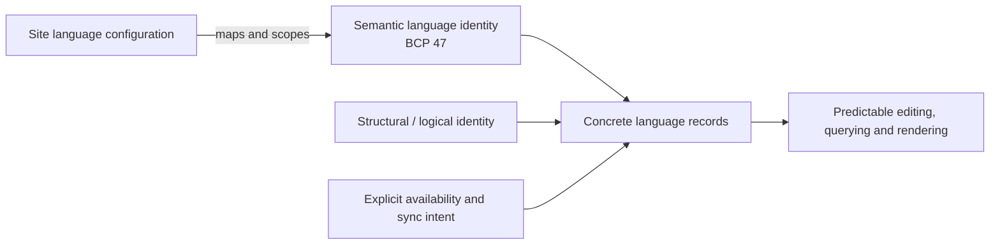
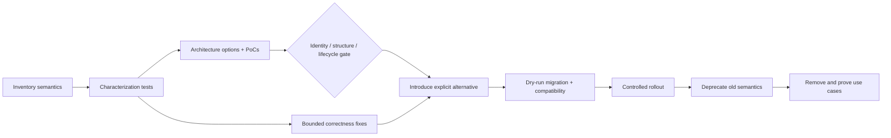

# T3DD26 Session Analysis: Translation Handling in TYPO3

**Session:** “Translation Handling in TYPO3: Where We Are and Where We Could Go”<br>
**Offizielle Session-Seite:** [T3DD26 schedule](https://t3dd.typo3.com/schedule/sessions/translation-handling-in-typo3-where-we-are-and-where-we-could-go-1203) – 08.08.2026, 14:00–14:30, Campfire Room<br>
**Analysestand:** 2026-08-08<br>
**Quellenbasis:** 121 Markdown-Dokumente unter `MeetingMinutes/` und 13 Transcripts unter `Transcripts/`; 17.596 Zeilen nach `wc -l`<br>
**Zweck:** Fachlich belastbare Arbeitsgrundlage für eine 30-minütige T3DD26-Session – ausdrücklich keine beschlossene TYPO3-Core-Roadmap

## Methodik und Leseschlüssel

Jedes Dokument des vereinbarten Korpus wurde vollständig gelesen. Wiederholungen wurden thematisch zusammengeführt; spätere Aussagen qualifizieren ältere Zwischenstände. Meeting Minutes haben bei verdichteten Ergebnissen Vorrang, Transcripts liefern Kontext, Korrekturen und Unsicherheiten. Die vollständigen periodischen Prüfdossiers liegen unter [`SourceAudits/`](SourceAudits/); das breitere Evidenzregister liegt in [`Decision-and-Evidence-Register.md`](Decision-and-Evidence-Register.md).

Jede bewertete Aussage verwendet genau einen dieser Statuswerte:

| Status | Bedeutung |
| --- | --- |
| `Current Core Behavior` | Belegtes heutiges Verhalten oder bestehendes Modell |
| `Problem` | Beobachteter Fehler, Widerspruch, UX- oder Architektur-Pain |
| `Idea` | Einzelne oder frühe Lösungsidee |
| `Discussed Direction` | Wiederholt oder konkret diskutierte Richtung ohne klare Präferenz |
| `Preferred Direction` | In den Quellen erkennbar favorisierte Richtung, noch keine Core-Zusage |
| `Open Question` | Nicht entschiedene oder nicht ausreichend belegte Frage |
| `Planned` | Explizit vorgesehener nächster Schritt |
| `In Progress` | Nachweislich begonnene, noch nicht abgeschlossene Arbeit |
| `Implemented` | Nachweislich umgesetzt beziehungsweise gemerged |
| `Analytically Derived Recommendation` | Aus Quellen und technischen Abhängigkeiten abgeleitet; keine THI-Position |

Zitate im Format `Pfad:Zeilen` beziehen sich auf den Repository-Stand vom 8. August 2026. Externe Live-Prüfungen werden separat gekennzeichnet und ersetzen keine Initiative-Quelle.

---

## 1. Executive Summary

### Belastbarer Kern

`Problem` – TYPO3s Translation Handling ist nicht allein deshalb komplex, weil Inhalte mehrsprachig sind. Komplexität entsteht vor allem dadurch, dass drei unterschiedliche Anliegen ineinandergreifen:

1. **Sprachidentität:** `sys_language_uid` mit lokalen positiven IDs sowie den semantischen Spezialwerten `0` und `-1`.
2. **Strukturelle Identität:** Default-Language-Record, `l10n_parent`, `l10n_source`, Connected/Free/Mixed Mode.
3. **Laufzeitverfügbarkeit:** Overlay, Fallback, fehlende Records, Synchronisation und Sichtbarkeit.

Diese Kopplung reicht von `DataHandler` über Page/Layout/List Module, Extbase und Frontend-Rendering bis zu Workspaces, Relationen, Import/Export und Permissions. Konkrete Beispiele sind der `Language All`-Paste-Guard, unzuverlässige Copy-/Move-Semantik über Site-Grenzen sowie schwer vorhersagbare Beziehungen. Quellen: `MeetingMinutes/Weekly/2024/01/2024-01-19.md:25-38,69-76,88-96`; `MeetingMinutes/Weekly/2025/07/2025-07-25.md:22-65`; `MeetingMinutes/Weekly/2026/03/20.md:23-45`.

`Preferred Direction` – Die stabilsten konzeptionellen Linien sind:

- `-1` soll langfristig als künstliche Recordsprache verschwinden, **aber erst mit funktionalem Ersatz** für „einmal pflegen, in mehreren/allen Sprachen verfügbar“.
- BCP 47 soll eine verständliche, site- und installationsübergreifende semantische Sprachidentität liefern.
- Technische Beziehungen sollen stärker vom System statt von Redakteuren verwaltet werden.
- Änderungen sollen inkrementell über Inventar, Characterization Tests, kleine Korrekturen und überprüfbare Migration erfolgen.

Quellen: `MeetingMinutes/Weekly/2024/01/2024-01-19.md:36-67,78-96,122-135`; `MeetingMinutes/Weekly/2025/07/2025-07-11.md:50-65`; `MeetingMinutes/Weekly/2025/09/2025-09-26.md:33-50`; `MeetingMinutes/Weekly/2026/04/24.md:29-37,49-75`.

`Open Question` – Das gemeinsame Zielbild ist noch **keine gewählte Zielarchitektur**. Offen bleiben insbesondere:

- Wie Record Identity ohne privilegierte konkrete Sprache repräsentiert wird.
- Ob strukturelle Lücken durch Shadow Records, einen neutralen Structure/Identity Layer oder eine Kombination geschlossen werden.
- Ob mehr persistierte Records tatsächlich genügend Core-Komplexität entfernen, um Datenbank-, Workspace- und Synchronisationskosten zu rechtfertigen.
- Wie automatisch erzeugte Records bei Aktivierung, Konflikt, Deaktivierung, Löschung, Restore und neuer Sprache behandelt werden.

Quellen: `MeetingMinutes/Weekly/2025/07/2025-07-18.md:49-83`; `MeetingMinutes/Weekly/2025/10/2025-10-24.md:45-78`; `MeetingMinutes/Weekly/2026/05/29.md:31-61`; `MeetingMinutes/Weekly/2026/07/10.md:24-30,50-58`.

`In Progress` – Der reale technische Stand ist bewusst kleiner: bestehende `-1`-Semantik wird inventarisiert und durch Tests greifbar gemacht; zugleich werden begrenzte Copy-, Free-Mode-, Relation-, Workspace- und Rendering-Probleme bearbeitet. Gerrit `92267` markiert zum Prüfzeitpunkt `LanguageAll`-Stellen mit TODOs, verändert aber das Verhalten nicht und ist keine vollständige Characterization-Test-Suite. Quellen: `MeetingMinutes/Weekly/2026/01/09.md:21-77`; `MeetingMinutes/Weekly/2026/03/13.md:41-51`; `MeetingMinutes/Weekly/2026/07/24.md:27-35`; externe Verifikation: [Gerrit 92267](https://review.typo3.org/c/Packages/TYPO3.CMS/+/92267).

### Geeignete Kernaussage der Session

`Analytically Derived Recommendation` – Die im Brief vorgeschlagene Erzählung trägt, wenn sie so präzisiert wird:

> TYPO3’s multilingual complexity is driven by implicit states and by language identity, structural identity, and runtime availability being encoded through the same values and relationships. The initiative prefers stable semantic language identities and an explicit replacement for `Language All`. It is exploring how structural identity can be separated from concrete language content, but complete language layers and a hidden structural layer remain hypotheses. The immediate work is characterization and bounded Core hardening, while the migration-safe target model is still being designed.

Diese Fassung vermeidet drei Übertreibungen: keine beschlossene vollständige Materialisierung, keine beschlossene Neutral-Layer-Architektur und keine formale Free-Mode-Deprecation.

---

## 2. Übergeordnetes Zielbild

### Fachliches Ziel, nicht Datenbankschema

`Preferred Direction` – Ein Record soll einer **konkreten fachlichen Sprache** zugeordnet sein; dessen Bedeutung soll nicht von der Default Language einer Site oder einer installationslokalen Zahl abhängen. Die strukturelle Zusammengehörigkeit von Sprachvarianten soll davon getrennt und technisch zuverlässig verwaltet werden. BCP 47 ist die favorisierte semantische Identität; `-1` und langfristig auch die Sonderrolle von `0` sollen nicht dauerhaft fachliche Bedeutung tragen. Quellen: `MeetingMinutes/Weekly/2023/11/2023-11-10.md:30-53`; `MeetingMinutes/Weekly/2024/01/2024-01-19.md:78-86`; `MeetingMinutes/Weekly/2025/07/2025-07-04.md:39-62`; `MeetingMinutes/Weekly/2025/07/2025-07-25.md:22-34`.

`Preferred Direction` – Aus Editorensicht lautet das stärkste Produktziel nicht „ein bestimmtes Datenmodell“, sondern: Inhalte dort erstellen und pflegen, wo sie gebraucht werden; TYPO3 verwaltet technische Beziehungen, Synchronisation und zulässige Varianten. Quellen: `MeetingMinutes/Weekly/2025/10/2025-10-24.md:37-43`; `MeetingMinutes/Weekly/2026/05/08.md:32-68`; `MeetingMinutes/Weekly/2026/06/26.md:56-80,194-212`.



`Open Question` – Die Grafik ist eine fachliche Trennung der Verantwortlichkeiten, kein belegtes endgültiges Schema. Insbesondere eine eigene Identity-Tabelle und die dauerhafte Beibehaltung numerischer Surrogat-IDs sind in den Quellen nicht entschieden.

### Reifegrad der Bausteine

| Baustein | Jüngster belastbarer Status | Kernaussage |
| --- | --- | --- |
| `-1` entfernen | `Preferred Direction` | Ersatz muss den heutigen Use Case erhalten. |
| BCP 47 | `Preferred Direction` | Semantische, site-unabhängige Sprachidentität; Speicherdetails offen. |
| Systemverwaltete Beziehungen | `Preferred Direction` | Technische Mode-/Parent-Entscheidungen aus der Alltags-UX nehmen. |
| Explizite Record-Synchronisation | `Discussed Direction` | Boolean zunächst, später möglicherweise Zielsprachengruppen. |
| Sonderrolle `0` entfernen | `Discussed Direction` | Ziel plausibel; struktureller Ersatz offen. |
| Vollständige Sprach-Layer | `Open Question` | Potenziell weniger Laufzeitlogik, aber mehr Daten und Lifecycle-Aufwand. |
| Neutraler Structure/Identity Layer | `Open Question` | 2025 zeitweise bevorzugt und 2026 als Prototyp-/Discovery-Hypothese vorgeschlagen, nicht gebaut oder entschieden. |
| Editing Language | `Preferred Direction` | Begriff und Produktziel sind bevorzugt; konkretes Modulverhalten bleibt diskutiert. |
| Free Mode deprecaten | `Open Question` | Keine formale Deprecation belegt; unabhängige Struktur bleibt ein valider Escape Hatch. |

---

## 3. Probleme des aktuellen Translation Handlings

### 3.1 Sonderwerte tragen mehrere Bedeutungen

`Current Core Behavior` – `0` bezeichnet nicht nur eine konkrete Sprache, sondern ist struktureller Ausgangspunkt verbundener Übersetzungen. `-1` bezeichnet eine virtuelle „All Languages“-Sprache. Positive IDs sind lokale technische Identifikatoren, können aber in unterschiedlichen Sites unterschiedliche Sprachen meinen. Quellen: `MeetingMinutes/Weekly/2024/01/2024-01-19.md:25-38`; `MeetingMinutes/Weekly/2025/07/2025-07-25.md:22-32`; `MeetingMinutes/Weekly/2026/07/31.md:55-61`.

`Problem` – Literale Vergleiche bilden Kontextsemantik nur unvollständig ab: manche Pfade gruppieren `0` und `-1`, andere unterscheiden sie, und `-1` kann sogar „keiner Sprache zugeordnet“ statt „alle Sprachen“ bedeuten. Eine rein mechanische Ersetzung wäre daher falsch. Quellen: `MeetingMinutes/Weekly/2026/01/16.md:57-69`; `MeetingMinutes/Weekly/2026/03/13.md:39-47`.

### 3.2 Beziehungen sind schwer zu erklären und nicht immer verlässlich

`Current Core Behavior` – `sys_language_uid`, `l10n_parent`, `l10n_source` und historisch `t3_origuid` beantworten unterschiedliche Fragen. Ein Target kann von einer Nicht-Default-Sprache kopiert sein, während `l10n_parent` im Connected Mode zur Default-Variante zeigt; Free Mode kann ohne diesen Parent existieren. Quellen: `MeetingMinutes/Weekly/2024/02/2024-02-02.md:26-60`; `MeetingMinutes/Weekly/2024/02/2024-02-16.md:24-40`.

`Problem` – Keine dieser Beziehungen liefert in allen Fällen eine sichere logische Identität. `l10n_source` kann nur eine Kopiervorlage ausdrücken; `t3_origuid` war in Workspaces unzuverlässig. Quellen: `MeetingMinutes/Weekly/2024/02/2024-02-16.md:24-40`.

### 3.3 Fehlende Records erzeugen implizite Zustände

`Current Core Behavior` – Je nach Site Language, Fallback Type, Sichtbarkeit und Mode kann ein Record konkret vorhanden, per Overlay ermittelt, aus einer Fallback-Sprache verwendet, absichtlich nicht verbunden oder überhaupt nicht vorhanden sein. Page- und Content-Verhalten sind historisch nicht vollständig gleichförmig. Quellen: `MeetingMinutes/Weekly/2024/01/2024-01-05.md:26-46`; `MeetingMinutes/Weekly/2024/02/2024-02-23.md:38-58`; `MeetingMinutes/Weekly/2025/07/2025-07-11.md:34-45`.

`Problem` – Dadurch verteilen sich Sonderregeln auf Queries, Rendering, Backend-Module, Copy/Move, Relationen und Workspaces. Der kompakte Paste-Fall zeigt das: UI-Ziel `0` plus Clipboard-Quelle `-1` wird in `DataHandler` wieder zu `-1` korrigiert. Quellen: `MeetingMinutes/Weekly/2026/03/20.md:23-35`; `Transcripts/2026-03-20 12-11-52 - Meeting der Initiative.txt:62-158`.

### 3.4 Die UX exponiert Datenmodellentscheidungen

`Problem` – Redakteure müssen heute Translate versus Copy/Free, Parent-Beziehung, Synchronisationszustand und teils Connected/Free/Mixed Mode verstehen. Ein Inhalt nur in einer Zielsprachen-Variante erfordert im Connected Model oft einen künstlichen Default-Partner oder den Wechsel in Free Mode. Quellen: `MeetingMinutes/Weekly/2026/05/08.md:32-42`; `MeetingMinutes/Weekly/2026/05/29.md:23-27,63-71`.

### 3.5 Cross-Site und globale Inhalte benötigen Mapping-Wissen

`Problem` – Dieselbe Zahl kann über Sites verschiedene Sprachen repräsentieren; dieselbe semantische Sprache kann verschiedene Zahlen erhalten. Das erschwert Copy/Move, globale Storage-Records, Site-übergreifende Wiederverwendung und Instanztransfer. Quellen: `MeetingMinutes/Weekly/2024/03/2024-03-01.md:44-46`; `MeetingMinutes/Weekly/2025/07/2025-07-25.md:57-65`; `MeetingMinutes/Weekly/2026/07/31.md:55-61`.

---

## 4. Historie und Entwicklung der Überlegungen innerhalb der Initiative

Die relevante Historie ist ein Reasoning Path, keine Meeting-Chronologie:

| Entwicklung | Früher Stand | Gegenargument / Verfeinerung | Jüngster defensibler Stand |
| --- | --- | --- | --- |
| `-1`-Ersatz | Januar 2024: Boolean auf Default-Record; DataHandler erzeugt und löscht Kopien. `MeetingMinutes/Weekly/2024/01/2024-01-19.md:40-67` | Juni 2024: vorhandene Übersetzungen, Provenienz, Überschreiben, Zielgruppen und Migration machen das Modell zu einfach. `MeetingMinutes/Weekly/2024/06/2024-06-28.md:36-82` | Funktionaler Ersatz bevorzugt; Lifecycle weiterhin offen; Characterization zuerst. |
| Synchronisation | Zunächst „Enforce Language Synchronization“ analog zu Allow. `MeetingMinutes/Weekly/2024/01/2024-01-19.md:56-67` | Feld-, Struktur- und Record-Sync müssen getrennt werden; `l10n_mode`, `l10n_state`, Relations- und Systemfelder reagieren unterschiedlich. `MeetingMinutes/Weekly/2025/08/2025-08-22.md:30-60` | Explizites Record-Intent plausibel; genaue Semantik offen. |
| `0` | Konfigurierbare Default Language und weniger Literalchecks. `MeetingMinutes/Weekly/2024/05/2024-05-24.md:20-26` | Juni 2024 pausiert, weil `-1` als Voraussetzung priorisiert wurde. `MeetingMinutes/Weekly/2024/06/2024-06-21.md:27-41` | Sonderrolle hinterfragen; Ersatzmechanismus nicht entschieden. |
| Hidden Default | März 2024: automatisch versteckte Default-Control-Records wegen Sortierung, Rechten und Verwirrung abgelehnt. `MeetingMinutes/Weekly/2024/03/2024-03-01.md:48-72` | 2025 wurden Shadows versus zentrale Struktur als bewusst getrennte Modelle formuliert. `MeetingMinutes/Weekly/2025/07/2025-07-18.md:49-83` | 2026 wurde ein Hidden-Layer-PoC nur vorgeschlagen und später als Hypothese eingeordnet; alte Einwände bleiben Designanforderungen. |
| Layer-Vollständigkeit | April/Juni 2024: linguistisch vollständige, selbsttragende Layer wurden stark befürwortet. `MeetingMinutes/Weekly/2024/04/2024-04-26.md:30-56`; `MeetingMinutes/Weekly/2024/06/2024-06-28.md:110-134` | High-Water-Mark: volle Team-Zustimmung zum grundsätzlichen Schließen der Lücken im Oktober und „linguistic completeness“ als Strategieanker im November. `MeetingMinutes/Weekly/2024/10/2024-10-18.md:21-37,60-66`; `MeetingMinutes/Weekly/2024/11/2024-11-15.md:32-36` | 2025/26 gewinnen Duplikation, Synchronisation, Workspaces und Datenökonomie wieder Gewicht; der Trade-off ist offen. `MeetingMinutes/Weekly/2025/10/2025-10-24.md:45-78`; `MeetingMinutes/Weekly/2026/03/27.md:32-40` |
| Strukturmodell | Juli/September 2025: vollständige Strukturen und Shadows gewinnen Sichtbarkeit. `MeetingMinutes/Weekly/2025/09/2025-09-26.md:58-66` | Oktober 2025 bevorzugt im Vergleich einen neutralen Struktur-Layer wegen Duplikation und Workspaces. `MeetingMinutes/Weekly/2025/10/2025-10-24.md:45-78` | Neutraler Layer ist jüngere Präferenz in diesem Vergleich, aber keine Entscheidung. |
| Free Mode | 2025: Vision, Free/Connected/Mixed technisch unnötig zu machen. `MeetingMinutes/Weekly/2025/09/2025-09-19.md:84-105` | 2026: unabhängige Strukturen bleiben legitim; konkrete Free-Mode-Bugs werden weiter behoben. `MeetingMinutes/Weekly/2026/05/29.md:39-45,63-71`; `MeetingMinutes/Weekly/2026/07/24.md:37-55` | Technische Mode-Wahl aus der UX nehmen; keine belegte Deprecation. |
| Roadmap | Juni 2026: `-1 → 0 → BCP 47 → hidden layer` als kommunizierbare Sequenz. `MeetingMinutes/Weekly/2026/06/11.md:74-80` | Juli: Hidden Layer ausdrücklich Hypothese; Priorität und Ownership unklar. `MeetingMinutes/Weekly/2026/07/10.md:24-30,50-58`; `MeetingMinutes/Weekly/2026/07/24.md:27-35` | Reasoning Path, keine verbindliche Roadmap. |
| Datenbank vs. Code | 2024 wurde Redundanz offensiv akzeptiert. `MeetingMinutes/Weekly/2024/01/2024-01-19.md:147-149` | 2026 wurde die generelle Akzeptanz synchronisierter Duplikate als Core-Entscheidung erneut geöffnet. `MeetingMinutes/Weekly/2026/03/27.md:32-40` | Mess- und Architekturfrage, nicht entschieden. |

---

## 5. BCP 47 und Sprachidentität

### 5.1 Warum BCP 47

`Preferred Direction` – BCP-47-Tags sind verständliche, standardisierte semantische Identifikatoren. Sie können dieselbe Sprache über Sites und Instanzen hinweg benennen und Varianten nach Sprache, Script oder Region ausdrücken, ohne dass eine lokale Zahl zur Fachsemantik wird. Quellen: `MeetingMinutes/Weekly/2023/11/2023-11-10.md:30-53`; `MeetingMinutes/Weekly/2024/01/2024-01-19.md:78-84`; `MeetingMinutes/Weekly/2025/07/2025-07-25.md:22-34`.

`Problem` – Numerische IDs sind innerhalb eines Kontexts technisch eindeutig, aber nicht semantisch stabil. Der 2026-Live-Fund demonstrierte beide Fehlrichtungen: dieselbe Esperanto-Konfiguration erhielt verschiedene IDs, und gleiche IDs konnten verschieden benannte Sprachen meinen. Quelle: `MeetingMinutes/Weekly/2026/07/31.md:55-61`; `Transcripts/2026-07-31 11-32-06 - Meeting der Initiative.txt:281-359`.

### 5.2 Record Language und Site Language

`Analytically Derived Recommendation` – Fachlich sollte eine Record Language durch einen kanonischen BCP-47-Tag identifiziert werden; Site Language sollte Routing, Locale, Fallback, Zugriffs- und Ausgabe-Kontext bereitstellen und auf diese Identität abbilden. Damit bleibt ein Record `de-DE`, auch wenn Site A dafür intern `0` und Site B `2` verwendet.

Diese Trennung ist technisch plausibel und durch Cross-Site-Probleme motiviert, aber **nicht als endgültige Abstraktion beschlossen**. Die Quellen formulieren teils ausdrücklich einen Wechsel von Integer zu String. Quellenbasis: `MeetingMinutes/Weekly/2025/07/2025-07-25.md:22-34,51-65`; `MeetingMinutes/Weekly/2026/07/31.md:55-61`.

### 5.3 Rolle numerischer IDs

`Open Question` – Ob numerische IDs vollständig aus persistierten Record-Sprachfeldern verschwinden oder als interne Surrogat-/Foreign Keys neben einer autoritativen BCP-47-Identität bleiben, ist nicht entschieden. Die hybride Variante darf daher nur als Architekturvorschlag, nicht als THI-Position präsentiert werden.

### 5.4 Chancen und Grenzen

| Szenario | Belegter Nutzen | Status |
| --- | --- | --- |
| Cross-Site/globaler Storage | Semantische Identität ohne lokale ID-Gleichheit; weniger Mapping-Workarounds. | `Preferred Direction` |
| Instanzübergreifender Import/Export | BCP 47 wurde wegen Interoperabilität gegenüber UUIDs favorisiert; Migrationsmapping bleibt offen. | `Discussed Direction` |
| Sprachspezifische Dateien/Metadaten | BCP 47 wurde als Voraussetzung beziehungsweise Chance genannt. | `Idea` |
| XLIFF | Die Quellen verbinden Sprach-Tags und File Translation, definieren aber kein XLIFF-Migrationsmodell. | `Open Question` |
| Externe Translation Services | Naheliegender Mapping-Vorteil, im Korpus jedoch ohne konkreten Vertrag. | `Analytically Derived Recommendation` |

Quellen: `MeetingMinutes/Weekly/2024/02/2024-02-23.md:54-62`; `MeetingMinutes/Weekly/2025/07/2025-07-25.md:30-65`; `MeetingMinutes/Weekly/2025/09/2025-09-26.md:27-31`.

---

## 6. Ablösung von `sys_language_uid = -1`

### 6.1 Heutiger Use Case und Problem

`Current Core Behavior` – `-1` modelliert einen Record, der einmal gepflegt und in allen Sprachen identisch sichtbar ist. Es ist eine virtuelle Recordsprache mit Sonderbehandlung in Reads, Writes, Filtern, Copy/Paste, Rendering, Workspaces und Tests. Quellen: `MeetingMinutes/Weekly/2024/01/2024-01-19.md:25-38`; `MeetingMinutes/Weekly/2026/03/20.md:23-45`.

`Problem` – Das Modell vermischt „Sprache des Records“ mit „Verfügbarkeits-/Synchronisationsabsicht“. Es kann Derivationsketten brechen, über Sprachrechte hinweg wirken, bestehende Übersetzungen zurücklassen und implizite Guards benötigen. Die Initiative bezeichnete es 2024 als „Broken by Design“. Quelle: `MeetingMinutes/Weekly/2024/01/2024-01-19.md:29-38`.

### 6.2 Führende Ersatzidee

`Preferred Direction` – Nicht der Use Case, sondern die spezielle Sprache soll verschwinden. Die fachliche Verteilungsabsicht soll explizit werden und durch konkrete Sprachrecords statt durch eine virtuelle Recordsprache erfüllt werden.

`Discussed Direction` – Das führende UI-/Storage-Modell dafür ist ein Flag auf einem Quell-/Strukturrecord: „für alle relevanten Sprachen synchronisieren“; `DataHandler` materialisiert konkrete Sprachrecords. Später könnte Boolean „alle“ zu einer auswählbaren Zielsprachengruppe erweitert werden. Diese konkrete Feld-/API-Form ist nicht beschlossen. Quellen: `MeetingMinutes/Weekly/2024/01/2024-01-19.md:40-67`; `MeetingMinutes/Weekly/2025/09/2025-09-26.md:33-43`; `MeetingMinutes/Weekly/2025/11/2025-11-28.md:47-57`; `MeetingMinutes/Weekly/2026/05/08.md:24-30`.

```text
Heute                                  Diskutierter Ersatz

Record                                 Source / structural record
sys_language_uid = -1                  synchronizeToLanguages = true
      │                                         │
      └─ Sonderlogik bei Lookup                 └─ DataHandler / sync service
         und Rendering                                  ├─ de-DE record
                                                        ├─ fr-FR record
                                                        └─ es-ES record
```

`Discussed Direction` – Gegenüber `-1` wären Zielrecords normal sprachspezifisch, sortierbar, referenzierbar und im jeweiligen Layer vorhanden. Das verlagert Arbeit von impliziten Reads zu expliziten Writes und Lifecycle-Operationen.

### 6.3 Der ungelöste Lifecycle

| Übergang | Quellenstand | Status |
| --- | --- | --- |
| Flag aktivieren, keine Zielrecords vorhanden | Erzeugen und synchronisieren ist die Grundidee. | `Discussed Direction` |
| Flag aktivieren, manuelle Übersetzungen vorhanden | Übernehmen, schützen, konvertieren oder ausschließen ist nicht entschieden. | `Open Question` |
| Quellrecord ändern | Automatische Aktualisierung vorgesehener Felder ist Teil der Idee. | `Discussed Direction` |
| Neue Site-/Zielsprache | Automatische Population wurde früh vorgeschlagen; Trigger, Scope und Retry fehlen. | `Open Question` |
| Flag deaktivieren | Löschen war 2024 eine frühe Idee; spätere Diskussion bevorzugt recoverable/soft-delete-artige Sicherheit. | `Open Question` |
| Automatisch erzeugter Record wurde manuell verändert | Provenienz und Konfliktregel fehlen. | `Open Question` |
| Workspace Publish/Discard/Restore | Testbedarf belegt; endgültige Semantik fehlt. | `Open Question` |
| Verschachtelte IRRE/MM-Beziehungen | Kombinationen werden charakterisiert; Ersatzregeln sind nicht beschlossen. | `In Progress` |

Quellen: `MeetingMinutes/Weekly/2024/01/2024-01-19.md:48-62`; `MeetingMinutes/Weekly/2024/06/2024-06-28.md:36-82`; `MeetingMinutes/Weekly/2025/08/2025-08-22.md:36-60`; `MeetingMinutes/Weekly/2025/11/2025-11-28.md:47-70`; `MeetingMinutes/Weekly/2026/03/20.md:37-45`.

`Analytically Derived Recommendation` – Vor einer mutierenden Implementierung braucht jeder generierte Record explizite Provenienz und einen Zustandsautomaten. Sichere Defaults wären: vorhandene redaktionelle Varianten nie still überschreiben; Konflikte vorab berichten; Deaktivierung zunächst entkoppeln statt löschen; Löschung nur bei nachweislich unveränderter, systemgenerierter Kopie und ausdrücklicher Wahl; Operationen batchbar, wiederholbar und Workspace-sicher gestalten.

---

## 7. Ablösung der Sonderrolle von `sys_language_uid = 0`

### 7.1 Problemformulierung

`Current Core Behavior` – Im Connected Model fungiert der Default-Language-Record als struktureller Mittelpunkt; `l10n_parent` zeigt auf ihn. Pages sind an eine Default-Language-Seite gebunden und können nicht als Free Mode existieren. Quellen: `MeetingMinutes/Weekly/2024/02/2024-02-02.md:26-50`; `MeetingMinutes/Weekly/2026/01/16.md:29-43`.

`Problem` – Dadurch werden zwei Verantwortlichkeiten in einem konkreten Sprachrecord vereint: fachlicher Inhalt einer Sprache und strukturelle Identität aller Varianten. Ein Wechsel der Default Language oder eine Site mit anderer Default Language wird entsprechend teuer und referenzsensitiv. Quellen: `MeetingMinutes/Weekly/2026/03/13.md:17-21`; `Transcripts/2026-03-13 12-00-26 - Meeting der Initiative.txt:92-119`.

### 7.2 Richtungen

`Discussed Direction` – Numerische Literalchecks könnten zunächst durch semantische Abstraktionen wie `isDefaultLanguage()` ersetzt werden. Ein früher Patch zur konfigurierbaren Default Language wurde jedoch 2024 zugunsten der `-1`-Arbeit pausiert. Quellen: `MeetingMinutes/Weekly/2024/05/2024-05-24.md:20-26`; `MeetingMinutes/Weekly/2024/06/2024-06-21.md:27-41`; `MeetingMinutes/Weekly/2025/07/2025-07-11.md:42-61`.

`Open Question` – Für die langfristige strukturelle Rolle existieren zwei Hauptalternativen:

1. Struktur wird in allen Sprachen materialisiert, fehlender Inhalt durch Shadows/Placeholder repräsentiert.
2. Eine sprachneutrale interne Struktur/Identity hält die gemeinsame Zuordnung; redaktionelle Records tragen konkrete Sprachen.

Quellen: `MeetingMinutes/Weekly/2025/07/2025-07-18.md:49-83`; `MeetingMinutes/Weekly/2025/07/2025-07-25.md:36-49`; `MeetingMinutes/Weekly/2025/10/2025-10-24.md:45-78`.

`Open Question` – Die im Mai 2026 diskutierte Hidden-`0`-Prototypidee entfernt `0` gerade **nicht** sofort, sondern würde es verborgen als Struktur nutzen. Ein PoC wurde vorgeschlagen; ein gebauter Prototyp ist nicht belegt. Die Idee belegt weder die Abschaffung von `0` noch die Auswahl dieses Layers. Quellen: `MeetingMinutes/Weekly/2026/05/08.md:40-46`; `MeetingMinutes/Weekly/2026/05/29.md:23-37`.

---

## 8. Vervollständigung von Sprach-Layern

### 8.1 Architekturhypothese

`Discussed Direction` – Ein vollständiger Layer bedeutet: jede strukturelle Identität besitzt in jeder relevanten Sprache eine explizite Repräsentation – echten Inhalt, synchronisierte Kopie oder technischen Shadow. Damit wären „Record fehlt“ und manche Overlay-Zweige nicht mehr implizite Laufzeitzustände. Quellen: `MeetingMinutes/Weekly/2024/04/2024-04-26.md:30-56`; `MeetingMinutes/Weekly/2024/06/2024-06-28.md:110-134`; `MeetingMinutes/Weekly/2025/09/2025-09-26.md:58-66`.

### 8.2 Erwartete Vereinfachungen

`Discussed Direction` – Vollständigere Layer könnten:

- sprachkonsistente Queries und Relationen ermöglichen,
- fehlende-Record-/Overlay-Verzweigungen reduzieren,
- Sortierung und Zuordnung expliziter machen,
- Synchronisation in konkrete Zielrecords übersetzen,
- Verhalten leichter charakterisierbar machen.

Quellen: `MeetingMinutes/Weekly/2024/06/2024-06-28.md:110-134`; `MeetingMinutes/Weekly/2025/07/2025-07-11.md:34-48`; `MeetingMinutes/Weekly/2025/07/2025-07-18.md:61-83`.

### 8.3 Kosten und Unsicherheiten

`Open Question` – Quellenbasiert sind mehr Records beziehungsweise Duplikation, komplexere Synchronisation, zusätzlicher Workspace-Aufwand sowie generelle Performance-/Datenökonomie-Bedenken. Es gibt weder einen belastbaren Benchmark noch eine Liste tatsächlich entfallender Core-Zweige. Quellen: `MeetingMinutes/Weekly/2025/07/2025-07-18.md:67-73`; `MeetingMinutes/Weekly/2025/10/2025-10-24.md:45-78`; `MeetingMinutes/Weekly/2026/03/27.md:32-40`.

`Analytically Derived Recommendation` – Write-Amplification, zusätzliche Workspace-Versionen, Reference-Index-Einträge, Backend-Filterung, Indizes und Query-Pläne sind wahrscheinliche Prüfkosten, aber im Korpus nicht vermessen. Sie müssen als PoC-Metriken statt als bereits belegte Folgen behandelt werden.

`Analytically Derived Recommendation` – Für eine vergleichbare Abschätzung sei:

- `N` = logische Records,
- `L` = relevante Sprachen,
- `p` = heutiger mittlerer Anteil vorhandener Übersetzungen je zusätzlicher Sprache.

Dann gilt näherungsweise:

```text
current rows  ≈ N × [1 + p × (L - 1)]
complete rows ≈ N × L
growth factor ≈ L / [1 + p × (L - 1)]
```

Das ist ein Analysemodell, keine Messung. Es zeigt nur: Der Faktor nähert sich `L`, wenn heute kaum Übersetzungen existieren, und `1`, wenn Layer bereits vollständig sind. Ein PoC muss reale Tabellen, IRRE/MM, Versionen, Indizes und Cache-/Query-Kosten messen.

---

## 9. Shadow Records vs. neutraler Structure/Identity Layer

Der ausführliche Modellvergleich einschließlich Workspaces, Versioning, Reference Index, Queries, UX, Migration und PoC-Kriterien steht in [`Architecture-Options-and-Open-Questions.md`](Architecture-Options-and-Open-Questions.md).

`Analytically Derived Recommendation` – In der folgenden Tabelle ist nur die Zeile „Quellenstatus“ eine Statuszusammenfassung der Initiative-Evidenz. Die Read-/Write-, Sorting-, Versioning- und Reference-Index-Vergleiche sind technische Hypothesen für eine spätere Prüfung. Direkt belegt sind das heutige Overlay-/Fallback-Modell, Duplikations-/Synchronisations-/Workspace-Bedenken sowie Sortier- und Berechtigungsfragen; die genaue operative Wirkung ist nicht vermessen.

| Kriterium | Heutiges sparse/overlay-Modell | Vollständige Layer / Shadows | Neutraler Structure/Identity Layer | Hybrid – analytisch abgeleitet |
| --- | --- | --- | --- | --- |
| Grundidee | Sprachrecord nur bei Bedarf; Laufzeit ergänzt. | Jede strukturelle Identität ist in jedem Layer repräsentiert. | Eine sprachneutrale Struktur gruppiert konkrete Sprachrecords. | Neutrale Identität; Shadows nur dort materialisieren, wo Struktur/Runtime es braucht. |
| Quellenstatus | `Current Core Behavior` | `Open Question` | `Open Question` | `Analytically Derived Recommendation` |
| Read-Pfad | Viele Fallunterscheidungen, Overlay/Fallback. | Potenziell direkter sprachspezifischer Read. | Join/Mapping von Struktur zu Sprache. | Gemischter Pfad; höhere Modellkomplexität. |
| Write-Pfad | Weniger Rows, aber implizite Zustände. | Hohe Write-Amplification und Sync-Lifecycle. | Strukturelle und sprachliche Writes getrennt. | Selektive Materialisierung braucht klare Regeln. |
| Datenvolumen | Sparsam. | Maximal unter den drei Quellmodellen. | Weniger Duplikation, zusätzliche Identitätsrecords. | Zwischenwerte; ohne PoC unbekannt. |
| Redaktion | Lücken und Mode-Wahl sichtbar. | Technische Shadows müssen verborgen/erklärt werden. | Strukturansicht und Editing Language müssen konsistent zusammenspielen. | Gefahr, beide mentalen Modelle zu kombinieren. |
| Sorting | Bestehende Default-Abhängigkeit. | Global konsistent, wenn Shadows vollständig sind. | Zentraler Order muss auf Sprachansichten projiziert werden. | Projektion plus partielle Shadows. |
| Workspaces/Versioning | Bekannte, komplexe Sonderfälle. | Vervielfacht technische Versionen und Konflikte. | Struktur- und Content-Versionen müssen atomar koordiniert werden. | Höchster Designbedarf. |
| Reference Index | Fehlende Varianten/Overlays erschweren Auflösung. | Mehr explizite Einträge. | Referenzen können gegen Identität oder Variante gerichtet sein – Entscheidung nötig. | Beide Referenzarten müssen formalisiert werden. |
| Hauptvorteil | Geringes persistiertes Volumen. | Weniger implizite Missing-Record-Zustände. | Explizite Identität ohne maximale Duplikation. | Kann selektiv Vorteile kombinieren. |
| Hauptrisiko | Dauerhafte Core-Sonderlogik. | Record-Explosion und Lifecycle. | Neue zentrale Abstraktion/Mapping-Komplexität. | Zu viele Zustände, wenn Materialisierungsregeln unklar bleiben. |

Quellen: `MeetingMinutes/Weekly/2025/07/2025-07-18.md:49-83`; `MeetingMinutes/Weekly/2025/07/2025-07-25.md:36-49`; `MeetingMinutes/Weekly/2025/09/2025-09-26.md:58-66`; `MeetingMinutes/Weekly/2025/10/2025-10-24.md:45-78`; `MeetingMinutes/Weekly/2026/05/29.md:31-61`.

`Open Question` – Die Modelle sind teilweise kombinierbar, aber ein Hybrid ist nicht automatisch besser. Ein neutraler Identity-Knoten kann konkrete Varianten gruppieren; technische Shadows könnten zusätzlich nur für sortierbare oder referenzierbare Struktur benötigt werden. Diese Kombination ist im Korpus nicht ausdefiniert und bleibt analytisch.

---

## 10. Synchronisationsmodell

### 10.1 Bestehende und vorgeschlagene Ebenen

| Mechanismus | Ebene | Heutige/gedachte Semantik | Status |
| --- | --- | --- | --- |
| `l10n_mode = exclude` | Feld/TCA | Feld ist in Übersetzungen nicht editierbar; DataHandler kopiert/behält Quellwert. | `Current Core Behavior` |
| `behaviour.allowLanguageSynchronization` | Feld/Editorzustand | Redakteur kann pro Feld zwischen synchronisiert und individuell wählen; Zustand über `l10n_state`. | `Current Core Behavior` |
| `behaviour.enforceLanguageSynchronisation` | Feld, vorgeschlagen | System erzwingt Synchronisation; editorisches Opt-out soll gerade nicht nötig sein. Schreibweise und endgültige API sind nicht beschlossen. | `Discussed Direction` |
| All-Languages-Flag | Record | System erzeugt/aktualisiert konkrete Zielrecords und synchronisiert dafür vorgesehene Inhalte; die Details bleiben offen. | `Discussed Direction` |
| Zielsprachengruppe | Record | Weiterentwicklung von Boolean „alle“ zu einer Auswahl konkreter Ziele. | `Idea` |

Quellen: `MeetingMinutes/Weekly/2024/02/2024-02-23.md:66-74`; `MeetingMinutes/Weekly/2024/03/2024-03-01.md:114-135`; `MeetingMinutes/Weekly/2024/04/2024-04-26.md:44-56`; `MeetingMinutes/Weekly/2025/08/2025-08-15.md:21-53`; `MeetingMinutes/Weekly/2025/08/2025-08-22.md:30-41`.

### 10.2 Präzise Abgrenzung

`Current Core Behavior` – `exclude` ist Konfiguration, nicht per Record frei verhandelbar. `allowLanguageSynchronization` erlaubt editorisch veränderlichen Zustand. Beide lösen primär Feldwert-Semantik innerhalb bereits existierender Varianten; sie erstellen nicht allgemein einen vollständigen Satz von Sprachrecords.

`Discussed Direction` – Ein enforce-Mechanismus wäre die strengere, systemgarantierte Variante, darf aber nicht vorschnell als fertiges TCA-Feature dargestellt werden. Die Quellen wechseln zwischen `l10n_mode`, `l10n_state`, Feld- und Record-Ebene; eine abschließende API fehlt.

`Open Question` – Systemfelder wie `sorting`, `colPos`, Sprache, Parent, Relations- und Typfelder brauchen kontextspezifische Regeln. 2025 wurde einerseits strukturelle Konsistenz gewünscht, andererseits festgehalten, dass Systemfelder nicht pauschal mitsynchronisiert werden. Quellen: `MeetingMinutes/Weekly/2025/08/2025-08-15.md:31-53`; `MeetingMinutes/Weekly/2026/07/31.md:33-37`.

`Analytically Derived Recommendation` – Vor API-Design eine Feldklassifikation erstellen: fachlich übersetzbar, systemisch identisch, strukturell synchronisiert, relationsgesteuert, lokal überschreibbar. Darauf erst Record-Lifecycle und UI aufbauen.

---

## 11. Editing Language

`Problem` – Backend-Navigation und Bearbeitung sind stark an Default-/Spalten-/Mode-Darstellungen orientiert. Ein Editor, der nur eine Zielsprache pflegt, sieht technische Struktur oder kann in Connected Mode einen lokalen Zusatz nicht ohne Default-Partner anlegen. Quellen: `MeetingMinutes/Weekly/2026/05/08.md:32-42`; `MeetingMinutes/Weekly/2026/05/29.md:63-69`.

`Preferred Direction` – Der Begriff **Editing Language** wurde am 8. Mai 2026 ausdrücklich gegenüber „source language“ bevorzugt. Quelle: `MeetingMinutes/Weekly/2026/05/08.md:60-64`.

`Discussed Direction` – Das zugehörige Konzept bezeichnet die Sprache, in deren fachlichem Kontext gerade editiert wird. Sie ist weder Backend-UI-Sprache noch zwingend Übersetzungsquelle; konkrete Reichweite und Wirkung bleiben offen. Quelle: `Transcripts/2026-05-08 12-13-43 - Meeting der Initiative.txt:591-663`.

`Discussed Direction` – Der Kontext könnte Page Tree, Page/Layout Module, Vergleichsansichten und später List Module steuern: primär die gewählte Sprache zeigen, Beziehungen und Abweichungen nachvollziehbar machen, ohne die technische Default-Struktur als Arbeitssprache zu erzwingen. Quellen: `MeetingMinutes/Weekly/2026/05/08.md:46-68`; `Transcripts/2026-05-08 12-13-43 - Meeting der Initiative.txt:495-518,615-738`.

`Planned` – Im Mai war zunächst ein Sketch/clickable prototype vorgesehen, um den Editor-Flow verständlich zu machen; ein fertiges Backend-Konzept oder Core-Patch ist nicht belegt. Quelle: `MeetingMinutes/Weekly/2026/05/08.md:60-68`.

`Open Question` – Scope und Persistenz des Kontexts, Rechte, Page- versus Record-Sprache, Preview, Fallback-Anzeige, Sprachwechsel mit ungespeicherten Änderungen und List-Module-Verhalten sind unentschieden.

---

## 12. Translation vs. Localization / Zukunft von Free Mode

### 12.1 Terminologie für die Session

`Analytically Derived Recommendation` – Für die Session ist eine vierstufige Terminologie verständlicher als ein binäres „Translation versus Localization“:

- **Translation:** Übertragung eines bestehenden Inhalts in eine weitere Sprache.
- **Localization:** sprachliche/kulturelle Anpassung innerhalb einer grundsätzlich gemeinsamen Struktur.
- **Regional structural variation:** Elemente hinzufügen, weglassen, umsortieren oder ersetzen.
- **Independent structure / Free experience:** bewusster Escape Hatch für grundlegend verschiedene Strukturen.

Diese Einteilung nimmt die neuere Produktdiskussion ernst, die Localization, Regionalisierung und strukturelle Varianten differenziert. Quellen: `MeetingMinutes/Weekly/2026/06/26.md:17-80,194-212`; `MeetingMinutes/Weekly/2026/07/10.md:24-58`.

### 12.2 Zukunft der Modes

`Current Core Behavior` – Connected Mode nutzt technische Beziehungen und strukturelle Bindung; Free Mode erlaubt unabhängige Records; beide können als Mixed Mode in einer Darstellung zusammentreffen. Quellen: `MeetingMinutes/Weekly/2025/09/2025-09-19.md:69-92`; `MeetingMinutes/Weekly/2026/05/29.md:63-71`.

`Preferred Direction` – Editorinnen und Editoren sollen nicht entscheiden müssen, welcher technische Parent oder Mode nötig ist. Eine „free“ Arbeitsweise kann bestehen, während Core intern Identität/Beziehung verwaltet. Quellen: `MeetingMinutes/Weekly/2025/10/2025-10-24.md:37-43`; `MeetingMinutes/Weekly/2026/06/26.md:56-80`.

`Open Question` – Eine formale Free-Mode-Deprecation ist nicht belegt. Mai/Juli 2026 zeigen weiterhin legitime unabhängige Struktur, konkrete Free-Mode-Fixes und Fälle, in denen TYPO3 keine Verbindung erfinden darf. Quellen: `MeetingMinutes/Weekly/2026/05/29.md:39-45,63-71`; `MeetingMinutes/Weekly/2026/07/24.md:65-75`.

### 12.3 Redaktioneller Kern-Use-Case

```text
Heute                                    Produktziel

I need content here                      I need content here
        ↓                                        ↓
Default counterpart?                    Create content
Translate or Copy/Free?                          ↓
Which parent?                           TYPO3 manages identity,
Synchronize what?                       structure and visibility
```

`Preferred Direction` – Besonders wertvoll ist „mostly connected, selectively different“: gemeinsame Struktur behalten, aber in einer Sprache einen lokalen Teaser hinzufügen. Quellen: `MeetingMinutes/Weekly/2026/06/26.md:56-62,194-212`; `Transcripts/2026-06-26 12-00-22 - Meeting der Initiative.txt:367-404,470-483`.

---

## 13. Cross-Site- und Global-Record-Szenarien

### 13.1 Zwei Sites, dieselbe Sprache

`Problem`:

```text
Site A: de-DE → local ID 0
Site B: de-DE → local ID 2
```

Eine Zahl kann also nicht ohne Site-Kontext als fachliche Sprache dienen. Umgekehrt kann ID `2` in zwei Sites verschiedene Sprachen meinen. Quellen: `MeetingMinutes/Weekly/2025/07/2025-07-25.md:22-32`; `MeetingMinutes/Weekly/2026/07/31.md:55-61`.

`Analytically Derived Recommendation` – Ein Record mit semantischer Identität `de-DE` könnte siteübergreifend auf passende Site Languages abgebildet werden. Das vereinfacht Zuordnung, beseitigt aber nicht automatisch Berechtigungen, Fallback, Storage-PID, Routing oder Sichtbarkeit. Die Quellen tragen den BCP-47-Nutzen, entscheiden aber diese Record↔Site-Language-Abstraktion nicht.

### 13.2 Global Storage mit Sprachsubset je Site

`Current Core Behavior` – Ein realer Fall nutzt drei Sites mit verschiedenen Sprachkonfigurationen und einen globalen Storage-Bereich mit bis zu zwanzig Übersetzungen, obwohl eine einzelne Site nur zwei Sprachen anbietet. Mount Points dienen dem seitenbasierten Editing. Quelle: `MeetingMinutes/Weekly/2026/07/24.md:19-25`; `Transcripts/2026-07-24 12-01-03 - Meeting der Initiative.txt:36-49`.

`Discussed Direction` – BCP 47 kann die Sprachzuordnung solcher globalen Records entkoppeln. Site-Konfiguration bestimmt weiterhin, welche Varianten angeboten oder gerendert werden.

### 13.3 Grenzen

`Open Question` – Nicht spezifiziert sind Konflikte zwischen mehreren Site-Language-Konfigurationen desselben Tags, regionale Fallbacks, Access/Workspace-Zuordnung, Storage-Scoping, Übersetzungsdienste, XLIFF-Roundtrip und Import/Export bei privaten Subtags.

---

## 14. Database Complexity vs. Code Complexity

### Die zentrale Frage

> **Where should the complexity live: in the code or in the data model?**

`Open Question` – Die Quellen tragen diese Frage, aber keine eindeutige Antwort. 2024 wurden Redundanz und selbsttragende Sprach-Layer stark befürwortet; 2025/26 rückten Record-Duplikation, Synchronisierung, Workspaces und Core-Akzeptanz stärker in den Vordergrund. Quellen: `MeetingMinutes/Weekly/2024/01/2024-01-19.md:147-149`; `MeetingMinutes/Weekly/2024/06/2024-06-28.md:110-134`; `MeetingMinutes/Weekly/2025/10/2025-10-24.md:45-78`; `MeetingMinutes/Weekly/2026/03/27.md:32-40`.

| Weniger persistierte Records | Mehr explizite Records/Struktur |
| --- | --- |
| Geringere Row-Zahl | Potenziell einfachere sprachspezifische Reads |
| Weniger Write-Amplification | Weniger implizite Missing-Record-Zustände |
| Overlay-/Fallback-/Parent-Sonderpfade | Expliziter Lifecycle, Sync und Provenienz nötig |
| Komplexität überwiegend beim Lesen | Komplexität überwiegend beim Schreiben/Migrieren |
| Bekannte, aber schwer verständliche Semantik | Neue Workspaces-/Versioning-/Reference-Index-Kosten |

`Analytically Derived Recommendation` – Nicht abstrakt abstimmen, sondern zwei kleine PoCs mit identischem Use-Case messen: sparse current model vs. gewählter explicit model. Metriken: Rows und Versionsrecords, Write-Anzahl, Query-Anzahl/-plan, Reference-Index-Einträge, Workspace publish/discard, Copy/Move, UI-Filterung sowie Anzahl entfallender Core-Verzweigungen.

---

## 15. Offene Architekturfragen

### All-Languages-Verhalten

- `Open Question` – Welche bestehenden Zielrecords werden beim Aktivieren übernommen, geschützt oder als Konflikt gemeldet?
- `Open Question` – Welche Felder/Relationen sind enforced, welche strukturell, welche lokal?
- `Open Question` – Wie wird Provenienz automatischer Kopien persistiert?
- `Open Question` – Was geschieht bei Deaktivierung, neuer Sprache, Delete, Restore und Workspace Publish/Discard?
- `Open Question` – Gilt „all“ installationsweit, pro Site, pro Sprachgruppe oder pro erlaubtem Scope?

### Record Identity und `0`

- `Open Question` – Gruppiert weiterhin ein Parent konkrete Varianten oder eine neutrale Identity?
- `Open Question` – Kann jede Variante Content Source sein, ohne struktureller Parent zu werden?
- `Open Question` – Ist der neutrale Layer Record, Relation, Node oder Service-Abstraktion?
- `Open Question` – Welche UIDs referenzieren Extensions: Variante, Struktur oder beides?

### Vollständige Layer / Shadows

- `Open Question` – Wann entstehen und verschwinden Shadows?
- `Open Question` – Enthalten sie vollständige Inhalte, Strukturfelder oder nur Referenzen?
- `Open Question` – Wie werden sie vor Redakteuren verborgen, aber bei Sortierkonflikten sichtbar gemacht?
- `Open Question` – Wie verhalten sie sich bei Workspaces, Versioning, Reference Index, IRRE/MM, Delete/Restore?
- `Open Question` – Welche Core-Sonderlogik entfällt nachweislich und wie groß ist der reale Overhead?

### BCP 47

- `Open Question` – Wo liegt die authoritative Identity: Record, zentrale Language-Entität, Site Configuration oder Kombination?
- `Open Question` – Bleiben numerische interne IDs?
- `Open Question` – Wie werden Legacy-IDs, Regionen, Scripts, private-use Tags und unvollständige Locale-Konfiguration migriert?
- `Open Question` – Wie werden Import/Export und externe Übersetzungsdienste versionsfest abgebildet?

### UX und Berechtigungen

- `Open Question` – Welche technischen Entscheidungen bleiben bewusst editorisch?
- `Open Question` – Wer darf gemeinsame Struktur verändern, wenn nur Rechte für eine Sprache bestehen?
- `Open Question` – Wie zeigt Editing Language Fallback, intentional absence, Synchronisationsstatus und Konflikte?

Quellenbasis: `MeetingMinutes/Weekly/2024/06/2024-06-28.md:36-82`; `MeetingMinutes/Weekly/2025/07/2025-07-18.md:49-83`; `MeetingMinutes/Weekly/2025/11/2025-11-28.md:47-70`; `MeetingMinutes/Weekly/2026/05/29.md:31-61`; `MeetingMinutes/Weekly/2026/07/24.md:27-35,59-63`.

---

## 16. Aktueller Implementierungsstand

### 16.1 Was tatsächlich läuft

| Arbeit | Stand am 2026-08-08 | Status | Einordnung |
| --- | --- | --- | --- |
| `-1`-Inventar / Gerrit `92267` | WIP, Patch Set 6; TODO-Markierungen für Reads/Writes/Filter/Interpretationen sowie Assertions/Fixtures; 39 Dateien. | `In Progress` | Kein Funktionswechsel und keine komplette Testsuite. |
| `-1`-Characterization | Testlücken und kleine Use-Case-/Extension-Patches werden untersucht; Ownership/Priorität zuletzt unsicher. | `In Progress` | Fundament, keine Zielarchitektur. |
| Target-language copy filtering `#92580` | Laut Minutes gemerged. | `Implemented` | Verhindert bestimmte orphaned translations; ersetzt `-1` nicht. |
| Non-language-aware IRRE localization `#88837` | Laut Meeting am 11.04.2026 gemerged. | `Implemented` | Konkreter expliziter-copy/sync-Fall. |
| Translated Mount Point `94831` | Im Juli als gemerged dokumentiert. | `Implemented` | Begrenzter Bugfix. |
| Free/Mixed-Mode Layout `94917` | Im getesteten Zustand nicht merge-ready. | `In Progress` | UI/HTML-Strukturproblem. |
| Empty `l10n_source` `94914/94916/94915` | Patches vorhanden; Quellen belegen keinen Merge. | `In Progress` | Lookup-Fallback, keine neue Identity. |
| Parent selector `#110328` | Testgestützter Patch/ItemsProcessor in Arbeit. | `In Progress` | Verhindert doppelte Parent-Nutzung. |
| Free-source wizard `#110330` | Regel geplant: bei Free-Source direkt Copy, bei Connected beide Optionen. | `Planned` | UX-Korrektur am heutigen Modell. |

Lokale Quellen: `MeetingMinutes/Weekly/2026/02/13.md:17-41`; `MeetingMinutes/Weekly/2026/04/24.md:23-27,49-57`; `MeetingMinutes/Weekly/2026/07/24.md:17-75`; `MeetingMinutes/Weekly/2026/07/31.md:21-37`. Externe Details zu `92267`: [Gerrit Change](https://review.typo3.org/c/Packages/TYPO3.CMS/+/92267). Siehe auch [`External-Technical-Validation.md`](External-Technical-Validation.md).

`In Progress` – Die aktuelle `92267`-Inventur verteilt sich über `backend`, `core`, `extbase`, `frontend`, `workspaces`, `filelist`, `impexp`, `rte_ckeditor` und `seo`. Markiert werden unter anderem Query/Display, Localization Source/Target, Berechtigungen, Parent-/Relation-Selektoren, DataHandler Copy/Paste, Overlay/Rendering, Slugs, Persistence, Metadaten, Workspaces sowie bereits vorhandene Assertions und Fixtures. Diese Breite belegt Cross-Cutting-Semantik; sie beweist weder Vollständigkeit noch die Richtigkeit jeder Markierung. Extern verifiziert in [`External-Technical-Validation.md`](External-Technical-Validation.md), Abschnitt 2.

### 16.2 Wichtige Testgrenze

`Current Core Behavior` – Site Configuration Languages können kein `-1` repräsentieren. Tests für `Language All` müssen Record-Fixtures und reale Runtime-Pfade verwenden; Site-Language-Objekte sind kein gültiger Ersatz. Quellen: `MeetingMinutes/Weekly/2026/01/16.md:29-43`; `MeetingMinutes/Weekly/2026/04/24.md:49-51`; `Transcripts/2026-04-24 12-01-11 - Meeting der Initiative.txt:225-236`.

### 16.3 Was nicht implementiert ist

`Open Question` – Kein Beleg existiert für: BCP-47-Record-Schema, Entfernung von `0` oder `-1`, All-Languages-Flag im Core, `enforceLanguageSynchronisation` als fertige TCA-API, vollständige Sprach-Layer, neutralen Identity-Layer, Editing-Language-Backend oder eine Free-Mode-Deprecation.

---

## 17. Konkrete nächste Schritte und möglicher Evolutions-/Migrationspfad

Der plausibelste Pfad ist ein System paralleler Tracks mit Entscheidungsgates, keine starre Sequenz.

Die ausführliche Track-/Gate-Fassung mit Risiken und Abnahmekriterien steht in [`Evolution-and-Migration-Path.md`](Evolution-and-Migration-Path.md).



| Track / Schritt | Pfadkategorie | Kontrollierter Status | Warum / Gate |
| --- | --- | --- | --- |
| Semantische `-1`-Stellen inventarisieren und False Positives entfernen | Already Started | `In Progress` | Spezialbedeutungen müssen vor Umbau auseinandergehalten werden. |
| Characterization Tests je Subsystem/Use Case, inklusive Workspaces | Already Started | `In Progress` | Aktuelles Verhalten und Testlücken sichtbar machen. |
| Kleine Korrekturen unabhängig mergen | Already Started | `In Progress` | Invarianten klären und aktuelle Schäden begrenzen. |
| Core-Maintainer-Review von Semantik und Zieloptionen | Discussed | `Open Question` | Der Review soll die Entscheidung ermöglichen; Ownership und Priorisierung waren im jüngsten Stand ungeklärt. |
| Expliziten All-Languages-Ersatz spezifizieren | Discussed | `Discussed Direction` | Use Case muss vor Deprecation vorhanden sein. |
| Feld-/Relation-/Systemfeld-Klassifikation | Likely Technical Prerequisite | `Analytically Derived Recommendation` | Enforce-Sync ist sonst nicht deterministisch. |
| Provenienz- und Lifecycle-State-Machine | Likely Technical Prerequisite | `Analytically Derived Recommendation` | Verhindert stillen Datenverlust bei Toggle/Migration. |
| BCP-47-Authority und Mapping entscheiden | Depends on Architecture Decision | `Open Question` | Record-, Site- und interne Identity müssen getrennt werden. |
| Shadow-, Neutral-Layer- und Hybrid-PoC mit gleichen Use Cases | Potential Additional Step | `Analytically Derived Recommendation` | Trade-off messbar statt rhetorisch entscheiden. |
| Workspace/Versioning/Reference-Index-Gate | Likely Technical Prerequisite | `Analytically Derived Recommendation` | Automatische Records vervielfachen Lifecycle-Flächen. |
| Neues Modell additiv einführen | Depends on Architecture Decision | `Open Question` | Benötigt gewähltes Datenmodell und API. |
| Read-only Migration Audit / Dry Run | Potential Additional Step | `Analytically Derived Recommendation` | Konflikte und ambige Sprachmappings vor Writes zeigen. |
| Reversible Upgrade Wizard / Batch-Job | Depends on Architecture Decision | `Analytically Derived Recommendation` | Große Datenmengen, Retry, Locking und Rollback berücksichtigen. |
| Compatibility Layer für Extensions | Potential Additional Step | `Analytically Derived Recommendation` | Direkte `0`/`-1`-Checks und TCA-/Query-Annahmen existieren außerhalb Core. |
| Editing-Language-Sketch / clickable prototype | Explicitly Planned | `Planned` | Der Editor-Flow sollte vor einem Core-UI-Konzept sichtbar und prüfbar werden. |
| Backend UX und Editing Language integrieren | Depends on Architecture Decision | `Discussed Direction` | Muss den gewählten Struktur-/Sync-Zustand erklären. |
| Parallel-Track- und Gate-Synthese dieses Pfads | Analytical Recommendation | `Analytically Derived Recommendation` | Verbindet unabhängig fortführbare Tests/Fixes mit expliziten Architekturentscheidungen. |
| Alte Semantik deprecaten, dokumentieren, telemetrie-/auditierbar machen | Potential Additional Step | `Analytically Derived Recommendation` | Erst nach funktionalem Ersatz und Migration. |
| Alte Sonderlogik entfernen und Use Cases gegen Tests beweisen | Potential Additional Step | `Analytically Derived Recommendation` | „Prove“ schließt den Pfad, nicht nur grüner Unit-Test. |

Quellen: `MeetingMinutes/Weekly/2024/01/2024-01-19.md:94-96,122-194`; `MeetingMinutes/Weekly/2025/09/2025-09-26.md:33-66`; `MeetingMinutes/Weekly/2026/01/09.md:63-99`; `MeetingMinutes/Weekly/2026/03/13.md:41-51`; `MeetingMinutes/Weekly/2026/04/24.md:69-75`; `MeetingMinutes/Weekly/2026/05/08.md:60-68`; `MeetingMinutes/Weekly/2026/07/24.md:27-35`.

`Analytically Derived Recommendation` – Feature Flags sind hier kein Default. Die 2024-Quelle warnt vor dauerhaftem Dual-Mode und verzögertem Feedback. Besser sind additive Schema-/API-Schritte, ein expliziter per-Record Opt-in oder kontrollierter Migration Mode. Ein globaler Toggle ist nur sinnvoll, wenn er einen klar befristeten Compatibility-Zweck mit Removal-Kriterium besitzt. Quelle für die Initiative-Abwägung: `MeetingMinutes/Weekly/2024/01/2024-01-19.md:172-184`.

---

## 18. Empfohlene Dramaturgie der T3DD26-Session

### 30-Minuten-Bogen

| Zeit | Akt | Ziel |
| --- | --- | --- |
| 0:00–2:30 | **A familiar editorial need** | „Mostly connected, selectively different“ als menschlichen Einstieg etablieren. |
| 2:30–7:00 | **Where we are** | Nur die nötigen Bausteine: `0`, `-1`, Parent, Modes, Overlay/Fallback. |
| 7:00–10:30 | **Where it hurts** | Drei vermischte Verantwortlichkeiten und zwei konkrete Failure Cases. |
| 10:30–15:30 | **Make intent explicit** | BCP 47 und `-1` → konkrete Sprachrecords + Sync. |
| 15:30–20:30 | **The architecture fork** | Shadows vs neutral structure; Code-vs-Data-Frage. |
| 20:30–23:30 | **Editor-first outcome** | Editing Language und „create content here“. |
| 23:30–27:00 | **Where we actually are** | WIP-Inventar/Tests, kleine Fixes, keine fertige Architektur. |
| 27:00–30:00 | **What happens next / invitation** | Parallele Tracks, Entscheidungsgates und konkrete offene Fragen. |

`Analytically Derived Recommendation` – Die zentrale Spannung ist nicht „alt gegen neu“, sondern **implicit runtime state versus explicit persisted intent**. Erst danach die Architekturvarianten zeigen. So ist verständlich, warum mehrere Ideen zusammenhängen, ohne sie als Paketentscheidung zu verkaufen.

### Priorität für die Session

| Thema | Priorität | Begründung |
| --- | --- | --- |
| Drei vermischte Achsen | Essential | Erklärt fast alle weiteren Probleme. |
| `-1` und explizite Synchronisation | Essential | Klarster Problem→Richtung→Arbeit-Bogen. |
| BCP 47 / Cross-Site | Essential | Sofort verständlicher Nutzen. |
| Strukturidentität / `0` | Essential | Verbindet Datenmodell und UX. |
| Shadows vs neutral layer | Essential | Zentrale offene Architekturdiskussion. |
| Editing Language | Essential | Zentrales Produktargument sichtbar machen, ohne Implementierungsversprechen. |
| Free/Connected/Mixed Details | Useful | Nur so viel wie für den Use Case nötig. |
| Sync-Lifecycle | Essential | Offene Lifecycle-Fragen verhindern eine überoptimistische Roadmap. |
| Exakte TCA-Kombinatorik | Too Detailed | Backup. |
| Einzelne Gerrit-Patches | Useful | Statusfolie; nur 3–4 repräsentative nennen. |
| BCP-47-Subtag-Policy | Too Detailed | Backup / spätere Architekturarbeit. |

---

## 19. Vorschlag für einzelne Slides

Die ausführliche Fassung steht in [`T3DD26-Session-Deck-Blueprint.md`](T3DD26-Session-Deck-Blueprint.md). Der kompakte Hauptsatz:

Der **Slide-Status** verwendet hier bewusst das im Auftrag verlangte, dramaturgisch verdichtete Fünfer-Vokabular `Current`, `Problem`, `Vision`, `Open`, `In Progress`. Er ist nicht mit dem zehnstufigen Quellenstatus der Analyse gleichzusetzen; die Quelleneinordnung steht in den Fachkapiteln und der Quellenmatrix.

| # | Slide-Titel | Zentrale Aussage | 3–5 Kernpunkte | Visual | Quellen | Slide-Status |
| --- | --- | --- | --- | --- | --- | --- |
| 1 | Where We Are and Where We Could Go | Heute geht es um Richtung plus ehrlichen Stand. | Problem; Hypothesen; erste Schritte | Titel + zwei Wegweiser | Offizielle Sessionbeschreibung; `MeetingMinutes/Weekly/2026/07/10.md:24-30` | Current |
| 2 | Mostly Connected, Selectively Different | Der Normalfall ist gemeinsame Struktur mit wenigen lokalen Abweichungen. | shared majority; local teaser; heutiger Mode-Konflikt | 95% shared / 5% local | `MeetingMinutes/Weekly/2026/06/26.md:56-62,194-212` | Problem |
| 3 | The Model We Have | Vier Mechanismen tragen zu viele Verantwortlichkeiten. | `0`; `-1`; `l10n_parent`; overlay/fallback | minimaler Record-Graph | `MeetingMinutes/Weekly/2024/01/2024-01-19.md:25-38`; `MeetingMinutes/Weekly/2024/02/2024-02-02.md:26-50` | Current |
| 4 | One Value, Several Meanings | Identity, structure und availability sind gekoppelt. | language ID; parent; runtime | drei überlappende Kreise | `MeetingMinutes/Weekly/2026/03/13.md:39-47`; `MeetingMinutes/Weekly/2026/03/20.md:23-35` | Problem |
| 5 | Two Sites, One Language | Lokale Zahlen sind keine stabile Sprachidentität. | same tag/different ID; inverse mismatch; globals | Site A/B mapping | `MeetingMinutes/Weekly/2025/07/2025-07-25.md:22-65`; `MeetingMinutes/Weekly/2026/07/31.md:55-61` | Problem |
| 6 | Stable Language Identity | BCP 47 benennt die Sprache fachlich. | semantic tag; cross-site; migration open | `de-DE` als Anchor | `MeetingMinutes/Weekly/2023/11/2023-11-10.md:30-53`; `MeetingMinutes/Weekly/2025/07/2025-07-25.md:22-34` | Vision |
| 7 | All Languages Is Not a Language | `-1` sollte Intent, nicht Record Language sein. | current special value; explicit flag; concrete targets | Vorher/Nachher-Tree | `MeetingMinutes/Weekly/2024/01/2024-01-19.md:40-67`; `MeetingMinutes/Weekly/2025/11/2025-11-28.md:47-57` | Vision |
| 8 | Synchronization Has a Lifecycle | Der Boolean ist nur der Anfang. | activate; conflicts; new language; deactivate; provenance | State-machine mit Fragezeichen | `MeetingMinutes/Weekly/2024/06/2024-06-28.md:36-82`; `MeetingMinutes/Weekly/2025/11/2025-11-28.md:53-70` | Open |
| 9 | Why Language 0 Is Structural | Default content und gemeinsame Identität sind gekoppelt. | parent anchor; equal languages; identity gap | einen Knoten in zwei Rollen aufspalten | `MeetingMinutes/Weekly/2025/07/2025-07-18.md:49-83`; `MeetingMinutes/Weekly/2026/05/08.md:40-46` | Problem |
| 10 | Three Ways to Represent a Gap | Sparse, Shadow und Neutral Layer sind Alternativen. | runtime gap; materialized gap; central identity | Drei Mini-Graphs | `MeetingMinutes/Weekly/2025/07/2025-07-18.md:61-83`; `MeetingMinutes/Weekly/2025/10/2025-10-24.md:45-78` | Open |
| 11 | Where Should Complexity Live? | Mehr Daten können Reads vereinfachen, schaffen aber Lifecycle-Kosten. | read branches; write amplification; workspaces; no benchmark | Waage Code ↔ Data | `MeetingMinutes/Weekly/2024/06/2024-06-28.md:110-134`; `MeetingMinutes/Weekly/2026/03/27.md:32-40` | Open |
| 12 | I Need Content Here | UX soll den Arbeitskontext, nicht das Datenmodell zeigen. | Editing Language; create here; system relations | heutiger Funnel vs 1 Schritt | `MeetingMinutes/Weekly/2026/05/08.md:46-68`; `MeetingMinutes/Weekly/2026/06/26.md:56-80` | Vision |
| 13 | What We Know / What We Do Not | Präferenzen und Hypothesen sauber trennen. | BCP47; replace -1; structure open; Free not deprecated | Zwei-Spalten-Truth Table | `MeetingMinutes/Weekly/2026/07/10.md:24-30,50-58`; `MeetingMinutes/Weekly/2026/07/24.md:27-35` | Open |
| 14 | Where We Actually Are | Charakterisierung und kleine Fixes, kein Big Bang. | #92267 WIP; tests; bounded fixes; site-language constraint | Track board | `MeetingMinutes/Weekly/2026/01/09.md:21-77`; `MeetingMinutes/Weekly/2026/07/24.md:17-75` | In Progress |
| 15 | Understand → Test → Decide → Change → Migrate → Prove | Der Pfad ist inkrementell und parallel; nur die frühen Tracks laufen bereits. | characterize; PoC; decision gates; reversible migration | Parallel-Track-Roadmap | `MeetingMinutes/Weekly/2024/01/2024-01-19.md:122-194`; `MeetingMinutes/Weekly/2026/03/13.md:41-51`; `MeetingMinutes/Weekly/2026/07/24.md:27-35` | Open |
| 16 | Help Decide the Model | Die offenen Fragen sind Teil der Arbeit. | identity; lifecycle; data/code; UX | vier Diskussionsfragen | `MeetingMinutes/Weekly/2026/05/29.md:31-61`; `MeetingMinutes/Weekly/2026/07/24.md:27-35` | Open |

### Backup Slides

| Titel | Inhalt | Priorität |
| --- | --- | --- |
| `exclude` vs `allow` vs `enforce` | Feld-/Record-Ebenen und Opt-out-Semantik | Too Detailed |
| `Language All` paste path | UI `0` + Clipboard `-1` + DataHandler guard | Useful |
| BCP-47 migration decisions | Region, Script, private use, ambiguous mappings | Too Detailed |
| Workspace lifecycle | publish/discard/restore und generated records | Useful |
| Record-growth model | `N`, `L`, `p`-Formel plus Messplan | Optional |
| Current patch ledger | IDs, Status, was sie ausdrücklich nicht implementieren | Optional |

---

## 20. Geeignete Use Cases und Visualisierungen

### Use Case A – All Languages ohne künstliche Sprache

`Essential`, Status `Preferred Direction`: Der heutige „maintain once, use in relevant languages“-Nutzen soll erhalten bleiben, während `-1` als persistierte Recordsprache entfällt. Quellen: `MeetingMinutes/Weekly/2026/04/24.md:29-37`; `MeetingMinutes/Weekly/2026/05/08.md:24-30`.

`Discussed Direction` – Visualisiere das konkrete, noch nicht entschiedene Ersatzmodell als expliziten Synchronisations-Intent mit konkreten `de-DE`, `fr-FR`, `es-ES`-Records. Der Spannungsmoment ist nicht die Kopie, sondern der Lifecycle bei vorhandener französischer Redaktion. Quellen: `MeetingMinutes/Weekly/2025/11/2025-11-28.md:47-57`; `MeetingMinutes/Weekly/2026/06/11.md:62-74`.

### Use Case B – Zwei Sites, dieselbe Sprache

`Essential`, Status `Problem`: Site A `de-DE=0`, Site B `de-DE=2`; die lokalen IDs sind als sprachliche Identität instabil. Die bevorzugte BCP-47-Richtung wird anschließend separat als mögliche Auflösung gezeigt. Quellen: `MeetingMinutes/Weekly/2026/07/31.md:55-61`.

### Use Case C – Sprach-Layer mit Lücken

`Essential`, Status `Open Question`:

```text
Sparse today          Complete/shadow option       Neutral identity option

en  A  B  C           en  A  B  C                  ID  A  B  C
de  A' -  C'          de  A' B· C'                    /|\ /|\ /|\
fr  -  B'' C''        fr  A· B'' C''                en de fr variants
```

`·` ist technischer Shadow. Die dritte Spalte ist eine Architekturabstraktion, keine gewählte Implementierung.

### Use Case D – Mostly connected, selectively different

`Essential`, Status `Preferred Direction`: Gemeinsame globale Struktur; US fügt einen lokalen Event-Teaser hinzu. Zeigt, warum die Ausnahme nicht die 95% gemeinsame Struktur zerstören sollte. Quellen: `MeetingMinutes/Weekly/2026/06/26.md:56-62,194-212`.

### Use Case E – Global Storage, 20 Übersetzungen, Site zeigt 2

`Useful`, Status `Current Core Behavior`: Realer Multisite-Anker für BCP47, Scope und Permissions. Quellen: `MeetingMinutes/Weekly/2026/07/24.md:19-25`.

### Use Case F – UK darf nicht auf Deutsch fallen

`Useful`, Status `Problem`: UK nutzt 95% General English, darf aber nie terminal auf German fallen. Die heutige Kombination „strict + chain“ bildet das valide Produktbedürfnis nicht korrekt ab. Quelle: `MeetingMinutes/Weekly/2026/07/31.md:39-45`.

`Idea` – Ein optionaler terminaler Default-Schritt im `fallback`-Modus ist eine diskutierte Lösungsrichtung; `strict` bleibt auf Records der angefragten Sprache beschränkt. Das ist kein beschlossenes Verhalten.

### Use Case G – Language-All-Paste-Guard

`Useful`, Status `Current Core Behavior`: Ein einzelner Ablauf macht unsichtbare Sonderlogik greifbar. Quellen: `MeetingMinutes/Weekly/2026/03/20.md:23-35`.

### Use Case H – 500.000 Bildreferenzen

`Optional`, Status `Problem`: Der Vorfall ist ein aufmerksamkeitsstarker Hinweis auf Copy/Sync-Risiken, aber die Kausalität war im Meeting nur vermutet. Deshalb nur mit deutlichem Unsicherheitslabel verwenden. Quelle: `MeetingMinutes/Weekly/2026/01/23.md:33-40`.

---

## 21. Quellenmatrix

Die breite, wiederverwendbare Matrix steht in [`Decision-and-Evidence-Register.md`](Decision-and-Evidence-Register.md). Die folgende kanonische Auswahl deckt alle tragenden Aussagen dieser Analyse ab.

| Thema | Erkenntnis | Status | Quelle | Datum | Session-Priorität |
| --- | --- | --- | --- | --- | --- |
| BCP 47 | BCP 47 wurde als stabile Basis für sprachliche Identität und Cross-Site-Zuordnung herausgearbeitet. | Preferred Direction | `MeetingMinutes/Weekly/2023/11/2023-11-10.md:30-53` | 2023-11-10 | Essential |
| `-1` heute | Virtuelle Sprache, identisch in allen Sprachen sichtbar. | Current Core Behavior | `MeetingMinutes/Weekly/2024/01/2024-01-19.md:25-27` | 2024-01-19 | Essential |
| `-1`-Pain | Rechte, vorhandene Übersetzungen und Derivationsketten machen das Konzept „Broken by Design“. | Problem | `MeetingMinutes/Weekly/2024/01/2024-01-19.md:29-38` | 2024-01-19 | Essential |
| `-1` entfernen | Entfernen oder ersetzen wurde ausdrücklich favorisiert. | Preferred Direction | `MeetingMinutes/Weekly/2024/01/2024-01-19.md:36-38` | 2024-01-19 | Essential |
| Boolean-Ersatz | Boolean auf Quellrecord; DataHandler erzeugt Zielkopien. | Discussed Direction | `MeetingMinutes/Weekly/2024/01/2024-01-19.md:40-55` | 2024-01-19 | Essential |
| Enforce Sync | Name/Analogie für strengere Synchronisation. | Idea | `MeetingMinutes/Weekly/2024/01/2024-01-19.md:56-67` | 2024-01-19 | Essential |
| BCP47 Storage | Wechsel von Integer zu BCP-47-String wurde bevorzugt formuliert. | Preferred Direction | `MeetingMinutes/Weekly/2024/01/2024-01-19.md:78-84` | 2024-01-19 | Essential |
| Tests | DataHandler-Änderungen benötigen genaue Functional Tests. | Preferred Direction | `MeetingMinutes/Weekly/2024/01/2024-01-19.md:94-96` | 2024-01-19 | Essential |
| Arbeitsmodus | Große Richtung, PoC, Vorpatches und Bugs parallel bearbeiten. | Planned | `MeetingMinutes/Weekly/2024/01/2024-01-19.md:122-135` | 2024-01-19 | Essential |
| Beziehungen | Vier Felder tragen Sprach-, Parent-, Source- und Copy-Identität. | Current Core Behavior | `MeetingMinutes/Weekly/2024/02/2024-02-02.md:26-50` | 2024-02-02 | Essential |
| Identity-Gap | `l10n_source` und `t3_origuid` liefern keine verlässliche logische Identität. | Problem | `MeetingMinutes/Weekly/2024/02/2024-02-16.md:24-40` | 2024-02-16 | Essential |
| `l10n_mode=exclude` | Feld wird kopiert/synchron gehalten und in Zielvariante verborgen. | Current Core Behavior | `MeetingMinutes/Weekly/2024/02/2024-02-23.md:66-74` | 2024-02-23 | Essential |
| Cross-root Copy | Gleiche Zahl kann in Zielsite eine andere Sprache meinen. | Problem | `MeetingMinutes/Weekly/2024/03/2024-03-01.md:44-46` | 2024-03-01 | Essential |
| Hidden Controls | Automatische versteckte Default-Control-Records wurden wegen Struktur/UX abgelehnt. | Discussed Direction | `MeetingMinutes/Weekly/2024/03/2024-03-01.md:48-72` | 2024-03-01 | Useful |
| Sync-Triade | `exclude`, allow und vorgeschlagenes enforce wurden differenziert. | Discussed Direction | `MeetingMinutes/Weekly/2024/03/2024-03-01.md:114-135` | 2024-03-01 | Essential |
| Vollständigkeit | Records in allen Sprachen wurden als Weg zu konsistenten Relationen diskutiert. | Discussed Direction | `MeetingMinutes/Weekly/2024/04/2024-04-26.md:30-56` | 2024-04-26 | Essential |
| Boolean-Lifecycle | Vorhandene Übersetzungen, Provenienz und Übergänge machen das frühe Modell unzureichend. | Open Question | `MeetingMinutes/Weekly/2024/06/2024-06-28.md:36-82` | 2024-06-28 | Essential |
| Self-contained layers | Daten eines Layers sollen möglichst aus Records dieses Layers bestehen. | Preferred Direction | `MeetingMinutes/Weekly/2024/06/2024-06-28.md:110-134` | 2024-06-28 | Essential |
| Gap Closure | Volle Team-Zustimmung zum grundsätzlichen Schließen von Übersetzungslücken; Umsetzung weiterhin offen. | Preferred Direction | `MeetingMinutes/Weekly/2024/10/2024-10-18.md:21-37,60-66` | 2024-10-18 | Essential |
| Linguistic completeness | Linguistische DB-Vollständigkeit wurde als langfristiger Strategieanker notiert. | Preferred Direction | `MeetingMinutes/Weekly/2024/11/2024-11-15.md:32-36` | 2024-11-15 | Essential |
| `-1` zuerst | `-1`-Entfernung wurde als erster konkreter Scope empfohlen. | Preferred Direction | `MeetingMinutes/Weekly/2025/07/2025-07-11.md:50-61` | 2025-07-11 | Essential |
| Strukturmodelle | Unsichtbare zentrale Struktur und per-language Shadows wurden gegenübergestellt. | Discussed Direction | `MeetingMinutes/Weekly/2025/07/2025-07-18.md:49-59` | 2025-07-18 | Essential |
| Layer-Trade-off | Redundanz versus zentrale Mapping-Struktur bleibt offen. | Open Question | `MeetingMinutes/Weekly/2025/07/2025-07-18.md:61-83` | 2025-07-18 | Essential |
| BCP47 Migration | BCP47 bevorzugt; ambige Mappings brauchen Integratorentscheidung. | Open Question | `MeetingMinutes/Weekly/2025/07/2025-07-25.md:22-34,51-55` | 2025-07-25 | Useful |
| Global Records | Unterschiedliche Defaults/IDs erfordern heute Custom Mapping. | Problem | `MeetingMinutes/Weekly/2025/07/2025-07-25.md:57-65` | 2025-07-25 | Essential |
| Record Flag | Enforced Boolean und DataHandler-Duplikation wurden konkretisiert. | Discussed Direction | `MeetingMinutes/Weekly/2025/08/2025-08-15.md:21-45` | 2025-08-15 | Essential |
| Sync-Felder | Struktur- und Systemfelder dürfen nicht pauschal gleichbehandelt werden. | Open Question | `MeetingMinutes/Weekly/2025/08/2025-08-15.md:31-53` | 2025-08-15 | Essential |
| TCA-Komplexität | Mapping von `l10n_mode`/allow/enforce und Relationsfällen muss analysiert werden. | Open Question | `MeetingMinutes/Weekly/2025/08/2025-08-22.md:30-60` | 2025-08-22 | Essential |
| Mode-Vision | Technische Free/Connected/Mixed-Modi langfristig unnötig machen. | Preferred Direction | `MeetingMinutes/Weekly/2025/09/2025-09-19.md:84-105` | 2025-09-19 | Essential |
| Shadows | Vollständige Strukturen und automatische Shadows wurden als Zukunftsmodell beschrieben. | Discussed Direction | `MeetingMinutes/Weekly/2025/09/2025-09-26.md:58-66` | 2025-09-26 | Essential |
| Neutral layer | Vergleich favorisierte zentralen sprachunabhängigen Struktur-Layer. | Preferred Direction | `MeetingMinutes/Weekly/2025/10/2025-10-24.md:45-78` | 2025-10-24 | Essential |
| Toggle cleanup | Soft deletion/controlled restore bevorzugt; Record-Explosion vermeiden. | Preferred Direction | `MeetingMinutes/Weekly/2025/11/2025-11-28.md:53-57` | 2025-11-28 | Essential |
| AI-Inventar | `-1`-Stellen wurden AI-gestützt klassifiziert und markiert. | In Progress | `MeetingMinutes/Weekly/2026/01/09.md:21-67` | 2026-01-09 | Useful |
| Frühe Phasen | Marker, Tests, Helper, Breaking Change wurden als frühe Sequenz notiert. | Planned | `MeetingMinutes/Weekly/2026/01/09.md:69-77` | 2026-01-09 | Essential |
| Kein Konsens | Replacement Model brauchte weiterhin Core-Feedback. | Open Question | `MeetingMinutes/Weekly/2026/01/09.md:91-99` | 2026-01-09 | Essential |
| Site Language ≠ `-1` | Page-/Site-Language-Pfade sind teils False Positives für Record Language All. | Current Core Behavior | `MeetingMinutes/Weekly/2026/01/16.md:29-43` | 2026-01-16 | Useful |
| Copy filter | Target-Site-Language-Filter wurde gemerged. | Implemented | `MeetingMinutes/Weekly/2026/02/13.md:17-19` | 2026-02-13 | Useful |
| Constants/semantics | `0`/`-1`-Konstanten helfen, ersetzen semantische Helper aber nicht. | Discussed Direction | `MeetingMinutes/Weekly/2026/03/13.md:39-47` | 2026-03-13 | Useful |
| Test-first | Kleine Tests nach Use Case/Extension, beginnend bei DataHandler. | Planned | `MeetingMinutes/Weekly/2026/03/13.md:45-51` | 2026-03-13 | Essential |
| Paste guard | UI-Ziel `0` und Quelle `-1` werden durch DataHandler-Sonderregel aufgelöst. | Current Core Behavior | `MeetingMinutes/Weekly/2026/03/20.md:23-35` | 2026-03-20 | Essential |
| Workspace Tests | Vier Workspace-Copy-Szenarien wurden vorbereitet, noch nicht abgeschlossen. | In Progress | `MeetingMinutes/Weekly/2026/03/20.md:37-45` | 2026-03-20 | Useful |
| Data vs code | Synchronisierte Duplikation versus Datenökonomie braucht Core-Entscheidung. | Open Question | `MeetingMinutes/Weekly/2026/03/27.md:32-40` | 2026-03-27 | Essential |
| IRRE fix | Nicht sprachfähige IRRE-Children werden bei Localization korrekt getrennt/synchronisiert. | Implemented | `MeetingMinutes/Weekly/2026/04/24.md:23-27` | 2026-04-24 | Useful |
| Ersatz vor Deprecation | `-1` nur mit funktionsfähigem „maintain once“ Ersatz deprecaten. | Preferred Direction | `MeetingMinutes/Weekly/2026/04/24.md:29-37` | 2026-04-24 | Essential |
| Testgrenze | Site Configuration Languages können nicht als `-1`-Testbasis dienen. | Current Core Behavior | `MeetingMinutes/Weekly/2026/04/24.md:49-51` | 2026-04-24 | Essential |
| Editing Language | Arbeitskontext wurde ausdrücklich so benannt. | Preferred Direction | `MeetingMinutes/Weekly/2026/05/08.md:60-64` | 2026-05-08 | Essential |
| Hidden `0` | `0` als verborgene Struktur und reale Sprachen als editierbare Layer. | Discussed Direction | `MeetingMinutes/Weekly/2026/05/08.md:40-46` | 2026-05-08 | Essential |
| PoC/Sketch | Editor-Story sollte zunächst prototypisch sichtbar werden. | Planned | `MeetingMinutes/Weekly/2026/05/08.md:60-68` | 2026-05-08 | Useful |
| Sorting/Permissions | Unsichtbare Struktur erzeugt mehrdeutige Sortierung und Rechtefragen. | Open Question | `MeetingMinutes/Weekly/2026/05/29.md:47-61` | 2026-05-29 | Essential |
| Roadmap-Sequenz | `-1 → 0 → BCP47 → hidden layer` wurde als kommunizierbarer Weg formuliert. | Discussed Direction | `MeetingMinutes/Weekly/2026/06/11.md:74-80` | 2026-06-11 | Useful |
| Mostly connected | Gemeinsame Struktur mit selektiven regionalen Abweichungen ist Kern-Use-Case. | Preferred Direction | `MeetingMinutes/Weekly/2026/06/26.md:56-62,194-212` | 2026-06-26 | Essential |
| Hypothese | Structural Layer wurde ausdrücklich als Hypothese/Discovery-Thema eingeordnet. | Open Question | `MeetingMinutes/Weekly/2026/07/10.md:24-30,50-58` | 2026-07-10 | Essential |
| Global Storage | Drei Sites teilen globalen Storage mit bis zu 20 Übersetzungen. | Current Core Behavior | `MeetingMinutes/Weekly/2026/07/24.md:19-25` | 2026-07-24 | Useful |
| Ownership | `-1`-Tests bleiben sinnvoll, Priorität/Ownership aber unklar. | In Progress | `MeetingMinutes/Weekly/2026/07/24.md:27-35` | 2026-07-24 | Essential |
| Free Mode Patch | Layout-Verbesserung war im getesteten Zustand nicht merge-ready. | In Progress | `MeetingMinutes/Weekly/2026/07/24.md:37-55` | 2026-07-24 | Useful |
| Free source wizard | Free Source soll direkt Copy nutzen; Connected Source behält Wahl. | Planned | `MeetingMinutes/Weekly/2026/07/24.md:65-75` | 2026-07-24 | Useful |
| Free Mode bleibt offen | Eine formale Deprecation ist nicht belegt; unabhängige Struktur und konkrete Free-Mode-Fixes bleiben legitim. | Open Question | `MeetingMinutes/Weekly/2026/05/29.md:39-45,63-71`; `MeetingMinutes/Weekly/2026/07/24.md:37-55,65-75` | 2026-07-24 | Essential |
| Cross-site IDs | Gleiche Sprache kann verschiedene IDs, gleiche ID verschiedene Bedeutungen haben. | Problem | `MeetingMinutes/Weekly/2026/07/31.md:55-61` | 2026-07-31 | Essential |
| Fallback use case | UK nutzt General English, darf aber nicht auf German fallen; die heutige Semantik bildet das nicht korrekt ab. | Problem | `MeetingMinutes/Weekly/2026/07/31.md:39-45` | 2026-07-31 | Useful |
| Fallback-Erweiterung | Optionaler terminaler Default-Schritt im `fallback`-Modus; `strict` bleibt auf Records der angefragten Sprache beschränkt. | Idea | `MeetingMinutes/Weekly/2026/07/31.md:39-45` | 2026-07-31 | Useful |
| Hybrid identity/shadow | Neutraler Identity Layer plus selektive Shadows sollte als PoC verglichen werden. | Analytically Derived Recommendation | Abgeleitet aus `MeetingMinutes/Weekly/2025/07/2025-07-18.md:49-83`; `MeetingMinutes/Weekly/2025/10/2025-10-24.md:45-78` | 2026-08-08 | Useful |
| Sichere Sync-Migration | Conflict dry-run, Provenienz, detach-by-default und reversible Batches. | Analytically Derived Recommendation | Abgeleitet aus `MeetingMinutes/Weekly/2024/06/2024-06-28.md:36-82`; `MeetingMinutes/Weekly/2025/11/2025-11-28.md:53-70`; `MeetingMinutes/Weekly/2026/07/24.md:59-63` | 2026-08-08 | Essential |
| Messbarer Trade-off | PoCs müssen Rows, Queries, Workspaces, References und entfallende Branches messen. | Analytically Derived Recommendation | Abgeleitet aus `MeetingMinutes/Weekly/2025/07/2025-07-18.md:67-73`; `MeetingMinutes/Weekly/2026/03/27.md:32-40` | 2026-08-08 | Essential |

---

## Abschließende Bewertung

Die Initiative hat kein fertiges neues Translation-Handling entworfen. Sie hat jedoch den Problemraum deutlich präzisiert: Sprachidentität, Record-/Strukturidentität, Synchronisationsabsicht und Laufzeitverfügbarkeit müssen voneinander getrennt werden. Das Entfernen von `-1` mit explizitem funktionalem Ersatz und die semantische Identifikation über BCP 47 sind die klarsten Richtungen. Wie die Sonderrolle von `0` ersetzt und strukturelle Vollständigkeit repräsentiert wird, bleibt der entscheidende Architektur-Fork.

Für die T3DD26-Session ist gerade diese Ehrlichkeit die Stärke: konkrete Schmerzen, ein zunehmend konsistentes Zielbild, echte technische Vorarbeit – und offen benannte Entscheidungen, zu denen das Core-Ökosystem beitragen kann.
