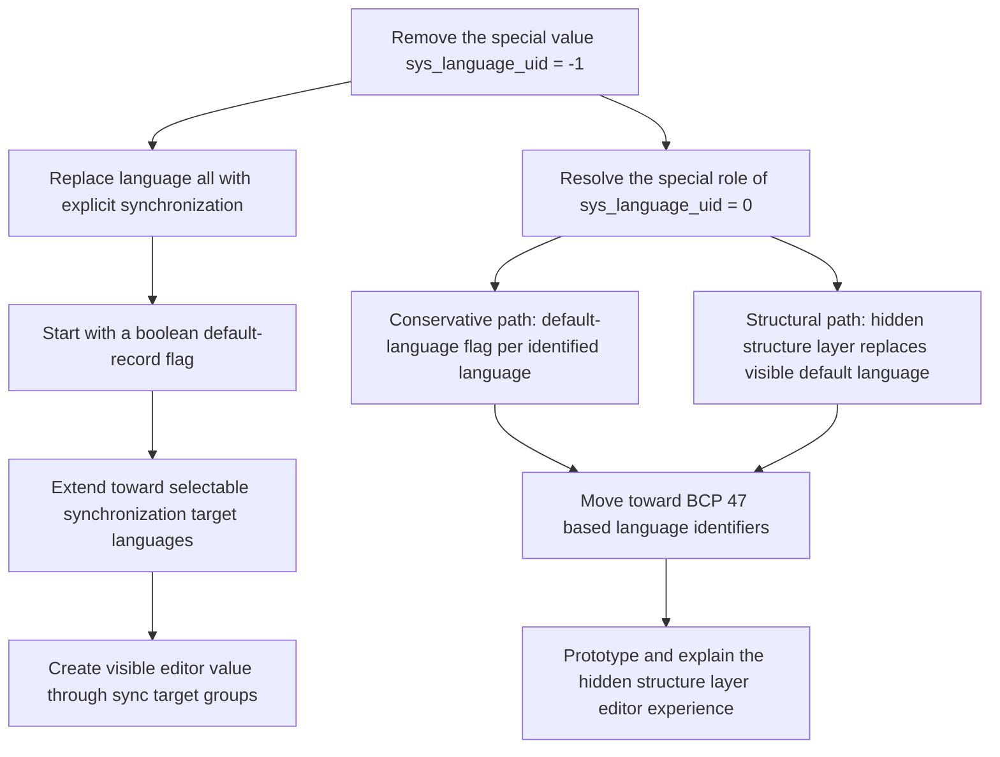

# Translation Handling Initiative Team Meeting Minutes

[← Back to the overview](https://notes.typo3.org/s/f3ae8fZSD)

- **Date:** 2026-06-11 
- **Where:** [Slack Huddle](https://app.slack.com/huddle/T024TUMLZ/C05D7UF1L8M)
- **Participants:**
    - André Buchmann
    - Eric Harrer
- **No participation:**
    - Astrid Haubold
    - Jo Hasenau
    - Sven Wappler

## Topic 1: Strict Mode and Fallback Chain Regression

Eric opened with Johannes' chat report about a current Core issue around language fallback behavior. André immediately noticed that the shown site language configuration used `fallbackType: strict` while still defining `fallbacks`, which looked contradictory to him. Eric agreed that this was the central question: the team needed to clarify what `strict` should mean when a fallback chain is configured at the same time.

Eric summarized the observed behavior. In a setup with a default language, an English general language, and an English UK language, English UK can be configured as `strict` and still carry a fallback to English general. The analyzed patch behavior appeared to make hidden English UK content fall back to English general content. Eric considered this a real Core issue because `strict` should guarantee that only the currently selected language is rendered, while the `fallback` mode is the mode that intentionally allows content from other languages.

André confirmed the same conceptual understanding. In his view, `strict` should either show content in the selected translation or show nothing. The fallback chain should not participate in content output in that mode. He checked existing TYPO3 versions and found that the fallback field is visible in the site configuration even when `strict` is selected, at least from TYPO3 v11 through TYPO3 v15. Eric checked TYPO3 v14 and v15 and confirmed that the UI still exposes the "Fallbacks to other languages" field independently of the selected fallback type.

The team compared this with existing changelog wording. André found that the TYPO3 v9.5 and v12.2 documentation states that content fallback is intended for `fallbackType: fallback`. Eric quoted the behavior of strict fetching as fetching records and overlaying them with the target language, while not showing records that are not translated into the target language. On that basis, the team treated the newly observed strict-mode fallback-chain behavior as a regression introduced by a fallback-related fix.

The related existing reference was [Forge issue #95013](https://forge.typo3.org/issues/95013), which was fixed through [patch #83169](https://review.typo3.org/c/Packages/TYPO3.CMS/+/83169) and had a TYPO3 13.4 cherry-pick in [patch #88828](https://review.typo3.org/c/Packages/TYPO3.CMS/+/88828). Eric and André understood that those changes solved real problems for `fallbackType: fallback`, but did not sufficiently separate the `strict` case.

## Topic 2: Possible Fixes for Strict Mode Fallback Handling

André outlined three possible changes. First, the relevant condition in the rendering logic should only apply the longer fallback chain when the language actually uses `fallbackType: fallback`. Second, the site configuration editor could hide the fallback field unless `fallback` is selected. Third, existing fallback values could be cleaned up when a non-fallback mode is saved.

Eric agreed with the first two ideas, but rejected automatic cleanup as too intrusive. He argued that TYPO3 generally keeps unknown or currently inactive YAML keys rather than deleting them, and that users may switch between fallback types without wanting to re-enter the fallback chain. André then considered clearing the value only at runtime while parsing the site configuration, but the team realized that this would still become destructive when the backend editor later opens and saves the configuration with an empty value.

The immediate bugfix was therefore narrowed to the rendering condition. Eric described the expected code change as keeping the current content ID restriction unless the active fallback type is `fallback`. The merge between the content ID and the fallback chain should only happen for `fallbackType: fallback`. In all other modes, especially `strict`, the content ID must stand alone.

For the UI, the team considered a separate improvement. The fallback chain field could either be hidden for non-fallback modes or remain visible with a clear note that it is only effective in fallback mode. Eric preferred at least preventing the misleading impression that the value affects strict rendering. The proposed test case would cover `strict` with a configured fallback chain and a hidden target-language element, and assert that no fallback content is rendered.

Eric and André discussed how to answer Johannes. Eric suggested asking why the fallback chain was configured in a strict context at all. As a short-term workaround, Johannes could remove the fallback chain if it has no real purpose in that configuration. As a longer-term solution, the initiative can prepare a Core patch that protects strict rendering from fallback-chain effects.

## Topic 3: TYPO3 Dialog Days and Strategic Representation

Eric then brought up the TYPO3 Association's invitation to the TYPO3 Dialog Days on July 13 and 14 in Düsseldorf. He described the event as a two-day strategy meeting organized by the TYPO3 Association board, bringing together Association members, team leads, and official bodies to define TYPO3's strategic direction. Eric considered this exactly the kind of event where translation handling needs representation.

The team connected the event to the initiative's current strategic challenge. Eric noted that Olivier is involved in the event context and has already shown interest in the initiative's topics, which makes him a relevant contact. If the initiative is not represented, multilingual support risks remaining absent from the strategy process. Eric had not seen multilingual support or translation handling named clearly in the last strategy iterations, so even getting the topic mentioned would already be progress.

André checked whether his membership level would allow participation. Eric read the invitation wording as addressing TYPO3 Association members generally and argued that initiative members sit somewhere between ordinary Association members and team members in the organizational structure. André was not sure whether he could attend in person, while Eric decided to register because tickets were limited and free. The meeting briefly paused while Eric completed his registration.

## Topic 4: Strategic Roadmap for Translation Handling

The team then returned to the broader strategy that should be prepared before the Dialog Days. Eric described two visible work streams that need to be communicated together without blurring their different purposes. The hidden structural layer and automatic shadow records offer a direct editor-facing improvement. The removal of `sys_language_uid = -1`, by contrast, is a demanding refactoring step whose main value is preparing the ground for clearer future behavior.

André suggested presenting these as two separately understandable concepts. Eric agreed that coupling everything too tightly would make the proposal harder to discuss, because disagreement about one part could block the other. The initiative should therefore describe both the immediate product value and the necessary underlying cleanup.

The strategic path discussed in the meeting can be represented as follows:

Eric described the `sys_language_uid = -1` replacement as a first step toward explicit synchronization. Initially, a boolean flag on the default-language record could express the current "language all" behavior without storing `-1` in the language field. Once the synchronization process exists, it could later evolve from an all-or-nothing flag into a multi-select of target languages. This would allow editors to synchronize a record only into specific language groups, for example English general, English UK, and English US, while leaving French and Spanish independent.

The team then discussed the separate problem of `sys_language_uid = 0`. Eric explained that numeric language identifiers cannot be converted cleanly to `BCP 47` identifiers as long as special values remain. The value `0` is problematic because it can mean different real languages in different site roots. A conservative path would introduce a default-language flag on a real language identified by a `BCP 47` tag, so the default-language role survives without relying on the numeric value `0`.

The alternative path is the hidden structural layer. In that model, `sys_language_uid = 0` no longer represents an output language at all. It becomes a purely structural layer, while all real editorial languages use explicit identifiers and remain connected to that structure. Eric noted that this could remove the need for a separate default-language flag later, because the structural layer would take over what "default" currently means structurally.

The team saw the most communicable sequence as removing `sys_language_uid = -1`, resolving `sys_language_uid = 0`, moving toward `BCP 47` based language identifiers, and then presenting the hidden structural layer as the editor-facing future model. At the same time, Eric kept open that parts of the hidden-structure idea could be prototyped earlier to make the product value tangible.

## Topic 5: Preparing Strategy Material and Prototype Work

Eric proposed starting with a text document that states what the initiative wants to achieve. He suggested deriving the first version from the topics already discussed in recent meetings and then deciding how much graphical or prototype material is needed. Ideally, the team would have at least a rough visual or dummy representation of the hidden structural layer before the Dialog Days.

The team discussed the tension between direct editor value and Core refactoring. The hidden structural layer, automatic shadow records, and a prototype in extension form can show what editors gain. The `sys_language_uid = -1` cleanup and later identifier changes are less visible, but make the visible improvements easier and cleaner to implement. Eric framed this as the central narrative for the strategy meeting.

André suggested using the existing repository of meeting minutes as input for AI-assisted synthesis. Eric agreed that the minutes are already available in the repository and can be used to extract all prior discussions about a specific topic. André considered trying another AI model for this, while Eric said the available data is the important part and can be processed with whichever tool is useful.

## Topic 6: Meeting Schedule and Chat Response

Eric reminded André that he will be in Norway during the next regular meeting slot, which was the reason this meeting had been moved to Thursday. The next regular meeting is planned for Friday, June 26. The following Friday, July 3, may be difficult for both participants because André may have a kindergarten summer event and Eric may be involved in Challenge Roth volunteering. They agreed to revisit the July 3 situation on June 26.

At the end of the meeting, André asked whether he should answer Johannes in the chat. Eric asked him to wait briefly for the meeting minutes because the transcript and AI-supported protocol would be created right away. If Eric had not posted an answer by 17:00, André could take over.
