# Translation Handling Initiative Team Meeting Minutes

[← Back to the overview](https://notes.typo3.org/s/f3ae8fZSD)

- **Date:** 2026-06-26 
- **Where:** [Slack Huddle](https://app.slack.com/huddle/T024TUMLZ/C05D7UF1L8M)
- **Participants:**
    - André Buchmann
    - Eric Harrer
    - Martin Clewing

## Topic 1: Strategic Framing for the TYPO3 Dialog Days

Eric returned to the initiative's main topic by reviewing the strategic roadmap from the previous meeting. The goal is to prepare a clear position for the TYPO3 Dialog Days that explains how TYPO3 can improve translation handling and why the work matters for editors, integrators, and developers.

The team agreed that the strategy should not start with implementation cost or technical difficulty. André suggested leaving effort estimates out of the initial framing. Instead, the initiative should describe the current state, the practical problems that follow from it, the benefits of a better model, and the technical path needed to reach those benefits.

Eric described the central vision as simplifying multilingual work in TYPO3. The focus is not only content translation, but editorial and structural handling of multilingual content as well. The roadmap should therefore distinguish visible product value from underlying cleanup. Removing `sys_language_uid = -1`, replacing language-all behavior with explicit synchronization, resolving the special role of `sys_language_uid = 0`, and moving toward `BCP 47` identifiers are enabling steps. The hidden structural layer is the clearer editor-facing model that can make those changes understandable.

The strategic framing discussed in the meeting can be represented as follows:

```mermaid
flowchart TD
    A["TYPO3 Dialog Days opening:<br/>TYPO3 already supports many multilingual scenarios,<br/>but the mental and structural complexity is high"] --> B["Start with product value:<br/>Multilingual work should become simpler,<br/>more predictable and more robust<br/>for editors, integrators and developers"]

    B --> C["Key distinction:<br/>Localisation vs Internationalisation"]

    C --> D["Localisation"]
    D --> D1["Translate content<br/>within a shared structure"]
    D1 --> D2["Same pages, same content positions,<br/>same structural relationships"]
    D2 --> D3["Different field values:<br/>header, text, media, labels, links"]
    D3 --> D4["Assessment:<br/>TYPO3 works well here"]

    C --> E["Internationalisation"]
    E --> E1["Adapt content and structure<br/>to a specific market, region or language variant"]
    E1 --> E2["The target market may keep, omit, add,<br/>reorder, replace or fully own structure"]
    E2 --> F{"How does the target structure deviate?"}

    F --> G["1. Same structure"]
    G --> G1["Classic localisation case"]
    G1 --> G2["The target market uses the same structural frame"]
    G2 --> G3["Benefit:<br/>Editors can focus on translation<br/>without rethinking structure"]
    G3 --> G4["Current state:<br/>Strong and well understood"]

    F --> H["2. Reduced structure"]
    H --> H1["The target market omits content"]
    H1 --> H2["Example:<br/>A legal note, teaser or campaign block<br/>is not relevant in one market"]
    H2 --> H3["Benefit:<br/>The market can deviate<br/>without rebuilding the whole structure"]
    H3 --> H4["Current state:<br/>Mostly manageable today,<br/>depending on fallback and mode"]

    F --> I["3. Enriched structure"]
    I --> I1["The target market adds content"]
    I1 --> I2["Example:<br/>A market-specific teaser, campaign,<br/>event notice or call-to-action"]
    I2 --> I3["Typical pattern:<br/>Most surrounding content should remain connected"]
    I3 --> I4["Current problem:<br/>Connected Mode is lost<br/>or Mixed Mode is introduced"]
    I4 --> I5["Editorial loss:<br/>Sorting, retranslation and language synchronisation<br/>become weaker or unclear"]
    I5 --> I6["This is the central pain point:<br/>The exception should not break<br/>the connected support for the rest"]

    F --> J["4. Changed structure"]
    J --> J1["The target market keeps the topic,<br/>but changes the structural representation"]
    J1 --> J2{"Type of change?"}
    J2 --> J3["Reorder content"]
    J2 --> J4["Replace content"]
    J3 --> J5["Example:<br/>Same elements exist,<br/>but in a different order for the target market"]
    J4 --> J6["Example:<br/>A source text-image element becomes<br/>an accordion, video teaser or contact box"]
    J5 --> J7["Challenge:<br/>How much structural deviation<br/>can remain connected?"]
    J6 --> J7
    J7 --> J8["Benefit if solved:<br/>Markets can adapt communication patterns<br/>without losing structural assistance"]

    F --> K["5. Independent structure"]
    K --> K1["The target market needs its own structure"]
    K1 --> K2["Example:<br/>A country site with its own information architecture,<br/>campaign logic or content model"]
    K2 --> K3["Assessment:<br/>This is a valid escape hatch"]
    K3 --> K4["Important principle:<br/>TYPO3 should not force connection<br/>where connection no longer creates value"]

    G4 --> L["What the use cases show"]
    H4 --> L
    I6 --> L
    J8 --> L
    K4 --> L

    L["Internationalisation is not binary:<br/>The common middle case is mostly connected structure<br/>with explicit, understandable market-specific deviations"] --> M["Why connected structures matter"]

    M --> M1["Connected structures provide<br/>a shared structural reference"]
    M1 --> M2["They allow sorting to follow the source structure"]
    M1 --> M3["They support retranslation<br/>when source content changes"]
    M1 --> M4["They enable features such as<br/>language synchronisation"]
    M2 --> M5["Benefit:<br/>Central structural guidance remains possible"]
    M3 --> M5
    M4 --> M5
    M5 --> M6["But:<br/>The current structural lead is the Default Language"]

    M6 --> N["Current structural model"]
    N --> N1["Default Language acts as visible content"]
    N --> N2["Default Language also acts as hidden structural control"]
    N1 --> N3["Problem:<br/>Two responsibilities are mixed"]
    N2 --> N3
    N3 --> N4["Consequence:<br/>Backend clutter when default records<br/>only exist as structural anchors"]
    N3 --> N5["Consequence:<br/>Duplicate work when editors must create<br/>artificial default-language counterparts"]
    N3 --> N6["Consequence:<br/>Hard-to-explain editing workflows<br/>for market-specific additions"]

    N4 --> O["Current workaround for enriched structure"]
    N5 --> O
    N6 --> O
    O --> O1["Create a hidden default-language element"]
    O1 --> O2["Translate it"]
    O2 --> O3["Show only the translation"]
    O3 --> O4["This keeps the connection technically,<br/>but makes the editorial model confusing"]
    O4 --> P["Core question"]

    P["Who owns the structural lead<br/>and where is it maintained?"] --> Q["Target model:<br/>Separate structure from translation"]

    Q --> Q1["Structure"]
    Q --> Q2["Translation"]
    Q1 --> Q3["Position, sorting, navigation,<br/>relations and output context"]
    Q2 --> Q4["Language-specific and market-specific<br/>field values"]
    Q3 --> Q5["Benefit:<br/>Structure can be maintained centrally"]
    Q4 --> Q6["Benefit:<br/>Editors can translate or adapt content<br/>without creating artificial default records"]
    Q5 --> Q7["Benefit:<br/>Connected support remains available<br/>even when individual markets deviate"]
    Q6 --> Q7

    Q7 --> R["Architectural principle:<br/>Unified Structural Layer"]

    R --> R1["Same base model for pages"]
    R --> R2["Same base model for tt_content"]
    R --> R3["Same base model for other localisable records"]
    R1 --> R4["Pages:<br/>navigation, page visibility,<br/>page-level translation behaviour"]
    R2 --> R5["Content:<br/>page module connections,<br/>columns, sorting and frontend output"]
    R3 --> R6["Records:<br/>extension records, teaser records,<br/>news records or other localisable data"]
    R4 --> R7["Benefit:<br/>Fewer special cases"]
    R5 --> R7
    R6 --> R7
    R7 --> R8["Benefit:<br/>More consistent backend editing<br/>and more predictable frontend output"]

    R8 --> S["What should not be the central argument"]
    S --> S1["Do not lead with implementation cost"]
    S --> S2["Do not lead with technical cleanup"]
    S --> S3["Do not make page-specific fallback complexity<br/>the main topic"]
    S1 --> S4["Instead:<br/>Explain user value first"]
    S2 --> S4
    S3 --> S5["Instead:<br/>Resolve the mismatch between backend structure,<br/>frontend fallback behaviour and market-specific additions"]
    S4 --> S6["Benefit:<br/>The discussion stays product-oriented"]
    S5 --> S6

    S6 --> T["Technical enablers<br/>only after the value is clear"]

    T --> T1["Remove sys_language_uid = -1"]
    T1 --> T2["Replace language-all behaviour<br/>with explicit synchronisation"]
    T2 --> T3["Resolve the special role of sys_language_uid = 0"]
    T3 --> T4{"Possible path"}
    T4 --> T5["Conservative path:<br/>Identify the default language<br/>through an explicit flag"]
    T4 --> T6["Structural path:<br/>A hidden Structural Layer<br/>replaces the Default Language<br/>as structural lead"]
    T5 --> T7["Move towards BCP 47 language tags"]
    T6 --> T7
    T7 --> T8["Benefit:<br/>A clearer, more modern<br/>and internationally compatible language model"]

    T8 --> U["Resulting value for TYPO3"]

    U --> U1["Editors"]
    U1 --> U1a["Less mental overhead"]
    U1 --> U1b["Fewer artificial records"]
    U1 --> U1c["Clearer multilingual editing"]

    U --> U2["Integrators"]
    U2 --> U2a["Fewer special cases"]
    U2 --> U2b["Setups that are easier to explain"]
    U2 --> U2c["More predictable configuration behaviour"]

    U --> U3["Developers"]
    U3 --> U3a["More consistent Core logic"]
    U3 --> U3b["Less legacy mapping"]
    U3 --> U3c["Cleaner APIs for localisable records"]

    U --> U4["Projects"]
    U4 --> U4a["More stable output"]
    U4 --> U4b["Lower error potential"]
    U4 --> U4c["More trust in configured content"]

    U1c --> V["TYPO3 Dialog Days closing point"]
    U2c --> V
    U3c --> V
    U4c --> V

    V["Core cleanup is not the goal in itself.<br/>It is the path towards a simpler, more stable<br/>and more understandable Internationalisation model for TYPO3."]
```

## Topic 2: Localization and Regionalization Use Cases

André prepared anonymized project examples to show where TYPO3's current translation handling becomes difficult. The team used them as concrete input for the Dialog Days narrative. Eric connected them with Astrid's earlier current-state document and with the initiative's existing concept material.

The first case was classic localization. A content element has a default-language parent and is translated while keeping the same structure. Eric described this as the area where TYPO3 works well, especially when fields such as `CType` and `colPos` are synchronized.

The second case was structural reduction. A target language or region may omit individual elements. André noted that this can be handled in `strict` mode without fallback. Eric connected this to Johannes' earlier strict-plus-fallback use case and noted that the team still needs to understand the use case more precisely, even though the strict fallback behavior discussed in the previous meeting still looked like a bug.

The third case was structural enrichment. A regional language variant may need an additional element, such as a market-specific teaser, while most surrounding content remains connected to the source structure. André explained that this currently leads toward Mixed Mode because the page contains connected elements together with an element that has no `l10n_parent`. Eric considered this the most important case because the structural deviation is the exception and the editor should not lose connected-mode support for the rest of the page.

The fourth case was the current workaround for connected structural enrichment. Editors can create a hidden default-language element, translate it, keep the connection, and show only the translated element. André explained that this works only by switching the site configuration to a mode that allows such handling and that it becomes increasingly confusing when several languages need different regional additions. The default-language column then accumulates hidden structural records that are not meaningful as visible default-language content.

## Topic 3: Value of Connected Structures

The team clarified why connected structures are valuable in the first place. André noted that a connection through fields such as `l10n_parent` allows sorting to follow the structural source, enables retranslation when source content changes, and supports features such as `allowLanguageSynchronization`. Eric summarized the main benefit as a leading layer that can define structure across languages while still allowing individual regional deviations.

Eric distinguished localization from regionalization. Localization translates content within a shared structure. Regionalization or internationalization may adapt the structure itself for a target market. TYPO3 should support both without forcing editors to choose between fully independent structures and rigid default-language binding.

The team considered the editor-facing question behind this model: who owns the structural lead, and where is that lead maintained? Today, the default language clearly has that role. This creates backend clutter when records are needed only as structural anchors and not as visible default-language content. It creates double work when an editor wants to add content directly in a translation but first has to create an artificial default-language counterpart.

Martin emphasized that TYPO3 already allows many complex configurations, but that this flexibility can become hard to understand for editors. Eric connected this with the initiative's goal of fewer mental overheads, clearer controls, and more predictable central behavior.

## Topic 4: Unified Structural Layer for Pages, Content, and Records

Eric proposed using a general structural layer as the common model for pages, `tt_content`, and other localizable records. The team discussed that TYPO3 already treats all backend-relevant data as records in a broad sense, usually with `uid` and `pid`, while pages and content receive additional Core-defined behavior. Pages define navigation and can contain content. Content has a predefined output position on a page. Other records, such as news or teaser records, depend more strongly on the extension or rendering mechanism that outputs them.

André pointed out that many records are stored in folders, but some records are attached to individual pages and may participate in page-specific structures. Eric noted that the decisive question for translation handling is not whether a table is called page, content, or record, but whether the record is localizable and relevant in backend or frontend output.

The participants identified three currently separate areas. Page translation has page-level mechanisms such as `l18n_cfg`. Content translation has backend-visible connections in the Page Module and frontend behavior controlled by fallback handling. Other localizable records depend on the rendering logic of plugins, `Extbase`, `DataProcessing`, or custom code. Eric argued that these differences create complexity and that a structural layer could provide a consistent foundation for backend editing and frontend output.

In this model, the structure of translated data and the translation of field values become separate concerns. Editors should be able to translate a field such as `header` without having to think about where the structural position of the record comes from. The hidden structural layer would make that structural position explicit without tying it to a visible default-language content column.

## Topic 5: Fallback Configuration and Predictable Output

André raised a possible feature request for page-specific fallback behavior. Instead of defining `fallbackType` only globally in the site configuration, an individual page could opt into a fallback to another language. Eric connected this with the older TypoScript flexibility that was intentionally removed when the site configuration became the single source of truth for language fallback behavior.

The team decided not to make page-specific fallback a central part of the current strategy discussion. Eric considered it a step back toward a model that TYPO3 deliberately simplified. The initiative should focus on problems that are not already addressed by current architecture decisions, especially the mismatch between connected backend structure, frontend fallback behavior, and regional content additions.

The participants discussed that the current Core still maps modern language settings onto older internal concepts in some places. André connected this with inconsistent fallback behavior. Eric translated the internal cleanup into user value: cleaner Core behavior is not an end in itself, but should reduce errors, make output logic predictable, and let editors trust that configured content appears as expected.

## Topic 6: Meeting Schedule and Additional Use Cases

Martin joined later because the calendar entry still showed the shifted time from the previous meeting. Eric corrected the meeting time information and noted that the next meeting is planned for July 3.

Eric suggested turning the current discussion into written strategy material and reviewing it in the next meeting. André asked Martin to bring additional project use cases, especially difficult multilingual setups, so the initiative can address concrete pain points before the TYPO3 Dialog Days.
